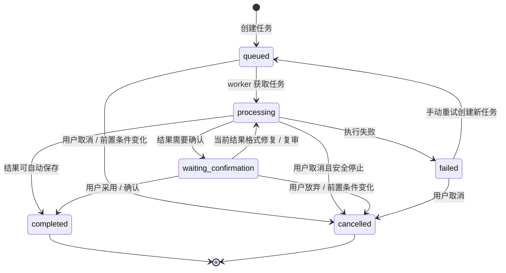

# AI 任务生命周期

本文档补齐 `GAP-P0-005`：统一 AI 生成、审稿、重写、影响评估、长篇记忆同步、TTS、视频渲染等长耗时任务的状态、进度、失败、重试、取消、互斥和结果确认规则。

AI 任务系统的目标不是把复杂技术细节暴露给小白用户，而是让用户始终知道三件事：

- 系统现在正在做什么。
- 做到哪一步了。
- 失败或待确认时下一步应该点什么。

## 任务范围

以下操作都必须进入任务系统，不能只依赖一次接口请求等待：

- 热点分析。
- 小说方向生成。
- 小说方向审稿。
- 方向优化和方向融合。
- 小说设定档案生成。
- 全书大纲生成。
- 阶段大纲生成。
- 章节目录生成。
- 试写章节生成。
- 试写总评。
- 章节正文生成。
- 章节正文重写或局部优化。
- 候选版本复审。
- 章节审稿。
- 章节重写影响评估。
- 章节重写影响处理方案生成。
- 长篇记忆同步。
- 全书 AI 审稿。
- 视频化前检查。
- 音频生成、字幕生成、视频渲染、发布记录同步等后续视频任务。

只要一个动作具备“耗时、可能失败、需要进度、需要追踪成本、需要生成版本、可能影响正式资产”中的任意一项，就应该进入任务系统。

## 任务主状态

任务主状态保持 6 个，不再扩散：

| 状态 | 含义 | 用户看到什么 |
| --- | --- | --- |
| `queued` | 任务已创建，等待 worker 执行 | 已加入队列，等待开始 |
| `processing` | worker 正在执行任务 | 正在生成、审稿、解析、保存或同步 |
| `waiting_confirmation` | 任务已有结果，但需要用户确认采用或处理 | 有新结果待确认 |
| `completed` | 任务完成，结果已保存或确认采用 | 已完成 |
| `failed` | 任务失败，需要用户重试、调整或取消 | 失败原因和推荐处理 |
| `cancelled` | 用户取消，或系统因前置条件变化取消 | 已取消，说明原因 |

不新增“重试中”“等待模型”“解析失败”等主状态。这些信息通过 `currentStep`、`statusNote`、`errorCode`、`failureCategory` 和任务事件表达。

## 状态流转

### 流转规则

| 事件 | 来源状态 | 目标状态 | 要求 |
| --- | --- | --- | --- |
| 创建任务 | 无 | `queued` | 前置条件通过；无冲突任务；写入幂等标识 |
| worker 开始执行 | `queued` | `processing` | 加锁成功；记录开始时间和事件 |
| 产出需确认结果 | `processing` | `waiting_confirmation` | 结果结构有效；生成摘要、风险和候选版本 |
| 产出可自动保存结果 | `processing` | `completed` | 任务类型允许自动保存；保存版本、报告或记忆 |
| 执行失败 | `processing` | `failed` | 写入错误分类、错误码、错误摘要、可重试建议 |
| 用户重试 | `failed` | 新任务 `queued` | 原因允许重试；新任务通过 `retryOfTaskId` 关联原失败任务，原任务保持 `failed` |
| 用户取消 | `queued` / `processing` / `failed` / `waiting_confirmation` | `cancelled` | 记录取消原因；必要时释放锁和刷新推荐动作 |
| 用户确认采用 | `waiting_confirmation` | `completed` | 版本校验通过；写操作日志；刷新业务对象状态 |
| 用户放弃结果 | `waiting_confirmation` | `cancelled` | 保留任务和候选版本历史；刷新推荐动作 |

说明：

- 失败重试默认创建新任务，原失败任务不改回排队，避免覆盖失败历史。
- `waiting_confirmation` 只有在同一个结果需要格式修复或复审时才回到 `processing`；如果是继续优化正文、重新生成候选版本，应创建新的子任务。

## 任务类型

任务类型需要表达业务含义，不使用笼统的 `generate`。

建议任务类型：

| 分类 | 任务类型示例 | 结果处理 |
| --- | --- | --- |
| 热点 | `hotspot_report_generate` | 自动保存报告，必要时待人工确认 |
| 方向 | `novel_direction_generate`、`novel_direction_review`、`novel_direction_optimize`、`novel_direction_fuse` | 方向生成、优化、融合结果需要确认 |
| 设定 | `novel_setting_generate`、`novel_setting_review`、`novel_setting_optimize` | 设定档案需要确认 |
| 大纲 | `novel_outline_generate`、`novel_outline_review`、`novel_outline_optimize`、`stage_outline_generate`、`stage_outline_adjust_count`、`chapter_plan_generate`、`chapter_plan_review`、`chapter_plan_optimize` | 大纲和章节目录需要确认 |
| 试写 | `trial_writing_generate`、`trial_review`、`trial_optimize` | 试写章节生成和总评自动保存；优化正文必须确认 |
| 章节 | `chapter_body_generate`、`chapter_body_rewrite`、`chapter_candidate_review`、`chapter_review` | 正文生成可按策略确认；重写结果必须确认 |
| 影响 | `chapter_impact_assess`、`chapter_impact_handle_plan`、`chapter_impact_generate_candidates` | 影响评估自动保存；处理方案和批量候选修正需要确认 |
| 记忆 | `long_memory_sync` | 自动保存，但要记录摘要和版本 |
| 全书 | `novel_full_review` | 自动保存报告，是否通过进入完成门禁 |
| 视频化准备 | `video_readiness_check` | 自动保存检查结果，进入待视频化需要用户确认 |
| 视频 | `tts_generate`、`subtitle_generate`、`video_render`、`video_publish_sync` | 按视频系统规则处理 |

任务类型需要和模型配置、提示词模板、策略配置、成本统计关联。

## 任务绑定对象

每个任务必须绑定具体业务对象：

- `tenantId`：租户。
- `novelId`：小说。
- `objectType`：业务对象类型，例如方向、设定、大纲、章节、版本、视频。
- `objectId`：业务对象 ID。
- `parentTaskId`：父任务，例如批量正文生成。
- `batchId`：批次 ID，例如同一次批量章节生成。
- `triggerSource`：用户手动、系统自动、批量任务、重试任务。

规则：

- 不能创建没有业务对象的模糊任务。
- 批量任务必须能追踪到每个子任务。
- 任务结果必须能反查生成了哪个版本、报告、影响评估或视频文件。
- 任务不直接保存完整提示词和完整模型响应，只保存摘要、版本号和可排错信息。

## 进度与步骤

任务进度不只显示百分比，还要显示当前阶段。

建议通用步骤：

| 步骤 | 用户文案 | 技术含义 |
| --- | --- | --- |
| `validating` | 正在检查前置条件 | 校验状态、版本、权限、互斥任务 |
| `preparing_context` | 正在整理上下文 | 读取设定、大纲、前文摘要、章节卡片 |
| `calling_model` | 正在调用模型 | 调用大模型、TTS 或视频工具 |
| `parsing_output` | 正在整理结果 | 解析 JSON、清洗文本、校验格式 |
| `quality_checking` | 正在检查质量 | 审稿、格式修复、安全检查 |
| `saving_result` | 正在保存结果 | 写版本、报告、任务事件和成本 |
| `waiting_user` | 等待你确认结果 | 结果需要用户采用、放弃或继续优化 |

规则：

- `progress` 可以是 0-100，但不能只依赖百分比。
- 长任务必须展示 `currentStep` 和通俗 `statusNote`。
- 批量章节生成的进度应显示“已完成章节数 / 总章节数”和当前章节。
- 如果无法准确计算百分比，可以只显示步骤和已耗时。

## 结果处理规则

任务结果分三类：

### 1. 自动保存结果

可以自动保存，但不能静默改变正式创作资产：

- 审稿报告。
- 影响评估报告。
- 长篇记忆同步结果。
- 任务事件。
- 成本记录。
- 模型调用摘要。

### 2. 候选结果

必须先保存为候选版本，用户确认后才成为正式版本：

- 小说方向。
- 方向融合或优化结果。
- 小说设定档案。
- 全书大纲。
- 阶段大纲。
- 章节目录。
- 章节正文重写结果。
- 手动编辑产生的新正文版本。
- 严重影响后的后续章节处理方案。

### 3. 直接完成结果

可以直接完成，但仍要记录版本或摘要：

- 章节首次正文生成，在策略允许自动采用时可以直接成为当前正文。
- 格式修复任务在不改变业务含义时可以直接写入修复后的结构化结果。
- 视频渲染结果可以直接保存文件引用，但发布仍需要人工记录或确认。

每类产物是否自动采用、是否必须确认、确认后如何切换当前版本，见 `docs/modules/ai-artifact-confirmation.md`。

## 失败分类

任务失败需要有稳定分类，方便前端展示、用户处理和后续复盘。

| 分类 | 典型原因 | 推荐动作 |
| --- | --- | --- |
| `provider_error` | 模型接口异常、网关错误 | 重试、稍后重试、换模型重试 |
| `timeout` | 模型或视频工具超时 | 重试、换模型、缩短上下文 |
| `rate_limited` | 触发限流 | 稍后重试、降低并发 |
| `quota_insufficient` | 额度不足、余额不足 | 更换模型配置、补充额度 |
| `context_too_long` | 输入上下文过长 | 缩短上下文、拆分章节、使用长上下文模型 |
| `output_parse_failed` | JSON 或结构化输出解析失败 | 自动格式修复、重试、换模型 |
| `quality_failed` | 输出质量低、审稿不通过 | 调整参数、优化输入、换模型 |
| `content_risk` | 敏感内容、平台风险 | 调整设定、降低风险元素 |
| `precondition_changed` | 任务执行中上游版本被修改 | 取消任务，基于新版本重建任务 |
| `conflict_task_exists` | 同对象已有冲突任务 | 查看已有任务、等待或取消旧任务 |
| `user_cancelled` | 用户主动取消 | 返回上一推荐动作 |
| `worker_error` | worker 异常、保存失败 | 重试、查看技术详情 |

小白页面展示通俗原因和下一步按钮；技术错误码、堆栈、原始异常只在任务详情中按权限展示，且需要脱敏。

## 重试规则

重试分为自动重试和用户重试。

### 自动重试

适用：

- 临时网络错误。
- 短暂模型超时。
- 限流后等待可恢复。
- 结构化输出格式小问题，可先尝试格式修复。

规则：

- 自动重试次数必须有上限。
- 每次自动重试都要写入任务事件。
- 自动重试不能绕过用户确认。
- 自动重试后仍失败，任务转为 `failed` 并展示原因。

### 用户重试

用户可选：

- 原样重试。
- 换模型重试。
- 调整参数重试。
- 缩短上下文后重试。
- 返回上一步修改设定、大纲或章节摘要后重试。

规则：

- 重试必须创建或关联新任务，并通过 `retryOfTaskId` 保留原失败任务历史。
- 高成本任务重试前需要提示可能增加成本。
- 如果上游版本已变化，必须提示“请基于新版本重新创建任务”。
- 不允许用户连续重复点击创建多个相同任务，必须做幂等和防重复。

## 取消规则

可取消状态：

- `queued`：可以直接取消。
- `processing`：如果 worker 支持安全停止，可以请求取消；如果已经进入保存阶段，需要等待安全点。
- `waiting_confirmation`：可以通过放弃结果取消。
- `failed`：可以取消，表示不再处理该失败任务。

不可取消：

- `completed`：不能取消，只能通过业务版本回退或重新生成。
- `cancelled`：不能重复取消。

取消后需要：

- 记录取消原因。
- 释放任务锁。
- 刷新业务对象推荐动作。
- 如果取消导致小说阶段仍未完成，需要回到可执行的下一步。

## 任务互斥

同一业务对象不能同时执行互相冲突的任务。

常见互斥：

| 对象 | 冲突任务 | 规则 |
| --- | --- | --- |
| 小说方向 | 方向生成、方向融合、方向优化 | 同一草稿同一时间只允许一个方向主任务 |
| 设定档案 | 设定生成、设定重写、设定确认 | 设定生成中不能生成大纲 |
| 全书大纲 | 大纲生成、阶段大纲生成、章节目录生成 | 上游大纲未确认前不能继续下游 |
| 章节 | 正文生成、整章重写、局部优化、候选采用 | 同一章同一时间只允许一个会改变正文的任务 |
| 章节影响 | 影响评估、后续章节处理 | 同一影响评估未决策前不能重复创建 |
| 视频 | TTS、字幕、渲染、发布同步 | 同一视频同一步骤不能重复执行 |

允许并行：

- 不同小说之间可以并行。
- 同一小说的独立审稿摘要可以按策略并行。
- 批量章节生成可有并发上限，但依赖长篇记忆的章节需要按顺序或按分段顺序推进。

## 任务依赖

典型依赖：

- 方向审稿依赖方向生成完成。
- 设定生成依赖方向已确认。
- 全书大纲生成依赖设定已确认。
- 阶段大纲生成依赖全书大纲已确认。
- 章节目录生成依赖阶段大纲已确认。
- 试写依赖章节目录已确认。
- 试写总评依赖试写章节正文、章节摘要和章节审稿完成。
- 章节正文生成依赖章节卡片、前文摘要和长篇记忆。
- 章节审稿依赖章节正文。
- 候选版本复审依赖候选正文。
- 影响评估依赖候选版本被采用或正式正文发生变化。
- 全书审稿依赖所有计划章节可继续推进。
- 视频化前检查依赖全书审稿有效、完成确认、无待处理章节和无未关闭影响案例。

如果依赖对象版本发生变化：

- 未开始任务直接取消，原因写“前置数据已变化”。
- 处理中任务尽量在安全点取消。
- 待确认任务需要提示“该结果基于旧版本生成”，默认不建议采用。
- 已完成任务保留历史，但不再作为当前推荐动作依据。

## 前端展示规则

### 小说列表和行展开区

展示简化任务信息：

- 当前任务类型。
- 当前步骤。
- 进度。
- 已耗时。
- 失败原因。
- 一个主推荐动作。

列表页不展示完整输入、完整输出、完整提示词或模型响应。

### 任务抽屉

用于承接当前页面的任务进度：

- 当前状态。
- 当前步骤。
- 时间线事件。
- 失败原因和推荐动作。
- 重试、换模型重试、取消。
- 结果摘要和确认入口。

任务抽屉适合小白用户，不展示过多技术字段。

### 任务列表 `/tasks`

用于高级查看和排查：

- 支持按任务类型、状态、小说、创建时间筛选。
- 展示模型、耗时、token、成本、失败分类。
- 支持查看详情、重试、换模型重试、取消。

### 任务详情 `/tasks/:taskId`

用于完整排错和复盘：

- 基本信息。
- 状态事件。
- 输入摘要。
- 输出摘要。
- 模型与提示词模板版本。
- 策略配置版本。
- token 和成本。
- 错误分类、错误码、错误摘要。
- 关联版本或报告。
- `sourceVersionRefs` 当前有效性。
- 如果上游版本已经变化，失败任务不展示可点击重试主动作；提示“上游内容已经变化，旧任务不能直接重试”，引导用户基于最新版本重新生成或放弃旧结果。

安全要求：

- 不展示 API Key。
- 默认不展示完整提示词。
- 默认不展示完整模型响应。
- 如果后续需要调试完整输入输出，必须有权限控制、脱敏和短期留存策略。

## 和小说状态的关系

任务状态不是小说状态，但会影响小说状态和推荐动作：

- 有主链路任务 `queued` 或 `processing` 时，小说当前阶段展示为处理中。
- 有任务 `waiting_confirmation` 时，小说当前阶段展示为待用户确认。
- 主链路任务 `failed` 且影响当前阶段产物时，小说当前阶段展示为失败或阻塞。
- 任务 `completed` 后，需要刷新小说阶段、章节状态、推荐动作和完成门禁。
- 任务 `cancelled` 后，需要回到可执行的下一步，而不是停在 loading 状态。

任务动作优先于阶段动作。比如设定生成中，主按钮应显示“查看生成进度”，而不是“生成设定”。

任务并发、批量任务、幂等、部分成功和上游版本变化处理的完整契约见 `docs/modules/novel-task-concurrency-contract.md`。任务完成后的资产采用与过期副作用见 `docs/modules/novel-asset-adoption-staleness-contract.md`。

## 数据与接口边界

建议接口：

- `GET /tasks`：任务列表。
- `GET /tasks/:taskId`：任务详情。
- `GET /tasks/:taskId/events`：任务事件时间线。
- `POST /tasks/:taskId/retry`：原样重试。
- `POST /tasks/:taskId/retry-with-model`：换模型重试。
- `POST /tasks/:taskId/cancel`：取消任务。
- `POST /tasks/:taskId/confirm-result`：确认采用结果。
- `POST /tasks/:taskId/discard-result`：放弃结果。

任务创建接口通常由业务动作触发，例如：

- `POST /novels/:novelId/directions/generate`
- `POST /novels/:novelId/chapters/:chapterId/rewrite`
- `POST /novels/:novelId/chapters/:chapterId/review`

不建议让前端直接传任意 `taskType` 创建任务，避免绕过业务前置条件和互斥规则。

## 事件日志

任务事件用于记录过程，而不是只记录最终状态。

建议事件类型：

- `task_created`
- `task_started`
- `progress_updated`
- `model_call_started`
- `model_call_finished`
- `output_parsed`
- `format_repair_started`
- `format_repair_finished`
- `result_saved`
- `waiting_confirmation`
- `auto_retry_scheduled`
- `retry_created`
- `task_failed`
- `task_cancelled`
- `result_confirmed`
- `result_discarded`

事件日志必须脱敏，不能写入 API Key、完整提示词和完整模型响应。

## 完成判断

一个任务可以视为完成，必须满足：

- 任务状态为 `completed`。
- 如果产生版本，版本记录已创建。
- 如果产生报告，报告已保存。
- 如果需要用户确认，用户已采用或明确确认。
- 如果自动保存，保存结果可被业务对象反查。
- 成本、耗时、模型、提示词模板版本和策略版本已记录摘要。
- 相关小说、章节、视频的推荐动作已刷新。

一个任务可以视为失败，必须满足：

- 任务状态为 `failed`。
- 有稳定错误分类。
- 有用户可理解的失败摘要。
- 有可执行的下一步建议。
- 已写入任务事件。

## 原型设计要求

后续画原型时，任务系统至少需要覆盖：

- 小说列表行上的简化任务进度。
- 创建小说、小说详情、章节详情里的任务抽屉。
- 任务失败弹窗或抽屉。
- 待确认结果提示。
- 任务列表。
- 任务详情。
- 重试、换模型重试、取消、确认结果、放弃结果。

小白入口优先展示“正在做什么”和“下一步点什么”；任务列表和任务详情服务排查、复盘和高级配置。
