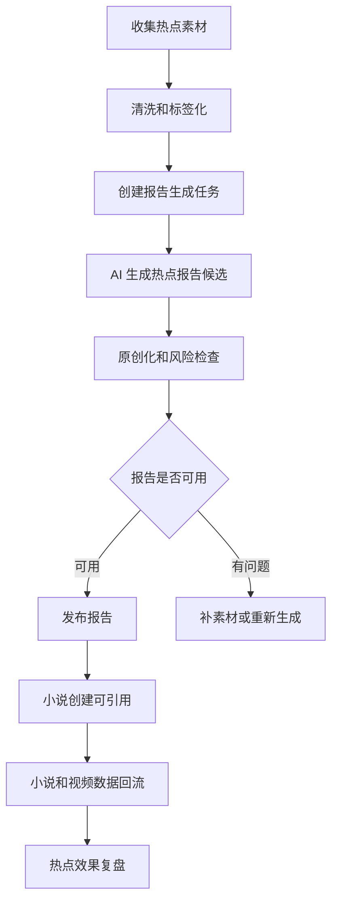

# 热点系统服务化完整设计

本文档补齐 `GAP-P2-001`：热点分析系统如何从“一个辅助页面”升级为独立服务，定期生成热点报告、支持手动触发、对外提供创作机会点，并稳定服务小说创建、内容策划、视频运营和系统自我成长。

热点系统的目标不是替代专业运营团队，也不是一开始就做复杂爬虫。它的核心价值是把用户看到的市场素材、系统内置题材库、后续第三方热点服务和视频发布反馈，整理成 AI 小说系统能直接引用的结构化输入。

## 设计目标

- 让小白用户没有热点素材时也能继续创建小说。
- 让有素材的用户可以把标题、文案、评论摘要、榜单和观察笔记转成创作机会点。
- 让小说方向生成能引用稳定的热点报告版本，而不是临时拼接文本。
- 让热点报告支持定期生成、手动生成、临时分析、发布和归档。
- 为后续接入第三方热点分析服务、平台数据回流和独立售卖预留服务边界。

## 范围边界

热点系统负责：

- 热点素材录入、导入、归档和标签化。
- 热点报告生成、审阅、发布、过期和归档。
- 创作机会点生成和推荐。
- 对小说系统提供热点报告、机会点和默认创作建议。
- 接收小说、视频和用户反馈，判断热点是否真的有效。

热点系统不负责：

- 在主路径里强依赖自动爬虫。
- 直接复制外部作品剧情、角色、标题或原文。
- 直接创建小说项目。
- 自动决定哪个热点一定能赚钱。
- 绕过内容安全和原创化检查。

## 核心对象

### 热点素材

热点素材是报告生成的原始输入，但不一定都来自真实平台抓取。

字段建议：

- 素材标题。
- 来源类型：手动录入、链接、榜单摘要、评论摘要、第三方服务、内置题材库、视频数据回流。
- 来源平台：抖音、快手、小红书、番茄、短剧平台、其他。
- 素材链接。
- 素材摘要。
- 评论区情绪摘要。
- 用户观察笔记。
- 题材标签。
- 爽点标签。
- 开篇钩子标签。
- 目标受众标签。
- 原创化风险。
- 平台风险。
- 可用状态：可分析、需清洗、已忽略、已归档。

规则：

- 素材正文和外部原文不应长期完整保存，优先保存用户摘要和 AI 清洗后的结构化摘要。
- 素材可以被多份报告引用。
- 高风险素材不能直接进入小说正文上下文，只能用于结构、情绪和节奏分析。

### 热点报告

热点报告是对一批素材、内置题材库或第三方服务结果的结构化总结。

字段建议：

- 报告标题。
- 报告周期：日报、周报、月报、临时报告、默认报告。
- 报告来源：用户素材、内置题材库、第三方服务、混合来源、视频数据回流。
- 数据范围说明。
- 置信度：高、中、低。
- 时效性：新鲜、可用、过期。
- 热门题材排行。
- 热门爽点排行。
- 高频开篇钩子。
- 常见主角开局。
- 高频冲突类型。
- 目标受众分布。
- 评论区情绪总结。
- 创作机会点列表。
- 同质化风险。
- 内容安全风险。
- 原创化建议。
- 小说创建推荐参数。
- 已被引用次数。
- 发布状态。
- 报告版本。

报告状态：

| 状态 | 含义 | 可做动作 |
| --- | --- | --- |
| `draft` | 已创建但未分析完成 | 继续补素材、生成报告 |
| `generating` | 正在生成 | 查看任务进度、取消 |
| `generated` | 已生成但未发布 | 查看、复审、发布、重新生成 |
| `published` | 可被小说创建默认引用 | 创建小说、复制机会点、归档 |
| `expired` | 已过时，不建议默认使用 | 查看、复制、归档、重新生成 |
| `archived` | 不再默认展示 | 查看历史、恢复 |

规则：

- 创建小说只能默认引用 `published` 且未过期的报告。
- 过期报告仍可手动引用，但页面必须提示时效风险。
- 报告发布属于高影响操作，需要记录发布原因和版本。

### 创作机会点

创作机会点是热点系统给小说系统的核心输出。

字段建议：

- 机会点标题。
- 推荐题材。
- 推荐子题材。
- 目标读者。
- 核心情绪承诺。
- 主角开局建议。
- 压迫来源。
- 反击方式。
- 开篇钩子类型。
- 前三章爽点承诺。
- 适合短视频表达的冲突。
- 推荐章节规模。
- 市场潜力评分。
- 长篇支撑评分。
- 视频化潜力评分。
- 原创化风险。
- 平台风险。
- 同质化风险。
- 差异化建议。
- 可引用题材模板。
- 不可直接使用的内容提醒。

规则：

- 机会点只能作为小说方向生成输入，不能直接成为小说设定或正文。
- 机会点需要能转成 `docs/modules/novel-hit-content-integration-matrix.md` 中的方向卡字段。
- 每个机会点需要记录来源报告版本，便于后续复盘。

## 报告生成流程

生成输入：

- 用户选择的素材集合。
- 内置题材库摘要。
- 历史热点报告摘要。
- 近期小说方向采用情况。
- 视频数据回流摘要。
- 内容安全和原创化规则。

生成输出：

- 热点趋势总结。
- 创作机会点。
- 风险和原创化建议。
- 推荐给小说创建的默认参数。
- 报告置信度和数据限制说明。

## 定期报告

完整产品支持定期报告，但首期不强依赖自动执行。

定期策略：

| 类型 | 建议频率 | 用途 |
| --- | --- | --- |
| 默认题材报告 | 系统初始化或题材库更新时 | 无素材兜底 |
| 手动热点报告 | 用户需要时触发 | 临时选题 |
| 周期热点报告 | 每日或每周 | 常规选题输入 |
| 运营复盘报告 | 视频数据沉淀后生成 | 判断热点是否有效 |

定期报告生成后默认进入 `generated`，需要发布后才成为小说创建默认引用。

## 手动触发

手动触发入口：

- 热点报告列表页。
- 临时热点素材分析页。
- 创建小说向导中的“我有热点素材”。
- 视频复盘页中的“根据表现生成新热点报告”。

手动触发需要选择：

- 素材来源。
- 目标平台。
- 目标题材或不限定。
- 是否优先短视频化。
- 是否生成小说机会点。

如果用户没有填写素材，系统可以使用内置题材库生成默认报告，但必须标记为“默认报告，不代表实时市场”。

## 对外服务

热点系统需要提供稳定服务能力，供小说系统、视频系统和后续外部调用。

建议服务能力：

| 能力 | 用途 |
| --- | --- |
| 获取最新可用报告 | 创建小说默认使用 |
| 获取报告详情 | 热点详情页和方向生成引用 |
| 获取机会点列表 | 创建小说选择方向输入 |
| 根据偏好推荐机会点 | 小白用户少输入时自动补齐 |
| 临时素材分析 | 用户粘贴素材后即时生成摘要 |
| 报告发布和归档 | 管理报告生命周期 |
| 反馈热点效果 | 接收小说、视频和用户反馈 |

建议接口：

- `GET /hotspot-reports/latest`
- `GET /hotspot-reports`
- `GET /hotspot-reports/:reportId`
- `POST /hotspot-reports/generate`
- `POST /hotspot-reports/:reportId/publish`
- `POST /hotspot-reports/:reportId/archive`
- `POST /hotspot-materials`
- `POST /hotspot-materials/analyze-temporary`
- `GET /hotspot-opportunities`
- `POST /hotspot-opportunities/recommend`
- `POST /hotspot-feedback`

所有生成类接口返回任务 ID；报告发布、归档和反馈写入需要记录操作日志。

## 小说创建引用方式

小说创建可以引用：

- 最新可用热点报告。
- 指定历史热点报告。
- 指定创作机会点。
- 临时热点分析结果。
- 不使用热点，只用内置题材模板。

引用规则：

- 小说方向生成时保存 `hotspotReportId`、`hotspotReportVersionId`、`opportunityId` 和引用摘要。
- 后续热点报告更新不自动改变已创建小说。
- 如果引用报告过期，小说不强制回退，但页面可提示“热点来源已过期，仅作为历史参考”。
- 方向重生成时可以选择继续使用原报告或改用最新报告。

## 效果回流

热点是否有效不能只看 AI 评分，需要回流真实使用结果。

回流来源：

- 用户是否采用该机会点。
- 小说方向评分。
- 试写是否通过。
- 全书审稿评分。
- 小说是否归档和归档原因。
- 视频是否创建。
- 视频播放、完播、点赞、评论、关注、付费或成交数据。

回流结果用于：

- 判断机会点有效性。
- 调整题材模板推荐权重。
- 发现虚热题材。
- 给系统自我成长模块提供学习信号。

## 页面设计

### 热点报告列表

字段：

- 报告标题。
- 报告周期。
- 来源。
- 置信度。
- 热门题材。
- 机会点数量。
- 已引用次数。
- 状态。
- 生成时间。
- 推荐动作。

主动作：

- 发布报告。
- 使用报告创建小说。
- 查看报告。
- 重新生成。
- 归档。

### 热点报告详情

展示：

- 报告摘要。
- 数据来源和限制。
- 热门题材。
- 热门爽点。
- 高频钩子。
- 创作机会点卡片。
- 风险提醒。
- 已引用小说。
- 效果回流摘要。

### 临时素材分析

小白体验：

- 提供示例输入。
- 支持粘贴标题、文案、评论摘要和榜单笔记。
- 生成结果先展示通俗结论，再允许转成报告或直接带入创建小说。

## 风险和安全

- 热点素材不能直接进入正文生成上下文。
- 对标素材不能保留完整原文用于生成。
- 高相似度机会点必须提示原创化风险。
- 第三方热点服务返回结果需要二次清洗和风险检查。
- 报告必须明确来源和置信度，避免把默认题材库包装成实时热点。
- 外部平台链接和素材摘要需要按权限展示。

## 实施分期建议

虽然本文是完整形态设计，但实现时可以分期：

1. 内置题材库默认报告、手动素材录入、手动生成报告、小说创建引用。
2. 报告发布/归档、机会点效果回流、定期报告。
3. 第三方热点服务接入、平台数据回流、热点效果复盘。
4. 对外开放热点服务或作为独立产品售卖。

## 验收口径

- 没有外部素材时，系统能生成默认热点报告并支持创建小说。
- 用户录入素材后，系统能生成热点报告和创作机会点。
- 小说方向能记录引用的报告版本和机会点。
- 热点报告有发布、过期、归档和引用状态。
- 报告能说明数据来源、置信度、风险和原创化建议。
- 后续小说和视频结果能回流到热点系统，用于判断机会点效果。
