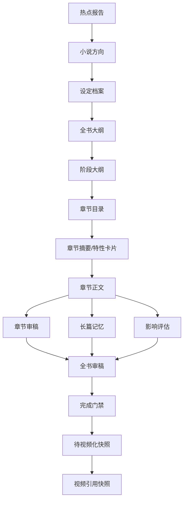

# 资产采用与过期副作用矩阵

本文档补齐 `GAP-P1-010`：统一小说关键资产从候选版本到当前版本的采用规则，以及采用后需要标记哪些下游产物过期、触发哪些检查、刷新哪些门禁和推荐动作。

本文档只定义需求级契约，不讨论具体代码实现。

## 核心结论

采用候选版本不是简单把 `isCurrent` 改成 true。它通常会引发一组副作用：

- 当前版本切换。
- 旧版本进入历史。
- 候选版本决策记录写入。
- 下游候选、审稿报告、门禁或快照过期。
- 推荐动作重算。
- 可能触发影响评估、长篇记忆同步或视频引用异常。

后续任何“采用”“恢复”“强制继续”“清空后续章节”“确认待视频化”都必须按本文档进行前置校验和副作用处理。

## 统一资产采用服务

所有会改变关键创作资产当前版本的动作，都必须走统一资产采用服务或等价的业务编排层，不能由各模块直接修改版本状态。

统一资产采用服务负责：

1. 校验小说生命周期、权限、当前阶段、冲突任务和用户看到的当前版本。
2. 校验候选版本、历史版本或目标快照是否仍可被采用。
3. 校验并记录高风险原因、确认项和决策记录。
4. 切换版本状态，保证同一对象同一资产类型只有一个 `current`。
5. 将旧当前版本、同对象其他候选和下游产物按规则标记为历史、放弃或过期。
6. 创建必要的影响评估、章节复审、全书审稿、长篇记忆同步、视频引用复查任务。
7. 写操作日志、任务事件和影响快照。
8. 调用统一状态摘要服务重新计算展示状态、门禁和推荐动作。
9. 返回新的状态摘要、受影响对象摘要和用户下一步动作。

以下动作必须接入统一资产采用服务：

- 采用方向、设定、大纲、章节目录、章节卡片、章节正文候选。
- 放弃候选、继续优化候选、低分强制采用。
- 手动编辑保存为当前版本。
- 恢复历史版本。
- 确认中等或严重影响无问题。
- 清空后续章节。
- 确认小说完成后刷新待视频化检查。
- 确认待视频化并生成待视频化快照。

禁止出现以下实现口径：

- 前端或普通接口直接传一个版本 ID，让后端把它改成当前版本。
- 某个模块只切换当前版本，不处理下游过期和推荐动作重算。
- worker 在用户未确认的情况下把候选结果直接变成当前正式资产。
- 高风险动作没有决策记录，只写普通日志。

## 统一采用动作契约

每次采用候选版本或恢复历史版本，必须满足：

| 项目 | 要求 |
| --- | --- |
| 版本校验 | 用户看到的当前版本仍然是最新当前版本 |
| 候选校验 | 候选未被放弃、未被其他候选替代、未强过期 |
| 门禁校验 | 当前小说生命周期允许操作，且无冲突任务 |
| 风险展示 | 展示评分变化、关键事实变化、影响范围和视频引用影响 |
| 决策记录 | 写入采用、放弃、继续优化或强制继续记录 |
| 操作日志 | 高风险操作必须写入操作日志 |
| 副作用处理 | 按矩阵标记下游过期或触发检查 |
| 推荐动作 | 采用完成后重新计算状态和推荐动作 |

高风险采用必须填写或选择原因：

- 低分候选仍采用。
- 评分未提升仍采用。
- 候选改变关键事实。
- 候选基于旧上游版本。
- 候选影响后续章节或视频引用。
- 恢复历史版本。
- 清空后续章节。

## 依赖链

小说关键资产依赖关系如下：



上游当前版本变化后，下游不一定全部删除，但必须判断是否过期。

## 资产采用副作用矩阵

| 资产 | 采用前置条件 | 采用后直接副作用 | 需要标记过期的对象 | 是否触发额外检查 |
| --- | --- | --- | --- | --- |
| 小说方向 | 有方向候选；低分或高原创化风险已确认 | 旧方向变历史；新方向成为当前方向；进入设定阶段 | 旧设定候选、方向审稿、基于旧方向的设定/大纲候选 | 方向变化大时提示重新生成设定 |
| 设定档案 | 当前方向有效；设定候选完整；风险已确认 | 旧设定变历史；新设定成为当前设定；允许生成大纲 | 全书大纲候选、阶段大纲候选、章节目录候选、试写、章节正文、审稿、全书门禁、视频化快照 | 已有下游内容时触发影响评估或下游重审提示 |
| 全书大纲 | 当前设定有效；大纲候选通过结构校验 | 旧大纲变历史；新大纲成为当前大纲；允许生成阶段大纲 | 阶段大纲、章节目录、试写、章节正文、全书审稿、完成门禁、视频化快照 | 已有正文时需影响评估 |
| 阶段大纲 | 当前全书大纲有效；阶段范围合理 | 旧阶段大纲变历史；新阶段大纲成为当前版本；允许生成章节目录 | 章节目录、章节卡、试写、章节正文、全书审稿、视频化快照 | 阶段范围变化时需影响评估 |
| 章节目录 | 当前阶段大纲有效；每章字段完整 | 旧章节目录变历史；新目录成为当前版本；创建或刷新章节计划 | 章节卡、试写、章节正文、章节审稿、全书审稿、完成门禁、视频化快照 | 已有正文时需影响评估 |
| 章节摘要/特性卡片 | 当前章节目录有效；卡片字段完整 | 旧卡片变历史；新卡片成为当前卡片 | 基于旧卡片的正文候选、章节审稿、全书审稿 | 关键事实变化时需影响评估 |
| 章节首次正文 | 当前章节卡有效；章节当前无正式正文；任务未过期 | 新正文成为当前正文；生成章节摘要；触发章节审稿；更新长篇记忆 | 全书审稿、完成门禁、视频化快照 | 可自动触发章节审稿和记忆同步 |
| 章节重写正文 | 当前章节有正式正文；候选未过期；风险已确认 | 旧正文变历史；候选正文成为当前正文 | 章节审稿、长篇记忆、全书审稿、完成门禁、视频化快照、相关视频引用 | 必须触发章节复审、长篇记忆同步和影响评估 |
| 手动编辑正文 | 用户保存为新版本；关键事实变化已提示 | 旧正文变历史；新正文成为当前正文 | 章节审稿、长篇记忆、全书审稿、完成门禁、视频化快照、相关视频引用 | 根据差异触发影响评估 |
| 恢复历史正文 | 用户确认恢复；影响范围已展示 | 历史版本复制成新当前版本；当前版本变历史 | 章节审稿、长篇记忆、影响评估、全书审稿、视频化快照、相关视频引用 | 必须触发影响评估 |
| 章节审稿报告 | 当前正文有效；审稿任务未过期 | 新报告保存为最新审稿 | 旧章节审稿显示为历史；全书审稿可能需要重算 | 低分时标记章节待处理 |
| 影响评估报告 | 当前章节正文变化后生成 | 报告自动保存；影响案例状态更新 | 全书审稿、完成门禁、视频化快照 | `medium/severe` 阻塞完成 |
| 长篇记忆 | 基于当前正式正文生成 | 新记忆成为当前记忆 | 基于旧记忆的后续章节任务上下文 | 关键事实冲突时触发影响评估 |
| 试写总评 | 试写章节、摘要、审稿完整 | 总评自动保存；试写门禁更新 | 基于旧试写结论的批量生成策略 | 低分继续必须填原因 |
| 全书审稿报告 | 全部章节当前有效；无未关闭影响 | 报告自动保存；生成或刷新完成门禁 | 旧完成门禁、旧视频化快照 | 低分或强阻塞影响完成确认 |
| 完成门禁 | 最新全书审稿有效 | 生成完成门禁结果；进入完成确认 | 旧视频化快照 | 通过后仍需用户确认完成 |
| 完成确认记录 | 完成门禁允许；用户确认风险 | 小说进入待视频化候选；写完成决策记录 | 无效旧待视频化检查 | 触发视频化检查 |
| 待视频化快照 | 完成确认有效；视频化检查通过 | 保存引用可用范围和风险摘要；进入 `video_ready` | 旧视频化快照、旧视频引用可用性 | 创建视频项目前需版本校验 |
| 视频引用快照 | 小说处于可视频化；引用范围有效 | 保存章节版本、审稿报告和风险摘要 | 无 | 小说后续修改时触发引用异常 |

## 过期等级

过期不是只有“可用/不可用”两类。建议分为三级：

| 等级 | 含义 | 默认处理 |
| --- | --- | --- |
| `soft_stale` | 上游轻微变化，结果可能仍可参考 | 可查看，不推荐直接采用 |
| `hard_stale` | 上游关键版本变化，结果不应采用 | 默认禁用采用，只能重新生成 |
| `risk_stale` | 结果可采用但风险明显，需要强确认 | 可强制采用，必须填写原因并触发检查 |

示例：

- 修正错别字导致旧章节审稿 `soft_stale`。
- 设定核心事实变化导致旧大纲候选 `hard_stale`。
- 章节正文轻微润色后旧视频化快照 `risk_stale`。

## 采用后副作用处理顺序

采用动作需要按以下顺序形成一致结果：

1. 校验小说生命周期、权限、版本和候选状态。
2. 校验是否存在冲突任务。
3. 写入用户决策原因和风险确认。
4. 切换当前版本。
5. 将旧当前版本标记为历史。
6. 将同对象其他未采用候选标记为历史或过期。
7. 标记下游候选、审稿、门禁和快照过期。
8. 创建必要的影响评估、审稿、记忆同步或视频引用检查任务。
9. 写操作日志和任务事件。
10. 重新计算展示状态和推荐动作。

如果任一关键步骤失败，不能出现“版本已切换但副作用没做”的半完成状态。需求上要求这些步骤具备原子口径，具体实现方式后续由后端设计。

## 下游过期规则

### 方向变化

当前方向变化后：

- 设定候选过期。
- 方向审稿报告过期。
- 若已有设定、大纲或正文，必须提示影响范围。
- 默认不自动清空下游内容。

### 设定变化

当前设定变化后：

- 全书大纲、阶段大纲、章节目录候选过期。
- 试写和正文需要影响评估。
- 全书审稿和完成门禁过期。
- 视频化快照过期。

### 大纲或阶段变化

当前大纲或阶段大纲变化后：

- 章节目录候选过期。
- 已生成正文需要影响评估。
- 全书审稿和完成门禁过期。
- 视频化快照过期。

### 章节目录变化

当前章节目录变化后：

- 章节卡片候选和正文生成任务上下文过期。
- 已生成正文需要影响评估。
- 试写总评、全书审稿和完成门禁过期。
- 视频化快照过期。

### 章节正文变化

当前章节正文变化后：

- 当前章节审稿过期。
- 长篇记忆需要同步。
- 若后续章节已生成，需影响评估。
- 全书审稿和完成门禁过期。
- 若章节已被视频引用，触发视频引用异常。

### 审稿策略变化

审稿策略版本变化后：

- 历史审稿报告不改写。
- 新任务使用新策略版本。
- 如果策略升级为更严格且影响待视频化检查，可要求重新审稿。
- 页面需要能解释历史报告使用的策略版本。

## 高风险副作用矩阵

| 操作 | 必须二次确认 | 必须填写原因 | 必须写操作日志 | 必须重新计算推荐动作 |
| --- | --- | --- | --- | --- |
| 低分候选仍采用 | 是 | 是 | 是 | 是 |
| 评分未提升仍采用 | 是 | 是 | 是 | 是 |
| 采用过期候选 | 是 | 是 | 是 | 是 |
| 修改关键设定 | 是 | 是 | 是 | 是 |
| 恢复历史版本 | 是 | 是 | 是 | 是 |
| 清空后续章节 | 是 | 是 | 是 | 是 |
| 手动确认中等/严重影响无问题 | 是 | 是 | 是 | 是 |
| 强制通过试写或全书审稿 | 是 | 是 | 是 | 是 |
| 修改已被视频引用章节 | 是 | 是 | 是 | 是 |
| 确认忽略视频引用异常 | 是 | 是 | 是 | 是 |

## 决策记录契约

每次候选采用、放弃、继续优化或强制继续，必须形成决策记录。

建议决策字段至少包括：

```text
decision
decisionReason
decisionNote
candidateVersionId
currentVersionIdBefore
currentVersionIdAfter
scoreBefore
scoreAfter
riskLevel
impactLevel
isForced
isStaleCandidate
createdBy
createdAt
```

`decision` 建议值：

- `adopted`
- `discarded`
- `continued_optimization`
- `regenerated`
- `forced_continue`
- `returned_to_upstream`
- `confirmed_no_impact`
- `ignored_video_reference_issue`

## 接口行为契约

采用类接口必须符合以下需求：

- 请求必须带用户看到的当前版本 ID。
- 请求必须带候选版本 ID 或目标历史版本 ID。
- 请求必须带决策原因，若为高风险操作。
- 后端必须重新校验候选是否过期。
- 后端必须重新校验是否存在冲突任务。
- 后端必须返回采用后的状态摘要和推荐动作。
- 如果采用失败，必须返回可解释失败原因，例如版本已变化、候选已过期、存在冲突任务。

不建议前端直接调用“改当前版本 ID”的通用接口。所有当前版本切换都应该通过业务动作完成。

## 验收口径

- 采用方向后，旧设定候选不会继续被推荐。
- 采用设定后，旧大纲候选能提示过期。
- 采用大纲或章节目录后，已生成正文不会被静默覆盖。
- 采用章节重写后，会触发章节复审、长篇记忆同步和影响评估。
- 章节正文变化后，全书审稿和视频化快照会过期。
- 已被视频引用章节变化后，视频引用异常会出现。
- 低分、过期或高风险候选采用必须有原因记录。
- 放弃候选后，候选保留历史，但不阻塞主流程。

## 和其他模块的关系

- AI 产物确认：`docs/modules/ai-artifact-confirmation.md`
- 版本管理：`docs/modules/novel-version-management.md`
- 状态、门禁、推荐动作：`docs/modules/novel-state-gate-action-contract.md`
- 章节影响处理：`docs/modules/chapter-rewrite-impact-handling.md`
- 视频引用异常：`docs/modules/video-reference-exceptions.md`
- 任务并发与批量任务：`docs/modules/novel-task-concurrency-contract.md`
