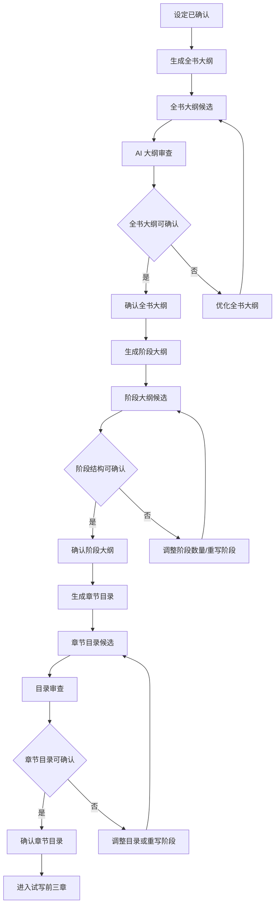

# 大纲三层结构交互

本文档补齐 `GAP-P0-008`：设定档案确认后，系统如何生成、展示、调整、确认全书大纲、阶段大纲和章节目录。

大纲不是正文，也不是简单标题列表。它是长篇小说的结构骨架，用来保证 30-100 章内主线清楚、冲突升级、爽点持续、人物不崩、伏笔可回收。

全书大纲、阶段大纲和章节目录需要按 `docs/modules/novel-hit-content-integration-matrix.md` 补齐阶段爽点升级、冲突去重、情绪峰值、伏笔路线、章节痛点、反击、爽点、钩子和情绪承诺等内容质量字段。

## 三层结构

大纲分三层：

1. 全书大纲：确定整本书讲什么、主角走向、核心冲突和终局回报。
2. 阶段大纲：把全书拆成多个阶段/分卷，规划每个阶段的目标、冲突升级和伏笔节奏。
3. 章节目录：把阶段目标拆到每一章，明确每章剧情目标、冲突、爽点、人物、场景、钩子和伏笔操作。

硬规则：

- 设定档案未确认前，不能生成全书大纲。
- 全书大纲未确认前，不能生成阶段大纲。
- 阶段大纲未确认前，不能生成章节目录。
- 章节目录未确认前，不能试写前三章。
- 三层结构都属于关键结构资产，默认候选待确认。

## 生命周期



## 全书大纲

全书大纲回答整本小说的主问题。

### 字段

- 一句话主线。
- 故事开局。
- 主角起点。
- 主角成长终点。
- 核心矛盾。
- 主要反派或长期阻力。
- 核心爽点升级方式。
- 长线伏笔。
- 中期反转。
- 终局高潮。
- 结局方向。
- 目标章节数。
- 推荐阶段数量。
- 长篇支撑理由。
- 市场和视频化风险。

### 生成规则

- 输入必须引用当前正式设定版本。
- 目标章节数来自创建偏好或小说配置，系统上限为 100 章。
- 系统需要判断大纲是否能支撑目标章节数。
- 大纲不能只写短篇故事骨架，必须给出长期冲突和阶段升级空间。
- 生成结果进入候选待确认。

### 确认规则

确认前展示：

- 全书一句话主线。
- 章节规模和推荐阶段数量。
- 主角成长线。
- 核心冲突和终局回报。
- 长篇支撑评分。
- 核心风险。
- 采用后下一步。

确认后：

- 当前全书大纲版本被锁定。
- 小说阶段仍处于大纲域，但推荐动作变为“生成阶段大纲”。
- 阶段大纲生成任务必须基于当前全书大纲版本。

## 阶段大纲

阶段大纲把全书拆成多个阶段，让长篇结构可控。

### 阶段数量推荐

| 目标章节数 | 推荐阶段数 | 说明 |
| --- | --- | --- |
| 30 章以内 | 3-4 个阶段 | 避免结构过碎 |
| 30-60 章 | 4-5 个阶段 | 适合中篇推进 |
| 60-100 章 | 5-8 个阶段 | 适合长篇持续升级 |
| 100 章 | 默认 6 个阶段 | 兼顾展开空间和小白理解成本 |

规则：

- 小白模式由系统推荐阶段数量。
- 高级模式允许手动调整阶段数量。
- 阶段数量不合理时必须提示风险，例如阶段太少导致中后期重复，阶段太多导致每阶段目标过碎。
- 调整阶段数量后，系统需要重新分配章节范围、阶段目标、冲突升级和伏笔节奏。

### 阶段字段

每个阶段需要包含：

- 阶段序号。
- 阶段名称。
- 覆盖章节范围。
- 阶段目标。
- 阶段核心冲突.
- 主要出场人物。
- 阶段反派或阻力。
- 阶段爽点。
- 情绪节奏。
- 阶段结尾钩子。
- 需要埋下的伏笔。
- 需要推进的伏笔。
- 需要回收的伏笔。
- 与下一阶段的衔接。
- 阶段风险。

### 调整阶段数量

调整阶段数量属于高影响操作。

用户调整前需要看到：

- 原阶段数量和新阶段数量。
- 原章节范围和新章节范围。
- 可能受影响的章节目录。
- 是否已有正文或视频引用。

处理规则：

- 章节目录未确认且没有正文时，可以生成新的阶段候选。
- 章节目录已确认但未生成正文时，需要标记旧章节目录候选过期或生成新目录候选。
- 已生成正文时，需要影响评估，不能静默重排章节。
- 已有视频引用时，需要提示可能导致视频引用异常。

## 章节目录

章节目录是正文生成前的最后结构层。

### 章节目录项字段

每章必须包含：

- 章节序号。
- 章节标题。
- 所属阶段。
- 字数目标。
- 本章剧情目标。
- 本章核心冲突。
- 本章爽点。
- 出场人物。
- 关键场景。
- 人物变化。
- 关系变化。
- 关键信息。
- 结尾钩子。
- 伏笔操作：埋伏笔、推进伏笔、回收伏笔或无。
- 不能改变的剧情事实。
- 生成正文时的注意事项。

规则：

- 章节目录不能只生成标题。
- 每章都要有推进，不能连续水剧情。
- 每章至少有一个冲突、爽点、情绪点或关键信息推进。
- 相邻章节不能重复同一个冲突套路。
- 关键伏笔需要标记埋设、推进和回收位置。

### 目录确认

确认前展示：

- 总章节数。
- 阶段分布。
- 每阶段章节范围。
- 前 3 章看点。
- 低质量或重复章节提醒。
- 章节目录审查结论。
- 采用后下一步：试写前 1-3 章。

确认后：

- 章节目录版本被锁定。
- 创建或更新章节规划项。
- 为每章准备生成章节摘要/特性卡片的输入。
- 小说进入 `trial` 阶段，推荐动作变为“试写前三章”。

## 审查规则

大纲和章节目录生成后都需要 AI 审查。

审查维度：

- 是否支撑目标章节数。
- 阶段之间是否有升级。
- 主角目标是否持续清晰。
- 反派或阻力是否持续增强。
- 爽点密度是否合理。
- 是否存在连续水剧情。
- 是否存在人设冲突。
- 是否存在设定冲突。
- 伏笔是否能回收。
- 章节之间是否断裂。
- 前 3 章是否有足够吸引力。
- 是否适合后续 TTS 和短视频切片。

审查结果：

- 自动保存审查报告。
- 生成 1-3 个核心问题卡片。
- 低于阻塞阈值时，大纲阶段进入 `blocked`。
- 通过但有轻微风险时，允许确认，但风险进入章节生成约束。

## 局部重写

局部重写用于修复某个阶段或某批章节目录，不必每次重生成整本大纲。

### 可局部重写对象

- 全书大纲的某个字段，例如中期反转或终局高潮。
- 某个阶段大纲。
- 某个阶段下的章节目录。
- 某几章的章节目标和冲突。

### 规则

- 局部重写结果必须进入候选版本。
- 采用前需要展示和当前版本的差异。
- 如果局部重写改变阶段目标、核心冲突、人物关系、伏笔或章节范围，需要影响评估。
- 已生成正文时，不能直接采用会破坏正文基础的目录变化。
- 局部重写应优先保持上下游兼容，减少对已确认内容的破坏。

## 版本和过期规则

全书大纲、阶段大纲、章节目录都要版本化。

过期规则：

- 设定版本变化后，当前大纲候选需要标记过期。
- 全书大纲变化后，阶段大纲和章节目录候选需要标记过期。
- 阶段大纲变化后，章节目录候选需要标记过期。
- 章节目录变化后，章节摘要/特性卡片和未采用正文候选需要标记过期。
- 已确认正文存在时，过期不等于删除，必须进入影响评估或人工确认。

用户强制采用过期候选时，必须填写原因。

## 推荐动作

| 场景 | 主推荐动作 | 点击结果 |
| --- | --- | --- |
| 设定已确认但无全书大纲 | 生成全书大纲 | 创建 `novel_outline_generate` 任务 |
| 全书大纲生成中 | 查看生成进度 | 打开任务抽屉 |
| 全书大纲候选待确认 | 确认全书大纲 | 打开确认抽屉 |
| 全书大纲审查不通过 | 优化全书大纲 | 打开问题抽屉或创建优化任务 |
| 全书大纲已确认但无阶段大纲 | 生成阶段大纲 | 创建 `stage_outline_generate` 任务 |
| 阶段大纲候选待确认 | 确认阶段大纲 | 打开阶段确认抽屉 |
| 阶段数量不合理 | 调整阶段数量 | 打开阶段数量调整抽屉 |
| 阶段大纲已确认但无章节目录 | 生成章节目录 | 创建 `chapter_plan_generate` 任务 |
| 章节目录候选待确认 | 确认章节目录 | 打开目录确认抽屉 |
| 章节目录审查不通过 | 调整章节目录 | 进入大纲管理区 |
| 章节目录已确认 | 试写前三章 | 创建试写任务 |

任务动作优先于阶段动作。

## 数据与版本

### NovelOutlineVersion

```text
id
tenantId
novelId
settingVersionId
versionNo
status
mainline
opening
protagonistStart
protagonistEndpoint
coreConflict
mainAntagonist
appealUpgradePlan
longForeshadowing
midpointReversal
finalClimax
endingDirection
targetChapterCount
recommendedStageCount
reviewReportId
sourceTaskId
score
longFormScore
riskLevel
isCurrent
isAccepted
createdBy
createdAt
```

### StageOutlineVersion

```text
id
tenantId
novelId
outlineVersionId
versionNo
status
stageCount
stages[]
reviewReportId
sourceTaskId
score
riskLevel
isCurrent
isAccepted
createdBy
createdAt
```

`stages[]` 中每个阶段包含阶段序号、名称、章节范围、阶段目标、冲突、人物、反派、爽点、钩子、伏笔和衔接。

### ChapterPlanVersion

```text
id
tenantId
novelId
outlineVersionId
stageOutlineVersionId
versionNo
status
targetChapterCount
items[]
reviewReportId
sourceTaskId
score
riskLevel
isCurrent
isAccepted
createdBy
createdAt
```

`items[]` 中每章包含章节标题、阶段、字数目标、剧情目标、冲突、爽点、人物、场景、钩子、伏笔操作和不能改变的事实。

## 接口边界

建议接口：

- `POST /novels/:novelId/outlines/generate`：生成全书大纲。
- `POST /novels/:novelId/outlines/:versionId/adopt`：确认全书大纲。
- `POST /novels/:novelId/outlines/:versionId/optimize`：优化全书大纲。
- `POST /novels/:novelId/stage-outlines/generate`：生成阶段大纲。
- `POST /novels/:novelId/stage-outlines/:versionId/adopt`：确认阶段大纲。
- `POST /novels/:novelId/stage-outlines/:versionId/adjust-stage-count`：调整阶段数量。
- `POST /novels/:novelId/chapter-plans/generate`：生成章节目录。
- `POST /novels/:novelId/chapter-plans/:versionId/adopt`：确认章节目录。
- `POST /novels/:novelId/chapter-plans/:versionId/optimize`：优化章节目录。
- `POST /novels/:novelId/outlines/:objectType/:versionId/impact-assess`：评估大纲或目录修改影响。

规则：

- 不能通过普通 PATCH 直接修改当前正式大纲或章节目录。
- 采用接口必须做版本校验、状态校验、幂等控制。
- 高风险确认必须提交原因。
- 列表页不加载完整章节目录，章节目录详情按需加载。

## 完成判断

大纲三层结构可以进入试写阶段，必须满足：

- 已有当前正式全书大纲版本。
- 已有当前正式阶段大纲版本。
- 已有当前正式章节目录版本。
- 三层结构都基于当前正式设定版本。
- 章节目录总数和目标章节数一致。
- 每章必要字段完整。
- 已完成大纲/目录审查，或策略允许用户确认风险。
- 没有进行中的大纲任务。
- 没有未处理的高风险确认。
- 推荐动作已刷新为“试写前三章”。

## 原型设计要求

后续画原型时至少覆盖：

- 全书大纲确认抽屉。
- 阶段大纲列表和阶段数量调整抽屉。
- 章节目录表格。
- 大纲审查问题卡片。
- 局部重写某阶段入口。
- 过期候选提示。
- 已有正文时修改大纲的影响提示。
- 大纲版本列表和版本对比入口。

大纲页面的核心不是让用户手写复杂大纲，而是让用户确认“这个结构能不能支撑后续生成好看的章节”。
