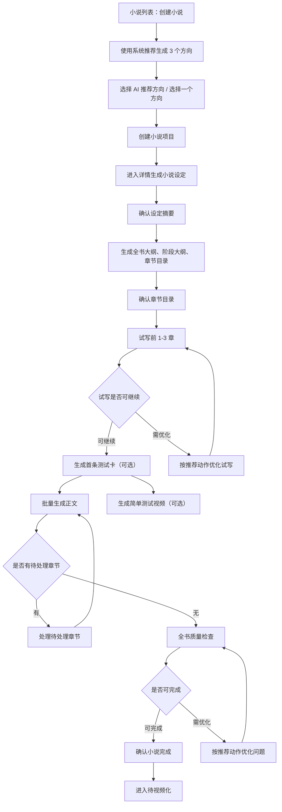

# P0 可见主流程与完整能力分层

本文档用于承接产品、后端、测试三类评审后的需求修订结论。

本次修订不讨论研发分期，也不定义实现计划。它只解决一个需求问题：P0 能力已经比较完整，但小白用户默认不应该看到全部复杂能力。小说系统需要把“完整能力”与“默认可见主流程”分开设计。

## 核心结论

P0 设计方向成立，但默认体验需要更轻。

小说系统的完整能力可以包含状态机、AI 任务、候选版本、影响评估、全书审稿、待视频化快照、版本记录和复盘数据；但小白用户默认只需要看到：

- 当前小说进行到哪一步。
- 系统建议下一步点什么。
- 当前有没有必须处理的问题。
- 问题能不能一键处理。
- 是否可以进入视频化。

因此，P0 的产品表达应分为两层：

| 层级 | 作用 | 用户感知 |
| --- | --- | --- |
| 默认可见主流程 | 带小白从创建小说走到待视频化 | 简单、连续、每次只做一件事 |
| 完整能力承载层 | 支撑调试、版本、影响、复盘和异常处理 | 只有遇到问题或用户主动展开时进入 |

一句话原则：小说列表是驾驶舱，详情工作台和章节工作台是维修间；列表负责发现问题和进入详情，详情负责具体处理。

## P0 原型验收硬规则

后续画原型时，以下规则作为 P0 小白体验的硬验收。只要不满足，就说明原型把完整后台复杂度外溢到了小白主流程。

| 验收项 | 必须满足 |
| --- | --- |
| 默认入口 | 登录后默认进入小说列表，不先进入工作台大屏或配置页 |
| 列表主操作 | 每本小说列表行同一时刻只突出“详情”主按钮 |
| 推荐动作 | 推荐动作在详情页、章节页或任务入口中突出展示 |
| 创建方向 | 默认只生成 3 个方向，主按钮优先是“使用 AI 推荐方向” |
| 审稿展示 | 默认只展示总分、一句话结论、Top 3 问题和一个推荐动作 |
| 章节工作台 | 首期默认只展示正文、问题卡、新改稿、影响摘要和任务状态 |
| 内部状态 | 不直接展示 `pending`、`blocked`、`waiting_confirmation` 等机器状态 |
| 高级内容 | 完整版本树、任务事件、模型、提示词、token 和成本默认隐藏 |
| 异常处理 | 每个失败或阻塞提示都要说明“影响什么”和“下一步点什么” |

## 默认小白主路径

小白用户的最短主路径应保持固定，不让用户在专业概念里绕路。

默认主路径中，用户不需要理解：

- 候选版本的完整版本树。
- 模型、提示词、token、成本。
- 完整审稿维度。
- 完整影响评估明细。
- 任务事件日志。
- 数据复盘和学习信号。

这些内容仍可被系统记录和在高级入口展示，但不应该阻断小白对主流程的理解。

试写后的“首条测试卡”是运营验证入口，不代表小说已经正式进入待视频化。用户可以跳过测试卡继续批量生成正文；也可以先用试写章节生成一条简单测试视频，用于验证标题、前 3 秒旁白、首屏字幕和题材吸引力。

## 创建小说边界

创建小说页面负责完成“方向确认”，不是只创建一个空项目。

默认规则：

- 用户可以零专业输入，只点“系统推荐”。
- 系统默认生成 3 个方向，高级入口才允许 5 个方向或更多自定义。
- 创建页完成方向选择后，才算创建小说项目。
- 创建完成后回到小说列表，新小说行高亮；列表主按钮仍是“详情”，进入详情后默认推荐动作为“生成小说设定”。

状态表达规则：

- `draft` 和 `direction` 可以作为创建向导内部状态或草稿状态存在。
- 对小白用户来说，正式小说项目从“待生成设定”开始推进。
- 小说列表不应让小白在“待生成方向”和“待选择方向”之间困惑，除非用户离开了未完成的创建向导。

## 页面承载边界

### 小说列表：驾驶舱

小说列表负责告诉用户哪些小说需要处理，并提供进入详情的稳定入口。

默认展示：

- 小说名称。
- 小说状态。
- 简化进度。
- 当前质量分或风险标记。
- 待处理问题数量。
- 视频引用状态。
- 详情按钮。

列表不展示：

- 完整正文。
- 完整审稿报告。
- 完整版本记录。
- 完整任务事件。
- 完整模型和提示词信息。

### 抽屉和弹窗：轻量确认

抽屉和弹窗承载轻量决策。

适合放在抽屉或弹窗：

- 确认设定摘要。
- 确认大纲摘要。
- 查看试写总评摘要。
- 查看任务进度和失败原因。
- 接受风险继续。
- 确认进入待视频化。

不适合放在弹窗：

- 长正文编辑。
- 多版本对比。
- 多章节影响处理。
- 复杂全书问题调试。

### 小说详情工作台：维修间

小说详情工作台承载完整创作现场，但不是小白每天推进的默认入口。

进入场景：

- 用户主动点击小说名称查看完整信息。
- 列表推荐动作需要复杂处理。
- 全书审稿发现结构性问题。
- 需要查看版本、任务、视频引用或复盘。

默认进入详情时，也应先展示概览和当前推荐动作，而不是直接把所有区块铺开。

### 章节详情工作台：单章维修间

章节详情只处理单章问题。

进入场景：

- 章节低分。
- 章节待处理。
- 章节有候选版本待确认。
- 当前章重写可能影响后文。
- 已视频引用章节发生修改。

默认展示：

- 当前正文。
- 一句话问题结论。
- Top 3 问题。
- 一个主推荐动作。

完整版本对比、影响明细和历史记录默认折叠。

## 复杂能力的可见性规则

以下能力属于 P0 完整能力，但不默认暴露给小白。

| 能力 | 默认展示 | 展开条件 |
| --- | --- | --- |
| 完整审稿维度 | 总分、评级、Top 3 问题、推荐动作 | 用户点击“查看完整报告” |
| 候选版本 | 新改稿摘要、评分变化、采用/放弃 | 用户点击“对比正文” |
| 影响评估 | 会不会影响后面章节、推荐处理 | 中等/严重影响时展开明细 |
| 任务日志 | 当前步骤、进度、失败原因 | 高级入口或失败排查 |
| 模型和提示词 | 不展示 | 管理员/高级配置入口 |
| 成本和 token | 不展示或只展示风险提醒 | 成本统计入口 |
| 项目复盘 | 不默认展示 | 归档、完成后复盘或高级入口 |
| 视频引用异常明细 | 风险摘要和处理入口 | 用户点击查看异常 |

## 文案简化规则

系统内部可以使用专业概念，但用户可见文案要更通俗。

| 内部概念 | 小白文案 |
| --- | --- |
| 完成门禁 | 完成前质量检查 |
| 影响评估 | 检查会不会影响后面章节 |
| 候选版本 | 新改稿 |
| 采用候选版本 | 使用这版改稿 |
| 强制继续 | 接受风险继续 |
| 全书审稿 | 全书质量检查 |
| 待视频化判定 | 检查是否可以做视频 |
| 章节状态 pending | 待处理 |
| 章节状态 resolved | 已处理，待确认 |
| 任务 waiting_confirmation | 等你确认结果 |

文案要求：

- 不直接把 `pending`、`blocked`、`waiting_confirmation` 等状态值显示给小白。
- 每个风险提示必须说明“影响什么”和“下一步点什么”。
- 每个低分结果必须给出一个最推荐动作。
- 每个高风险确认必须让用户知道能否回退。

## 审稿展示简化

审稿系统可以保留完整维度，但默认只展示四件事：

1. 总分和评级。
2. 一句话结论。
3. 最重要的 3 个问题。
4. 系统推荐动作。

默认不展示全部分项评分、权重、策略版本、模型信息。

低分处理：

- 低分但允许继续：展示“建议先优化，也可以接受风险继续”。
- 低分且不允许继续：展示“必须先处理这些问题”。
- 数据不完整或内容安全强风险：不提供接受风险继续。

## 章节影响展示简化

章节重写后，系统默认只告诉用户：

- 这次修改是否影响后面章节。
- 如果影响，影响大不大。
- 系统建议怎么处理。

展示规则：

| 影响等级 | 小白展示 |
| --- | --- |
| 无影响 | 没影响后面章节，可以继续 |
| 轻微影响 | 只影响摘要和记忆，系统已同步 |
| 中等影响 | 会影响后面几章，建议先处理这些章节 |
| 严重影响 | 会明显破坏后面剧情，需要选择处理方式 |

中等影响默认主按钮是“生成处理建议”或“处理受影响章节”。

严重影响展示三种选择，但文案要简单：

1. 后面章节重新生成。
2. 保留后面章节，逐章修正。
3. 返回修改当前章，让它兼容后面剧情。

## 视频化展示简化

待视频化不是小白需要理解的复杂状态。用户只需要知道：

- 这本小说是否可以做视频。
- 如果不可以，是哪里没处理完。
- 如果可以，去视频模块创建视频项目。

默认视频承接规则：

- 小说完成前不展示复杂视频创建入口。
- 完成前质量检查通过后，系统自动生成视频化检查摘要。
- 视频模块创建时默认使用推荐章节范围，完整范围选择放在高级入口。
- 已生成视频后，小说修改只提示“可能影响已生成视频”，不自动修改视频内容。

## P0 需求保留与降噪

### 必须保持为 P0 主流程

- 创建小说并确认方向。
- 生成并确认设定。
- 生成并确认大纲和章节目录。
- 试写前 1-3 章。
- 试写后生成首条测试卡，用户可选择先做简单测试视频。
- 批量生成正文。
- 章节待处理闭环。
- 全书质量检查。
- 确认小说完成。
- 检查是否可以做视频。

### P0 保留但默认隐藏

- 完整审稿报告。
- 完整版本对比。
- 影响评估明细。
- 任务事件时间线。
- 模型、提示词、成本摘要。
- 视频引用异常明细。
- 项目复盘。

### 不进入默认小白主流程

这些能力可以继续在完整产品蓝图中保留，但不进入小白默认主流程：

- 方向深度融合。
- 手动调整阶段数量。
- 局部重写阶段大纲。
- 批量生成受影响章节候选修正。
- 完整版本恢复。
- 多种视频引用范围复杂选择。
- 系统自我成长复盘。
- 模型效果对比和提示词策略调优。

## 需求验收口径提醒

为了避免后续原型和需求继续发散，后续补 P1 时需要优先明确：

- 质量评分默认阈值口径。
- 低分是否允许接受风险继续。
- `已处理，待确认` 是否阻塞全书质量检查。
- 推荐动作 `code` 枚举和每个动作的页面承载位置。
- 高风险操作的原因记录。
- 确认小说完成与检查是否可以做视频的关系。

这些仍属于需求设计，不是实现计划。它们会影响用户看到什么、能点什么、什么时候被系统阻止。
