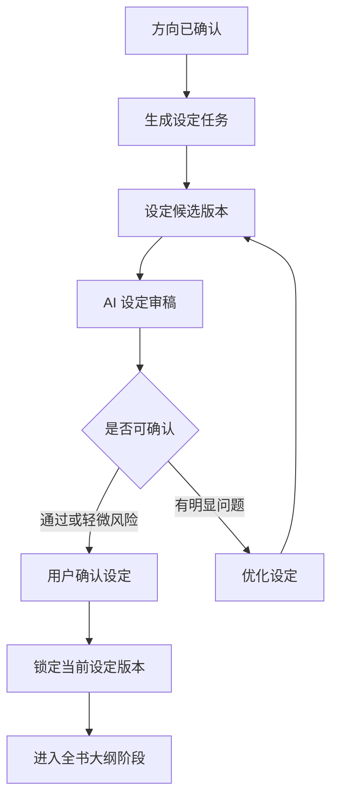

# 设定档案生成与确认

本文档补齐 `GAP-P0-007`：小说方向确认后，系统如何生成、展示、审稿、编辑、确认和锁定小说设定档案。

设定档案是后续全书大纲、阶段大纲、章节目录、章节正文、章节审稿和长篇记忆的基础规则。它不能只是一段文字，必须结构化保存，并能被后续任务稳定引用。

设定档案中的人设关系、爽点升级、故事圣经初始事实、伏笔计划、长篇风险和原创化约束，需要按 `docs/modules/novel-hit-content-integration-matrix.md` 的设定落点输出和审稿。

## 页面定位

设定档案位于小说详情工作台的“小说设定区”。小说列表只提供“详情”入口；生成设定、查看进度和确认设定都由小说详情页、详情页内任务抽屉或结果确认抽屉承接。

它解决三个问题：

- 这本小说到底写谁、写什么冲突、给读者什么爽点。
- 后续 30-100 章靠什么设定持续展开，不写崩。
- 哪些内容不能改，避免正文生成和重写时跑偏。

页面承接规则：

- 小说列表行只显示“详情”，不直接显示“生成设定”或“确认设定”主按钮。
- 进入小说详情后，如果小说处于 `setting/not_started`，顶部推荐动作显示“生成小说设定”。
- 设定生成中，详情页最近任务区和任务抽屉都要能查看进度。
- 设定候选待确认，详情页顶部推荐动作显示“确认小说设定”，点击后打开设定确认抽屉或定位到设定确认区。
- 设定确认后，小说阶段变为 `outline/not_started`，详情页推荐动作刷新为“生成全书大纲”。

## 生命周期



规则：

- 设定生成依赖已确认小说方向。
- 设定生成结果必须进入候选待确认，不能自动成为正式设定。
- 设定未确认前，不能生成全书大纲。
- 设定确认后，后续大纲、章节目录、章节正文和审稿都必须引用当前设定版本。
- 设定确认后再次修改关键事实，需要触发影响评估或下游同步提示。

## 生成输入

设定档案生成任务需要读取：

- 已确认小说方向。
- 热点报告和引用素材摘要。
- 用户创建偏好：题材、爽点、主角开局、目标读者、雷区。
- 目标章节数、每章字数范围、长篇规模。
- 市场导向程度、视频化倾向程度、内容安全策略。
- 禁用元素和平台风险规则。

输入必须是摘要和结构化字段，不直接把完整外部素材、完整提示词或敏感信息写入任务日志。

## 结构字段

设定档案分为摘要层和结构层。

### 摘要层

小白用户默认只看摘要层：

- 一句话设定。
- 主角是谁。
- 主角开局困境。
- 最大矛盾。
- 读者想追下去的理由。
- 主要爽点。
- 最大风险。
- 系统推荐动作。

摘要层要求：

- 用通俗话解释，不堆创作术语。
- 每项控制在短句或短段落。
- 明确告诉用户“能不能继续生成大纲”。
- 风险必须可操作，例如“主角目标不够强，建议优化主角欲望”。

### 基础信息

- 书名。
- 题材。
- 子题材。
- 目标读者。
- 核心卖点。
- 整体风格。
- 叙事视角。
- 情绪基调。
- 禁用内容和雷区。
- 平台风险提醒。

### 主角设定

- 姓名或代称。
- 性别和年龄段。
- 初始身份。
- 开局困境。
- 核心欲望。
- 外在目标。
- 内在缺口。
- 性格关键词。
- 能力、金手指或核心资源。
- 成长路线。
- 爽点触发方式。
- 不能违背的人设规则。

### 反派和阻力

- 主要反派。
- 阶段反派或阶段阻力。
- 反派动机。
- 反派资源。
- 反派压迫方式。
- 反派升级路线。
- 反派和主角的核心冲突。
- 不宜过早暴露的信息。

### 配角与关系

- 盟友。
- 情感线人物。
- 家人、师门、公司、组织或圈层。
- 背叛者。
- 工具型角色。
- 角色关系变化方向。
- 每个重要配角的作用。
- 不能随意改变的关系事实。

### 世界背景

- 时代背景。
- 地点和圈层。
- 权力结构。
- 商业规则、家族规则、修炼规则、系统规则或其他核心规则。
- 资源和利益分配方式。
- 主要场景。
- 世界规则边界。
- 不能打破的世界规则。

### 主线与阶段目标

- 全书主线目标。
- 前期目标。
- 中期目标。
- 后期目标。
- 终局目标。
- 主角成长终点。
- 反派压迫升级节奏。
- 长篇扩展空间。

### 爽点设计

- 主要爽点。
- 次要爽点。
- 爽点出现频率。
- 爽点升级方式。
- 禁止拖太久的憋屈点。
- 每阶段必须有的情绪回报。
- 短视频适合表达的爽点。
- 容易审美疲劳的风险。

### 伏笔与悬念

- 开局伏笔。
- 中期反转。
- 长线秘密。
- 终局回收点。
- 不宜提前揭开的秘密。
- 必须回收的伏笔。

### 文风和表达

- 语言风格。
- 节奏要求。
- 对话风格。
- 旁白适配要求。
- TTS 友好要求。
- 禁止过度使用的表达。
- AI 味风险提醒。

### 视频化预留

- 适合口播的核心卖点。
- 适合做标题的冲突点。
- 适合切片的高情绪场景。
- 可视化强的场景类型。
- 不适合视频化的复杂设定。
- 后续生成短视频时需要保留的内容。

## 确认页面

设定确认可以用抽屉或小说详情工作台分区承载。

### 小白确认视图

默认展示：

- 设定一句话总结。
- 质量评分。
- 市场潜力评分。
- 长篇可写性评分。
- 视频化评分。
- 核心设定摘要。
- 主要风险。
- 采用后下一步。
- 一个主推荐动作。

可选主推荐动作：

- 确认设定，进入大纲。
- 优化设定。
- 重新生成设定。
- 返回修改方向。

要求：

- 不要求小白逐项编辑设定。
- 风险文案必须说明“影响什么”和“建议怎么做”。
- 低分设定仍允许强制确认，但必须填写原因。

### 高级编辑视图

高级模式可展开：

- 主角设定。
- 反派和阻力。
- 配角关系。
- 世界背景。
- 主线和阶段目标。
- 爽点设计。
- 伏笔悬念。
- 文风表达。
- 视频化预留。

规则：

- 高级编辑不能直接覆盖正式设定，必须生成新候选版本。
- 每个关键字段允许“AI 解释：为什么这样设计”。
- 用户手动编辑后，需要重新生成摘要和风险提示。
- 关键事实变化后，需要重新审稿。

## 审稿规则

设定档案生成后建议自动触发设定审稿。

审稿维度：

- 主角目标是否清晰。
- 开局困境是否有吸引力。
- 核心冲突是否强。
- 反派或阻力是否足够。
- 爽点是否明确且可持续。
- 长篇扩展是否足够。
- 世界规则是否稳定。
- 人物关系是否有戏剧张力。
- 伏笔和悬念是否可回收。
- 是否适合短视频口播和切片。
- 是否存在内容安全或平台风险。
- 是否容易出现 AI 味或套路感。

审稿结果：

- 自动保存审稿报告。
- 生成 1-3 个核心问题卡片。
- 给出主推荐动作。
- 低于阻塞阈值时，设定阶段进入 `blocked`。
- 通过但有轻微风险时，可以确认，但风险进入后续大纲生成约束。

## 确认规则

设定档案采用 `docs/modules/ai-artifact-confirmation.md` 中的候选待确认规则。

确认前必须展示：

- 当前候选设定摘要。
- 审稿结论。
- 风险和建议动作。
- 采用后会进入全书大纲阶段。
- 如果已有大纲或章节，需要展示影响范围。

确认后系统必须：

- 将候选设定版本设为当前正式设定。
- 记录 `ArtifactDecisionRecord`。
- 记录当前设定版本号。
- 更新小说阶段为 `outline`，阶段状态为 `not_started`。
- 刷新小说列表推荐动作。
- 生成可用于大纲提示词的设定摘要。

高风险确认场景：

- 设定评分低于通过阈值。
- 长篇可写性不足。
- 主角目标不清晰。
- 反派或阻力太弱。
- 世界规则过复杂或不稳定。
- 明显不适合短视频化。
- 存在内容安全或平台风险。
- 采用基于旧方向版本生成的设定。

高风险确认必须填写或选择原因。

## 修改与影响

### 未确认设定

用户可以：

- 继续优化候选设定。
- 重新生成设定。
- 手动编辑后生成新候选。
- 放弃候选，返回方向阶段。

### 已确认设定

已确认设定属于正式创作资产。

允许修改，但必须生成新设定候选版本：

- 轻微修改：文风、摘要表达、非关键标签。
- 中等修改：人物关系、爽点频率、阶段目标、部分世界规则。
- 严重修改：主角目标、核心冲突、反派身份、能力规则、主线结局、禁用元素。

处理规则：

- 轻微修改可提示同步摘要和下游提示词约束。
- 中等修改需要评估大纲、章节目录和已生成章节是否受影响。
- 严重修改必须二次确认，并建议重新生成大纲或回到小说详情工作台处理影响。
- 如果已有视频引用，设定修改间接影响已引用章节时，需要提示视频引用风险。

## 推荐动作

| 场景 | 主推荐动作 | 点击结果 |
| --- | --- | --- |
| 方向已确认但无设定 | 生成小说设定 | 创建 `novel_setting_generate` 任务 |
| 设定生成中 | 查看生成进度 | 打开任务抽屉 |
| 设定候选待确认 | 确认小说设定 | 打开设定确认抽屉 |
| 设定审稿不通过 | 优化小说设定 | 打开设定问题抽屉或创建优化任务 |
| 设定候选过期 | 重新生成设定 | 基于当前方向创建新任务 |
| 设定已确认 | 生成全书大纲 | 创建大纲生成任务 |
| 已确认设定被修改 | 评估影响 | 创建影响评估或打开影响说明 |

任务动作优先于阶段动作。设定生成中，主按钮显示“查看生成进度”，不是“生成小说设定”。

## 数据与版本

建议设定档案保存为结构化版本。

### NovelSettingVersion

```text
id
tenantId
novelId
directionVersionId
versionNo
status
summary
basicInfo
protagonist
antagonists
supportingCharacters
worldBackground
mainPlot
appealDesign
foreshadowing
styleGuide
videoAdaptation
reviewReportId
sourceTaskId
score
marketScore
longFormScore
videoScore
riskLevel
isCurrent
isAccepted
createdBy
createdAt
```

规则：

- `status` 可表达候选、当前、历史、过期。
- `directionVersionId` 必须记录设定基于哪个方向版本生成。
- 设定确认时只切换 `isCurrent`，不覆盖旧版本。
- 设定版本摘要可进入小说列表和详情首屏，完整结构按需加载。

## 接口边界

建议接口：

- `POST /novels/:novelId/settings/generate`：生成设定档案。
- `GET /novels/:novelId/settings/current`：获取当前正式设定。
- `GET /novels/:novelId/settings/candidates`：获取候选设定列表。
- `GET /novels/:novelId/settings/:versionId`：获取设定版本详情。
- `POST /novels/:novelId/settings/:versionId/review`：发起设定审稿。
- `POST /novels/:novelId/settings/:versionId/adopt`：确认采用设定。
- `POST /novels/:novelId/settings/:versionId/discard`：放弃设定候选。
- `POST /novels/:novelId/settings/:versionId/optimize`：优化候选设定。
- `POST /novels/:novelId/settings/:versionId/impact-assess`：评估已确认设定修改影响。

规则：

- 不能通过普通 PATCH 直接修改当前正式设定。
- 采用设定必须做版本校验和幂等控制。
- 高风险确认必须提交原因。
- 设定详情接口不能返回完整提示词和完整模型响应。

## 完成判断

设定阶段可以进入全书大纲阶段，必须满足：

- 已有当前正式设定版本。
- 设定基于当前锁定方向版本生成。
- 必要字段完整。
- 已完成设定审稿，或策略允许用户确认风险。
- 没有进行中的设定任务。
- 没有未处理的高风险确认。
- 推荐动作已刷新为“生成全书大纲”。

## 原型设计要求

后续画原型时至少覆盖：

- 设定生成进度。
- 设定确认抽屉。
- 小白摘要视图。
- 高级编辑折叠区。
- 设定审稿问题卡片。
- 低分强制确认弹窗。
- 已确认设定修改影响提示。
- 设定版本列表和版本对比入口。

设定页面的核心不是让用户写设定，而是让用户判断“这个设定是否值得继续生成大纲和正文”。
