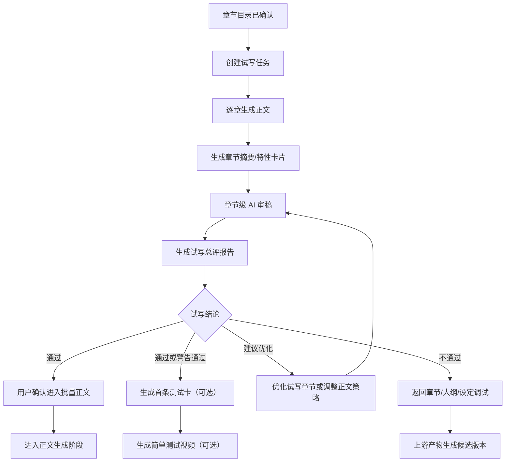

# 试写前三章调试闭环

本文档补齐 `GAP-P0-009`：章节目录确认后，系统如何先试写前 1-3 章，通过 AI 审稿和用户调试验证小说方向、开篇吸引力、文风、节奏和爽点，再决定是否进入批量正文生成。

试写不是“提前生成几章正文”这么简单。它是整本小说进入长篇生产前的质量闸口，目标是在成本较低时发现方向、设定、大纲和正文策略的问题。

试写总评需要引用 `docs/modules/novel-hit-content-planning.md` 中的开篇黄金段、前三章爽点兑现、前 1 分钟旁白风险和首条视频钩子标准，避免只用抽象的“开篇吸引力”判断是否可进入批量生成。具体字段、展示和低分动作按 `docs/modules/novel-hit-content-integration-matrix.md` 的试写总评落点执行。

试写阶段还需要支持“多开篇候选对比”和“首条测试卡”。多开篇候选用于避免只围绕一版平庸开头反复优化；首条测试卡用于在全书完成前验证标题、前 3 秒旁白、首屏字幕和开篇冲突是否有吸引力。

## 设计目标

- 让小白用户先看到真实正文效果，而不是只看抽象大纲。
- 用前 1-3 章验证开篇是否抓人、爽点是否成立、文风是否可持续。
- 低成本暴露问题，避免一次性生成几十章后才发现不好看。
- 把试写中有效的生成策略沉淀到后续批量正文生成。
- 给用户一个明确结论：通过、建议优化、必须调整、建议回到上游。

## 前置条件

进入试写前必须满足：

- 小说项目未暂停、未归档、未删除。
- 小说方向已确认。
- 小说设定档案已确认。
- 全书大纲、阶段大纲、章节目录已确认。
- 章节目录中至少存在前 3 章计划；若目标章节少于 3 章，则按实际章节数试写。
- 当前没有冲突的生成任务、审稿任务或上游结构候选版本。
- 模型、提示词模板和策略配置可用。

如果前置条件不满足，推荐动作不应显示“试写前三章”，而应引导用户回到缺失步骤。

## 试写范围

默认试写前 3 章。

可配置策略：

| 场景 | 建议试写章数 | 说明 |
| --- | --- | --- |
| 常规网文/短剧小说 | 3 章 | 足够验证开篇钩子、主角困境和第一个爽点 |
| 极短篇或测试项目 | 1 章 | 快速验证正文风格 |
| 强剧情长篇 | 3 章 | 建议不少于 3 章，避免只看开头误判 |
| 用户成本敏感 | 1-2 章 | 允许缩短，但系统要提示判断可信度下降 |

试写章数属于策略配置，小白默认使用系统推荐，高级模式允许调整。

## 多开篇候选

为了降低 AI 第一版开篇误判风险，高质量策略下建议为同一方向生成完整第 1 章候选。小白默认生成 3 个完整第 1 章候选，高级设置允许调整为 2、3 或 5 个；成本敏感或快速试错策略可以降为 1 个。

候选差异建议来自：

- 不同开篇钩子：身份反差、危机压迫、强羞辱、秘密揭露、反转承诺。
- 不同叙事入口：直接事件、冲突对话、主角困境、反派压迫。
- 不同旁白节奏：更短句、更强冲突、更少解释。

小白默认展示：

- 每个候选的一句话开篇看点。
- 完整第 1 章正文。
- 首句、前 300 字摘要和第 1 章结尾钩子。
- 前 1 分钟旁白风险。
- 横向评分：开篇钩子、主角吸引力、冲突强度、爽点前置、设定落地、AI 味、视频化潜力。
- AI 推荐候选和理由。

规则：

- 多开篇候选只在试写阶段使用，不直接进入全书正式正文。
- 用户选择某个候选后，该候选成为试写正文的基础版本，并用于生成第 2-3 章。
- 被选中的第 1 章候选不立即锁定为正式正文；只有第 1-3 章试写总评通过或用户确认风险继续后，才进入正式正文确认链路。
- 未采用候选保留为历史，不影响后续生成。
- 未采用候选默认只作为历史参考，不参与后续章节生成。

## 核心流程

## 试写任务

试写通常由一个父任务和多个子任务组成。

父任务：

- `trial_writing_generate`
- 绑定小说。
- 记录试写章数、目标字数、使用策略和输入摘要。
- 汇总子任务进度。

子任务：

- `chapter_body_generate`：生成单章正文。
- `chapter_review`：章节审稿。
- `trial_review`：生成试写总评。
- `long_memory_sync`：同步试写后的长篇记忆。

规则：

- 试写章节应按章节顺序生成，后一章需要读取前一章结尾和长篇记忆。
- 每章生成后都要生成章节摘要/特性卡片。
- 每章生成后都要审稿，不允许只生成正文不审稿。
- 试写总评必须读取试写章节正文、章节审稿、章节计划、设定档案和大纲。
- 任务失败时，保留已完成章节和审稿结果，用户可以重试失败章节或重新开始试写。

## 第 2-3 章衔接生成

用户选中完整第 1 章候选后，系统不应一次性无条件生成第 2-3 章。第 2 章需要先验证承接质量，避免第 1 章基础版本已经被选好但后续章节继续跑偏。

推荐流程：

1. 用户选择第 1 章候选，候选标记为 `selected_for_trial`。
2. 系统基于该候选、章节目录、设定档案和长篇记忆生成第 2 章。
3. 第 2 章生成后立即生成章节摘要/特性卡、单章审稿报告和第 1-2 章衔接检查。
4. 如果第 2 章没有硬失败，再生成第 3 章。
5. 第 3 章生成后同样生成章节摘要/特性卡和单章审稿报告。
6. 第 1-3 章全部完成后生成试写总评。

第 2 章硬失败时必须暂停，不继续生成第 3 章。硬失败包括：

- 第 2 章综合分低于 60。
- “承接第 1 章”低于 60。
- “主线连续性”低于 60。
- “人物一致性”低于 60。

普通低分不立即暂停，继续生成第 3 章，并由试写总评统一判断是否需要优化、重写或返回上游调整。

## 试写审稿维度

试写审稿分为单章审稿和试写总评。

### 单章审稿

沿用章节审稿规则，重点检查：

- 本章目标是否完成。
- 冲突是否清晰。
- 爽点是否出现。
- 人设是否符合设定。
- 结尾钩子是否足够。
- AI 味和废话是否明显。
- 是否适合后续视频旁白。

### 试写总评

试写总评必须给出以下维度：

| 维度 | 说明 |
| --- | --- |
| 开篇吸引力 | 前几段是否能让用户继续听或看 |
| 开篇黄金段 | 首句、前 300 字、前 1 分钟旁白和第一章结尾是否抓人 |
| 主角代入感 | 主角是否有清晰欲望、委屈感、行动力、反差和可追随性 |
| 核心爽点兑现 | 前 1-3 章是否兑现第一个可感知爽点 |
| 冲突强度 | 主角和反派/阻力的对抗是否成立 |
| 节奏密度 | 是否拖沓、解释过多或信息堆叠 |
| 文风稳定性 | 是否能持续写成长篇 |
| 设定落地度 | 设定是否自然进入正文 |
| 大纲匹配度 | 正文是否按章节计划推进 |
| AI 味风险 | 是否像模型堆词、套路话或空泛描述 |
| 视频化潜力 | 旁白是否顺畅，段落是否适合切短视频 |

## 评分动态调试机制

试写评分不能写死成不可追溯的固定规则。系统需要把评分标准设计为可版本化、可复盘、可调参的质量策略，让小说质量随着项目运营逐步提升。

每次评分必须记录：

- `scoringStrategyVersion`：评分策略版本。
- 各维度权重和通过/风险/阻塞阈值。
- 严重扣分规则和硬门槛。
- AI 评分提示词版本。
- 适用题材、目标人群和平台倾向。
- 每个分数的证据说明和扣分点。

第 1 章候选评分用于判断“是否适合作为继续试写基础”，不是抽象文学分。默认综合分按以下权重计算：

| 维度 | 权重 | 说明 |
| --- | --- | --- |
| 开篇钩子 | 20 | 首句、前 300 字是否马上抓人 |
| 主角吸引力 | 20 | 主角是否有痛点、目标、性格记忆点和代入感 |
| 冲突强度 | 15 | 第一章是否有明确压力、对手、损失和紧迫感 |
| 爽点前置 | 15 | 第一章内是否有反击、反转、情绪回报或期待兑现 |
| 设定落地 | 10 | 世界观或题材设定是否自然进入剧情 |
| AI 痕迹控制 | 10 | 是否少套路句、少空泛总结、少模板化转折 |
| 视频化潜力 | 10 | 是否适合首条短视频钩子、旁白和冲突切片 |

评分门禁：

- 综合分 80 及以上且无关键低分：可推荐继续试写。
- 综合分 70-79 或有关键低分：允许继续，但必须弹风险确认并填写原因。
- 综合分低于 70：不能直接继续，只能优化或重新生成。
- 开篇钩子、主角吸引力、冲突强度低于 60，或 AI 痕迹控制低于 50，都视为关键风险。

用户反馈需要作为后续调试信号记录：

- AI 推荐候选是否被采纳。
- 用户实际选择了哪一版候选。
- 未采纳原因，例如钩子弱、主角弱、AI 味重、节奏慢、不符合设定或个人偏好。
- 低分或风险继续的用户原因。
- 第 2-3 章生成表现和试写总评结果。
- 是否进入批量正文。

第一期只做“评分版本 + 评分证据 + 用户选择反馈 + 试写结果回流”的地基，不做自动学习和自动调权重。后续质量运营模块可以基于这些记录做评分复盘、人工调参和策略版本发布。

## 正文生成策略快照

试写通过或用户确认风险继续后，系统需要生成一份正文生成策略快照，作为后续批量正文生成的稳定输入。试写的价值不只是判断能不能继续，还要把前 1-3 章验证出来的写法沉淀下来，避免后续章节跑偏。

正文生成策略快照内部名建议为 `BodyGenerationStrategySnapshot`。

快照内容：

- 选中的第 1 章基础版本。
- 前 1-3 章剧情总结。
- 主角写法：性格、口头禅、行动倾向、情绪弧线。
- 爽点节奏：反击、奖励、反转和情绪回报的建议密度。
- 冲突写法：主要压迫源、升级方式和禁用套路。
- 文风规则：句子长短、旁白密度、对话比例和 AI 味禁区。
- 章节结尾规则：每章结尾需要保留的钩子类型。
- 长篇记忆：已发生事实、伏笔、人物关系和未兑现承诺。
- 风险项：试写阶段发现但暂时接受的问题。
- 加强复审规则：例如强制继续时前 10 章每章复审。

规则：

- 正文生成策略快照必须版本化，不允许静默覆盖。
- 修改试写章节、设定、大纲或章节目录后，需要重新生成或标记旧快照过期。
- 批量正文生成只能读取已确认的最新策略快照。
- 快照需要记录来源：试写批次、试写总评版本、用户确认动作和风险继续原因。

## 试写结论

试写总评输出一个 `trialResult`：

| 结论 | 含义 | 默认推荐动作 |
| --- | --- | --- |
| `pass` | 质量达到策略门槛，可以进入批量正文 | 确认进入批量生成 |
| `pass_with_suggestions` | 可以继续，但建议先做小优化 | 优化试写章节或确认风险继续 |
| `needs_revision` | 当前正文质量不稳，需要调试后复审 | 优化试写章节 |
| `return_to_outline` | 问题主要来自章节目录或大纲 | 返回大纲/章节目录调整 |
| `return_to_setting` | 问题主要来自人物、世界观或核心爽点 | 返回设定调整 |
| `return_to_direction` | 方向本身商业性或可写性不足 | 返回方向优化或重选 |

阈值由策略配置决定。标准策略默认使用 `docs/modules/review-strictness-policy.md` 定义的 80/70/60 档位：

- 80 分及以上：`pass`。
- 70-79 分：`pass_with_suggestions`。
- 60-69 分：`needs_revision`。
- 60 分以下：根据问题来源返回上游。

85/75/65 可作为严格策略示例，不作为默认标准策略。最终以后台策略版本为准。

## 低分处理

试写低分时，系统不能只告诉用户“不通过”，必须给出可执行动作。

常见动作：

- 一键优化第 1 章开头。
- 增强第一个爽点。
- 增强主角困境和反击。
- 强化主角代入感。
- 压缩解释性内容。
- 调整文风为更适合旁白。
- 重写试写章节。
- 修改章节目录前 3 章安排。
- 返回全书大纲调整开局。
- 返回设定强化主角和反派。
- 返回方向重新生成或融合。

规则：

- 优化试写正文必须生成候选版本。
- 候选版本通过复审后，用户确认采用。
- 采用试写候选版本后，需要同步章节摘要、长篇记忆和后续批量生成策略。
- 如果修改上游设定、大纲或章节目录，必须评估试写正文是否失效；失效时试写章节标记为待处理或清空当前正文引用。

## 用户确认

试写通过后，用户需要确认是否进入批量正文生成。

确认弹窗展示：

- 试写总分和评级。
- 试写结论。
- 前 1-3 章评分。
- 核心优点。
- 主要风险。
- 后续批量生成会继承的策略。
- 如果存在建议优化项，说明用户选择继续的风险。

低于策略推荐分仍继续时，必须填写原因，例如：

- 我认为这个开头能接受。
- 我想先快速生成整本再整体调。
- 我准备后面用视频素材弥补。
- 其他自定义原因。

强制继续记录进入操作日志、审稿报告和学习信号。

## 首条测试卡

试写通过或警告通过后，系统建议生成首条测试卡。

首条测试卡包含：

- 推荐测试章节范围。
- 标题钩子 2-3 个。
- 前 3 秒旁白 2-3 个。
- 首屏字幕 2-3 个。
- 结尾悬念。
- 建议发布平台和发布时间。
- 发布前检查。

规则：

- 首条测试卡不阻塞批量正文生成。
- 用户可以基于首条测试卡生成简单测试视频。
- 测试视频只验证试写内容，不代表整本小说已经完成或可正式视频化。
- 测试结果后续进入运营实验记录和系统自我成长信号。

## 完成门槛

试写阶段进入 `completed` 至少满足：

- 试写范围内所有章节都有当前正式正文。
- 每个试写章节都有当前章节摘要/特性卡片。
- 每个试写章节都有章节审稿报告。
- 已生成试写总评报告。
- 没有进行中的试写、章节重写、候选复审或影响评估任务。
- 没有未处理候选版本阻塞。
- 试写总评允许进入下一步，或用户已填写强制继续原因。
- 用户已确认进入批量正文生成。

未满足时，小说不能进入 `body` 阶段。

首条测试卡和测试视频不是进入 `body` 阶段的必要条件。

## 页面交互

小说详情工作台的“试写与开篇调试区”承载该流程。

建议页面结构：

- 顶部试写结论卡：分数、评级、结论、主推荐动作。
- 试写章节列表：章节、字数、评分、状态、推荐动作。
- 总评问题卡片：最多展示 3 个最关键问题。
- 策略继承区：展示后续批量生成将采用的文风、节奏和爽点策略。
- 上游调整入口：返回章节目录、大纲、设定或方向。
- 历史调试记录：显示每次优化前后分数变化。

小白模式只展示结论、问题和推荐按钮；高级模式可展开完整审稿维度、提示词版本、模型和成本摘要。

## 数据与接口边界

建议新增或复用对象：

- `TrialRun`：一次试写批次。
- `TrialChapterResult`：试写批次内单章生成和审稿结果。
- `TrialReviewReport`：试写总评，可复用 `ReviewReport`，`reviewLevel=trial`。
- `TrialDecisionRecord`：用户确认通过、强制继续或返回上游的决策记录。

建议接口：

- `POST /novels/:novelId/trial-runs`：创建试写任务。
- `GET /novels/:novelId/trial-runs/latest`：获取最新试写批次。
- `POST /novels/:novelId/trial-runs/:trialRunId/review`：生成或重新生成试写总评。
- `POST /novels/:novelId/trial-runs/:trialRunId/confirm-pass`：确认试写通过。
- `POST /novels/:novelId/trial-runs/:trialRunId/force-pass`：低分强制继续并填写原因。
- `POST /novels/:novelId/trial-runs/:trialRunId/return-upstream`：选择返回方向、设定、大纲或章节目录调整。

所有生成和审稿接口返回任务 ID，不直接等待完整模型结果。

## 和其他模块的关系

- 状态机：试写阶段对应 `creationStage=trial`。
- 章节详情工作台：单章试写问题进入章节详情处理。
- AI 任务生命周期：试写生成、章节审稿、试写总评和长篇记忆同步都通过任务管理。
- AI 产物确认：试写优化产物必须候选待确认。
- 章节重写影响处理：试写章节被重写后仍需要影响评估，但影响范围通常限于后续试写章和正文生成策略。
- 全书审稿：试写通过不代表全书通过，只代表允许进入批量正文生成。
- 爆款内容策划体系：试写总评需要引用开篇黄金段、爽点兑现、旁白钩子和短视频首条验证标准。
