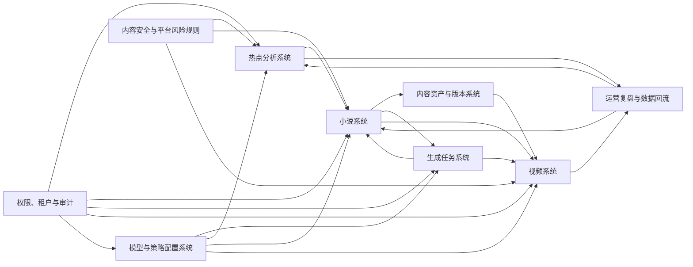

# 系统模块边界与模块衔接节点 v1

## 文档目的

本文档用于在研发前统一系统级模块边界，回答三个问题：

- 每个模块负责什么，不负责什么。
- 模块之间通过哪些业务节点交接。
- 首期实现时哪些能力需要保留入口，哪些能力只保留完整产品方向。

本系统的完整产品形态是“热点洞察 -> 小说创作 -> 语音/视频承载 -> 发布复盘 -> 策略回流”。当前阶段的研发优先级仍然是小说质量，视频系统先作为下游承载层，热点、配置、任务、审计和复盘系统先服务小说创作闭环。

## 系统模块总览

系统里有三类模块：

- 主业务模块：热点分析系统、小说系统、视频系统、运营复盘与数据回流。
- 横向支撑模块：生成任务系统、内容资产与版本系统、模型与策略配置系统、内容安全与平台风险规则。
- 管控模块：权限、租户与审计。

## 模块边界

### 热点分析系统

定位：上游内容情报和选题服务。

负责：

- 汇总手动录入、半自动分析、内置题材库和后续平台数据形成热点报告。
- 输出题材趋势、爽点趋势、开篇钩子、受众判断、机会点和风险提醒。
- 为创建小说提供可选择的热点建议卡片。
- 记录热点被哪本小说引用，后续支持效果回流。

不负责：

- 不直接生成正式小说正文。
- 不替代小说系统做设定、大纲和章节决策。
- 早期不强依赖自动爬虫或平台实时接口。

主要输出：

- 热点报告。
- 创作机会点。
- 风险标签。
- 可带入创建小说的方向素材。

### 小说系统

定位：系统核心内容资产生产模块，优先级最高。

负责：

- 从方向、设定、大纲、章节目录、试写、章节正文到全书审稿的完整创作闭环。
- 管理小说生命周期、创作阶段、质量门禁、推荐动作和待视频化判定。
- 生成和维护关键创作资产，包括设定档案、大纲、章节正文、审稿报告、影响评估和完成确认。
- 在用户确认后，把小说推进到可被视频系统引用的状态。

不负责：

- 不直接创建视频项目，不管理音频、字幕、渲染和发布。
- 不让 worker 绕过用户确认修改正式创作资产。
- 不把模型参数、完整提示词和供应商密钥暴露给普通用户。

主要输出：

- 已确认的小说方向、设定、大纲、章节目录和章节正文版本。
- 全书审稿结论。
- 待视频化检查结果。
- 视频引用快照。

### 生成任务系统

定位：跨模块的异步任务编排层。

负责：

- 承载热点分析、小说生成、AI 审稿、影响评估、TTS、视频渲染等耗时任务。
- 统一任务状态、进度、失败原因、重试、取消、幂等和互斥规则。
- 保存任务输入摘要、输出产物引用、成本消耗和可追踪日志。

不负责：

- 不拥有业务资产的最终状态。
- 不直接覆盖正式创作资产。
- 不把完整提示词、完整模型响应、密钥或平台 token 写入普通日志和前端响应。

主要输出：

- 任务记录。
- 候选产物引用。
- 进度与失败信息。
- 成本与资源统计。

### 内容资产与版本系统

定位：关键创作资产的历史、候选、采用和追溯能力。

负责：

- 保存方向、设定、大纲、章节目录、章节正文、审稿报告、影响评估和视频化快照的版本历史。
- 区分当前版本、候选版本、历史版本、已过期版本和被引用快照。
- 支撑采用、回滚、对比、影响评估和视频引用异常识别。

不负责：

- 不定义小说创作流程本身。
- 不替代业务模块判断某个资产是否可以采用。
- 不面向小白用户独立暴露复杂版本概念。

主要输出：

- 资产版本。
- 采用记录。
- 依赖快照。
- 过期和引用异常标记。

### 视频系统

定位：小说内容的下游承载层。

负责：

- 从已通过待视频化检查的小说或章节创建视频项目。
- 保存视频引用的小说、章节和版本快照。
- 管理音频、字幕、基础画面、渲染文件、人工发布记录和视频引用状态。
- 在小说内容变更后识别视频引用异常，并提示影响范围。

不负责：

- 不修改小说正式内容。
- 不反向决定小说是否完成，只消费小说系统给出的待视频化结果。
- 首期不做复杂 AI 分镜、自动发布和平台 API 同步。

主要输出：

- 视频项目。
- 视频引用快照。
- 音频、字幕和渲染状态。
- 人工发布记录。

### 模型与策略配置系统

定位：模型、Agent 模型路由、提示词、策略档位和输出结构的后台配置能力。

负责：

- 管理模型供应商、模型列表、Agent 能力配置、Agent 模型路由、任务到 Agent 映射、提示词模板、策略方案和输出结构校验。
- 管理审稿阈值、原创化严格程度、重写强度、市场导向程度、视频化倾向程度和自动处理程度。
- 支持模板测试、发布、回滚和版本记录。

不负责：

- 不直接面向小白用户暴露复杂模型参数。
- 不保存明文密钥到普通日志、前端响应和任务摘要。
- 不绕过业务模块的确认和门禁。

主要输出：

- Agent 模型路由配置。
- 任务到 Agent 映射配置。
- 提示词模板版本。
- 策略配置版本。
- 输出结构校验规则。

### 内容安全与平台风险规则

定位：贯穿热点、小说和视频的安全与发布风险判断。

负责：

- 在方向、设定、大纲、章节、全书审稿和待视频化阶段提示内容风险。
- 管理平台风险、题材风险、版权/同质化风险和原创化风险。
- 给出阻断、警告、接受风险继续和优化建议。

不负责：

- 不代替用户做所有内容判断。
- 不直接删除或覆盖创作资产。
- 不把风险规则写死在业务代码里。

主要输出：

- 风险标签。
- 审核结论。
- 风险处理建议。
- 接受风险记录。

### 运营复盘与数据回流

定位：发布效果、内容质量和策略优化的反馈闭环。

负责：

- 记录人工发布信息、24/48 小时播放数据、完播、互动、转化和用户主观复盘。
- 把视频表现回流到热点有效性、小说题材、开篇、爽点和模型策略评估。
- 支持成功案例、失败案例和后续优化建议。

不负责：

- 首期不强依赖平台 API 自动同步。
- 不直接修改小说正式内容。
- 不直接发布提示词或策略变更，策略变更仍需配置系统发布。

主要输出：

- 发布记录。
- 效果复盘。
- 热点有效性反馈。
- 内容和策略优化建议。

### 权限、租户与审计

定位：产品化、售卖和高风险操作的治理基础。

负责：

- 保存用户、租户、角色、权限点和数据归属。
- 为高风险操作记录原因、影响范围、操作人、操作时间和关键快照。
- 支持后续单用户、家庭成员、团队和 SaaS 售卖形态。

不负责：

- 首期不一定实现完整权限后台。
- 不参与具体创作质量判断。
- 不替代业务模块的状态机和门禁规则。

主要输出：

- 用户上下文。
- 权限判断结果。
- 操作日志。
- 审计记录。

## 模块衔接节点

### 1. 热点机会点进入小说创建

触发：用户在热点报告中选择一个创作机会点，或在创建小说时引用热点报告。

交接内容：

- 热点报告 ID。
- 机会点 ID。
- 题材、受众、爽点、风险标签。
- 可参考的开篇钩子和内容边界。

接收模块：小说系统。

结果：小说创建向导生成 3-5 个方向候选，热点系统记录引用关系。

### 2. 小说方向锁定进入设定生成

触发：用户选择、融合或优化后确认一个方向。

交接内容：

- 已确认方向版本。
- 用户选择原因或系统推荐理由。
- 风险接受记录。

接收模块：小说系统内部设定流程、内容资产与版本系统、生成任务系统。

结果：生成设定档案候选，方向版本成为后续资产依赖。

### 3. 设定确认进入大纲与章节目录

触发：用户采用设定档案。

交接内容：

- 设定档案当前版本。
- 人物、世界观、爽点、伏笔、文风和视频化预留。

接收模块：小说系统内部大纲流程、内容资产与版本系统、生成任务系统。

结果：生成全书大纲、阶段大纲和章节目录候选。

### 4. 试写通过进入批量正文

触发：用户确认试写前 1-3 章质量达标。

交接内容：

- 已采用试写章节版本。
- 文风、节奏、爽点、旁白适配和问题修正记录。
- 批量生成策略。

接收模块：小说系统、生成任务系统。

结果：允许批量生成后续章节正文。

### 5. 章节正文采用触发影响评估

触发：用户采用章节候选版本、手动编辑章节或恢复历史版本。

交接内容：

- 章节新版本。
- 旧版本快照。
- 依赖它的后续章节、伏笔、长篇记忆和视频引用情况。

接收模块：内容资产与版本系统、生成任务系统、视频系统。

结果：识别后续章节过期、长篇记忆需刷新、视频引用异常或无需处理。

### 6. 全书审稿通过进入待视频化确认

触发：正文全部完成并通过全书审稿。

交接内容：

- 全书当前章节版本集合。
- 全书审稿报告。
- 风险处理记录。
- 待视频化检查项。

接收模块：小说系统、内容资产与版本系统。

结果：形成可被视频系统引用的视频化快照。

### 7. 视频系统引用小说快照

触发：用户从已待视频化小说创建视频项目，或在视频系统选择可引用小说。

交接内容：

- 小说 ID。
- 引用章节范围。
- 章节版本快照。
- 文案、旁白和风险摘要。

接收模块：视频系统。

结果：生成视频项目，并保存引用快照。后续小说变化只产生引用异常，不直接修改视频内容。

### 8. 发布效果回流热点与小说策略

触发：用户录入发布平台、发布时间、播放、完播、互动和主观复盘，或后续平台 API 自动同步。

交接内容：

- 视频项目。
- 引用小说和章节版本。
- 发布数据。
- 用户复盘标签。

接收模块：运营复盘与数据回流、热点分析系统、模型与策略配置系统。

结果：沉淀热点有效性、题材表现、开篇表现、策略建议和成功/失败案例。

## 首期与后续边界

### 首期必须守住

- 小说系统是主线，列表、创建、详情、章节、审稿、重写、待视频化必须形成闭环。
- 热点系统至少支持手动或半自动素材分析，并能把机会点带入小说创建。
- 生成任务系统必须支撑异步进度、失败原因、重试、幂等和互斥。
- 关键创作资产必须版本化，AI 产物默认先进入候选。
- 视频系统至少保存视频列表、引用快照、人工发布记录和引用异常状态。
- 内容安全、平台风险、成本资源提醒和操作日志必须有数据口子。

### 后续可以延后

- 自动抓取热点和平台数据。
- 完整 AI 分镜、复杂视频画面生成和自动发布。
- 完整模型配置后台的高级测试、灰度和回滚页面。
- 完整租户、角色、授权和 SaaS 售卖后台。
- 系统自我成长大屏和自动策略优化。

## 研发拆分原则

- 先按业务边界拆任务，再按前后端拆实现。
- 横向模块先提供最小稳定契约，不提前做重后台。
- 小说系统的状态机、任务互斥、资产版本和待视频化快照要优先定契约。
- 视频系统早期只消费小说快照，不反向侵入小说流程。
- 所有高风险动作都需要版本校验、影响范围提示和操作日志。
