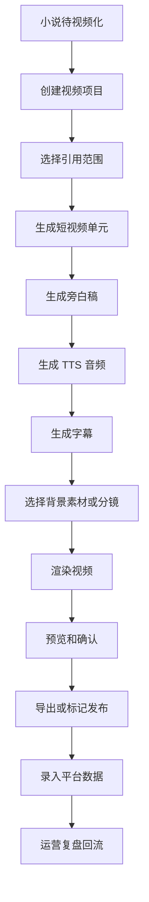
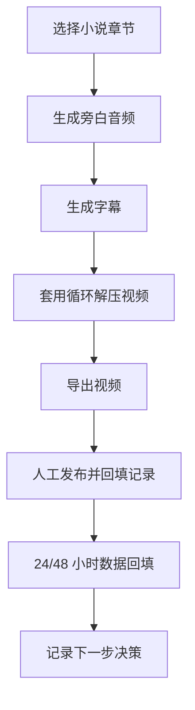

# 视频详情与发布运营完整设计

本文档补齐 `GAP-P2-005`：视频系统在完整产品形态下，如何从“视频列表和引用状态”扩展为视频详情、短视频集、音频/字幕/渲染产物、发布记录、平台数据回流和运营复盘。

视频系统不是当前项目初期的核心，初期可以只做“小说正文转语音 + 字幕 + 解压视频循环 + 手动发布记录”。但完整需求设计需要保留后续分镜、短视频小说集、平台数据回流和运营优化能力。

## 设计目标

- 稳定引用已完成小说和章节版本，避免小说修改影响已生成视频不可追溯。
- 支持从小说自动推荐首条、测试条、高潮条和追更条。
- 支持简单视频方案，也能扩展到 AI 分镜、外部视频生成工具和自动发布。
- 记录每条视频的音频、字幕、渲染、导出和发布状态。
- 让发布数据回流到热点系统、小说系统和自我成长模块。

## 范围边界

视频完整系统负责：

- 创建视频项目。
- 引用小说、章节范围和内容快照。
- 拆分短视频单元和短视频集。
- 生成旁白稿、音频、字幕和视频文件。
- 管理视频详情、任务进度、产物和引用异常。
- 记录人工发布或平台同步发布记录。
- 录入或同步播放、完播、互动和商业化数据。
- 生成运营复盘。

视频系统不负责：

- 修改小说正文。
- 自动覆盖已发布视频。
- 初期强制接入平台自动上传。
- 保证每条视频都能爆。
- 绕过内容安全和平台风险规则。

## 核心对象

### 视频项目

视频项目是视频系统的一级对象。

字段建议：

- 视频项目名称。
- 引用小说。
- 引用章节范围。
- 引用章节版本快照。
- 视频类型：单条测试、短视频集、阶段系列、整本小说。
- 生成模式：解压背景循环、模板素材、AI 分镜、外部视频工具。
- 当前状态。
- 发布状态。
- 引用异常状态。
- 预计总时长。
- 已生成条数。
- 已发布条数。
- 创建人。

### 短视频集

短视频集用于管理一组连续发布的视频。

字段建议：

- 短视频集名称。
- 所属视频项目。
- 引用小说阶段或章节范围。
- 集数规划。
- 发布顺序。
- 系列标题规则。
- 统一封面模板。
- 统一背景素材。
- 统一旁白音色。
- 当前进度。

规则：

- 一个视频项目可以只有一条视频，也可以包含一个短视频集。
- 短视频集不直接改小说，只保存引用快照和拆分结果。

### 单条视频

单条视频是最终发布或导出的单位。

字段建议：

- 视频标题。
- 所属项目和短视频集。
- 集数序号。
- 引用章节范围。
- 引用正文版本。
- 旁白稿版本。
- 音频版本。
- 字幕版本。
- 视频文件版本。
- 首屏字幕。
- 前 3 秒旁白钩子。
- 结尾悬念。
- 预计时长。
- 实际时长。
- 当前生成步骤。
- 当前推荐动作。

### 视频产物

视频产物包括：

- 旁白稿。
- TTS 音频。
- 字幕文件。
- 背景素材。
- 分镜脚本。
- 渲染视频文件。
- 封面图。
- 发布文案。

规则：

- 产物需要版本化。
- 重新生成音频不应覆盖旧音频。
- 重新渲染不应删除旧渲染文件。
- 已发布视频使用的产物版本要冻结。

### 发布记录

发布记录用于保存视频实际发布情况。

字段建议：

- 发布平台。
- 平台账号。
- 平台作品 ID 或链接。
- 发布时间。
- 发布标题。
- 发布文案。
- 标题钩子版本。
- 前 3 秒旁白钩子版本。
- 首屏字幕版本。
- 发布状态。
- 发布方式：手动记录、半自动、自动上传。
- 使用的视频文件版本。
- 发布人。
- 备注。

初期可以只支持人工发布后回填。

### 运营实验记录

运营实验记录用于回答“这条视频为什么发、发完以后下一步怎么办”。

字段建议：

- 实验目标：验证题材、开篇、标题、钩子、旁白、字幕或背景素材。
- 引用小说、章节、热点报告和题材模板。
- 视频类型：首条测试、章节测试、高潮测试、追更条。
- 平台、账号、发布时间和作品链接。
- 发布标题、封面文案、首屏字幕、前 3 秒钩子和结尾悬念版本。
- 24 小时数据：播放量、完播率、平均观看时长、点赞、评论、收藏、关注。
- 48 小时数据：播放量、完播率、平均观看时长、点赞、评论、收藏、关注。
- 用户主观判断：好、一般、差、样本太少。
- 下一步决策：继续同方向、优化开篇、换标题钩子、换题材、暂停该小说、重新生成试写。

规则：

- 早期可以全部手动录入，不依赖平台 API。
- 首条测试卡或简单视频试投也要能生成运营实验记录。
- 数据样本不足时不能直接判定小说失败，需要标记“样本不足”。
- 运营实验结果可以回流到热点、小说审稿校准和自我成长模块。

### 平台数据

字段建议：

- 播放量。
- 完播率。
- 平均观看时长。
- 点赞数。
- 评论数。
- 收藏数。
- 转发数。
- 新增关注。
- 付费观看。
- 成交或代理线索。
- 数据采集时间。
- 数据来源：手动录入、平台导入、API 同步。

## 视频生成流程

初期可以压缩为：

复盘后的研发分期口径：

- P8 只负责视频引用承接：创建视频项目、引用章节范围、保存引用快照、引用异常。
- P9 负责简单视频生成闭环：旁白稿、TTS、字幕、循环背景渲染、任务进度和产物版本。
- P10 负责人工发布和数据回填：发布记录、24/48 小时数据、样本不足和下一步决策。
- P11 负责视频详情和短视频单元：视频详情页、单元拆分、标题封面和钩子候选。
- P12 负责运营复盘和高级能力：复盘看板、小说/热点回流、Agent 效果复盘、外部视频工具和自动发布后置。

## 视频产物依赖和确认门禁

视频产物必须按版本链保存，不能让下游产物静默复用过期上游。

| 上游产物 | 下游产物 | 变更后的规则 |
| --- | --- | --- |
| 视频引用快照 | 旁白稿、短视频单元、标题封面、音频、字幕、渲染视频 | 引用出现 blocking 异常时，暂停继续生成；warning 需要用户确认继续或先处理 |
| 短视频单元范围 | 旁白稿、标题封面、音频、字幕、渲染视频 | 单元范围调整后，下游全部标记 stale |
| 旁白稿版本 | TTS 音频、字幕、渲染视频、发布文案 | 旁白稿变更后，音频、字幕、渲染和发布文案全部标记 stale |
| TTS 音频版本 | 字幕、渲染视频 | 音频变更后，字幕和渲染标记 stale，需要重新对齐 |
| 字幕版本 | 渲染视频 | 字幕变更后，渲染视频标记 stale |
| 背景素材或渲染参数 | 渲染视频 | 素材或参数变更后，只影响渲染视频 |
| 渲染视频文件 | 发布记录 | 发布记录冻结当时的视频文件版本，后续重新渲染不能覆盖已发布记录 |

确认门禁：

- 旁白稿需要用户确认或明确接受系统推荐后，才能生成 TTS。
- TTS 音频需要试听或至少生成成功后，才能生成字幕。
- 字幕需要预览或确认无阻塞错误后，才能渲染视频。
- 渲染前必须重新检查视频引用异常，blocking 异常必须先处理。
- 发布前必须确认视频文件存在、字幕音频匹配、平台风险已确认。
- 已发布版本使用的旁白、音频、字幕、渲染文件和发布文案必须冻结。

## 创建视频项目

入口：

- 小说详情待视频化区域跳转。
- 视频列表“新建视频”。

前置条件：

- 小说已进入待视频化或通过视频化检查。
- 引用章节有正式正文。
- 引用章节无阻塞状态。
- 引用范围能生成内容快照。

创建时选择：

- 视频类型：首条测试、章节范围、阶段系列、整本短视频集。
- 引用章节范围。
- 生成模式。
- 旁白音色。
- 背景素材方案。
- 字幕样式。
- 预计单条时长。

系统默认推荐：

- 首条视频单元。
- 前 3 秒旁白钩子。
- 首屏字幕。
- 标题钩子。
- 结尾悬念。

推荐来源见 `docs/modules/novel-video-readiness.md` 和 `docs/modules/novel-hit-content-integration-matrix.md`。

## 短视频单元拆分

章节不一定等于一条短视频。

拆分维度：

- 按章节。
- 按剧情冲突。
- 按情绪峰值。
- 按旁白时长。
- 按结尾悬念。

每个单元包含：

- 引用章节范围。
- 单元摘要。
- 前 3 秒钩子。
- 首屏字幕。
- 主要冲突。
- 情绪峰值。
- 结尾悬念。
- 推荐标题。
- 预计时长。
- 留存风险。

规则：

- 拆分结果属于视频结构资产，需要保存版本。
- 用户可以调整单元范围，但调整后需要重新生成旁白和字幕。
- 单元引用的小说版本不能静默变化。

## 生成模式

### 解压背景循环

适用初期。

能力：

- 使用固定背景视频循环。
- 合成旁白音频和字幕。
- 输出短视频文件。

优点：

- 成本低。
- 实现简单。
- 不需要剪辑能力。

限制：

- 画面和小说内容弱相关。
- 主要依赖小说和旁白质量。

### 模板素材模式

使用不同背景模板、字幕样式和封面模板。

适合：

- 按题材切换背景素材。
- 提高基础观感。
- 不进入复杂分镜。

### AI 分镜模式

后续能力。

流程：

- 识别剧情单元。
- 生成镜头脚本。
- 生成画面提示词。
- 调用外部图片或视频生成工具。
- 合成分镜视频。

规则：

- AI 分镜结果也是候选产物，需要预览确认。
- 外部生成工具的成本、失败和版权风险需要记录。

### 外部视频工具模式

后续可接入：

- 剪映类工具。
- 云渲染服务。
- 视频生成 API。
- 平台内置创作工具。

所有外部调用必须通过 provider 封装，并按任务记录状态、成本和失败原因。

## 视频详情页

页面区域：

1. 顶部状态栏
   - 视频名称。
   - 引用小说。
   - 引用章节范围。
   - 当前生成状态。
   - 发布状态。
   - 引用异常。
   - 主推荐动作。

2. 引用快照区
   - 小说标题。
   - 章节范围。
   - 章节版本。
   - 小说审稿评分。
   - 视频化建议。
   - 引用异常提醒。

3. 短视频单元区
   - 单元列表。
   - 集数。
   - 时长。
   - 钩子。
   - 结尾悬念。
   - 生成状态。

4. 产物区
   - 旁白稿。
   - 音频。
   - 字幕。
   - 背景素材。
   - 渲染文件。
   - 封面和发布文案。

5. 任务区
   - 当前任务。
   - 任务步骤。
   - 失败原因。
   - 重试入口。

6. 发布区
   - 发布平台。
   - 发布链接。
   - 发布时间。
   - 发布数据。

7. 复盘区
   - 表现总结。
   - 和小说、热点、题材模板的关联。
   - 给后续创作的建议。

## 状态设计

视频项目状态：

| 状态 | 含义 | 主动作 |
| --- | --- | --- |
| `draft` | 引用范围或参数未完整 | 完善设置 |
| `ready` | 可生成 | 生成视频 |
| `generating` | 有步骤生成中 | 查看进度 |
| `generated` | 已生成视频文件 | 预览/导出 |
| `publishable` | 已确认可发布 | 下载或标记发布 |
| `published` | 已有发布记录 | 查看数据 |
| `failed` | 生成失败 | 重试失败步骤 |
| `reference_stale` | 小说引用异常 | 查看引用异常 |
| `archived` | 项目归档 | 查看历史 |

单条视频步骤状态：

- 旁白稿：未生成、生成中、已生成、失败、已确认。
- 音频：未生成、生成中、已生成、失败。
- 字幕：未生成、生成中、已生成、失败。
- 渲染：未渲染、渲染中、已渲染、失败。
- 发布：未发布、已发布、发布异常。

## 发布运营

初期发布：

- 用户下载视频。
- 手动上传到平台。
- 回到系统标记已发布。
- 填写平台、账号、链接、发布时间、标题、钩子版本、首屏字幕版本和备注。
- 24 小时、48 小时后手动回填基础数据。
- 根据数据选择下一步决策。

后续发布：

- 接入平台账号。
- 自动上传或半自动发布。
- 自动同步播放数据。

发布前检查：

- 视频文件存在。
- 内容安全检查通过。
- 字幕和音频匹配。
- 引用小说未出现阻塞异常。
- 平台风险提示已确认。

已发布规则：

- 已发布视频不会被小说修改自动覆盖。
- 如果小说后续修改，系统只标记引用异常和提示风险。
- 重新生成视频需要创建新产物版本或新视频条目。

引用异常处理动作矩阵：

| 场景 | 默认动作 | 说明 |
| --- | --- | --- |
| 未生成任何视频产物，引用出现 info | 查看差异或忽略 | 忽略需要记录原因 |
| 未生成任何视频产物，引用出现 warning | 重新检测或返回小说处理 | 用户确认后可以继续生成 |
| 已生成但未发布，引用出现 warning | 重新生成受影响产物 | 从受影响的上游版本开始重新生成，不覆盖旧产物 |
| 已生成但未发布，引用出现 blocking | 暂停生成 | 必须先处理小说或重新选择引用范围 |
| 已发布，引用出现 info/warning | 保留已发布记录，创建新视频版本或新视频条目 | 旧平台内容不自动修改，旧发布数据保留 |
| 已发布，引用出现 blocking | 停止继续基于旧引用生成 | 推荐复制新视频项目或新视频条目 |
| 用户确认忽略异常 | 写原因和操作日志 | blocking 异常默认不允许忽略，除非后续策略明确开放 |

## 数据回流

视频数据需要回流到：

- 小说系统：判断小说视频化效果。
- 热点系统：判断热点和机会点是否有效。
- 自我成长模块：优化题材、提示词、模型和视频化推荐。

回流字段：

- 发布平台。
- 视频类型。
- 引用小说。
- 引用章节。
- 引用热点报告。
- 使用题材模板。
- 标题钩子。
- 前 3 秒钩子。
- 播放量。
- 完播率。
- 点赞率。
- 评论率。
- 关注率。
- 付费或成交。
- 用户主观复盘。
- 下一步决策。

24/48 小时回填规则：

- 发布记录创建后自动生成 24 小时和 48 小时待回填节点。
- 到期未填时，视频项目进入“数据待回填/逾期”状态，不影响已发布记录。
- 回填字段至少包含播放量、完播率、点赞、收藏、评论、关注和用户主观备注。
- 样本量不足时，复盘结论必须标记“样本不足”，不能强行用于全局模型或策略结论。
- 24 小时数据用于判断标题、前三秒钩子和首屏字幕是否有效。
- 48 小时数据用于判断内容留存、追更意愿和是否继续投入。
- 下一步决策必须从固定选项中选择：继续投放、优化标题、优化旁白、换章节、重做视频、暂停项目。

## 页面列表扩展

视频列表需要在 MVP 字段基础上增加：

- 视频类型。
- 所属短视频集。
- 集数进度。
- 首条/测试条/高潮条标签。
- 平台表现摘要。
- 数据更新时间。
- 复盘状态。

快捷筛选：

- 待生成。
- 生成中。
- 生成失败。
- 可发布。
- 已发布。
- 数据待回填。
- 表现较好。
- 表现较差。
- 引用异常。

## 风险和保护

- 引用小说版本变化后，不能自动覆盖视频产物。
- 删除已发布视频项目需要二次确认。
- 自动发布能力上线前，平台账号 token 必须安全存储并按权限访问。
- AI 分镜或外部视频生成结果需要版权和平台风险提示。
- 发布数据可能不完整，复盘结论需要标记数据来源和置信度。

## 和其他模块的关系

- 待视频化判定：视频项目只能引用通过检查的小说快照。
- 视频引用异常：小说修改后生成异常记录。
- 生成任务：TTS、字幕、渲染、分镜和发布同步都走异步任务。
- AI 配置：TTS、字幕、分镜和视频生成工具通过配置管理。
- 热点系统：视频表现回流到热点机会点。
- 自我成长：视频数据用于判断题材、开篇、钩子和模型效果。
- 权限租户：平台账号、发布记录和数据回流需要租户隔离。

## 实施分期建议

1. P8：视频列表、创建视频项目、引用快照、引用异常、已发布不覆盖基础规则。
2. P9：轻量视频详情页或详情抽屉、旁白稿、TTS、字幕、循环背景渲染、导出、产物版本和过期规则。
3. P10：人工发布记录、最小运营实验记录、24/48 小时数据手动回填、样本不足和下一步决策。
4. P11：短视频单元、单元范围调整、标题/封面/钩子候选、短视频集基础。
5. P12：运营复盘看板、标题/钩子对比、小说/热点回流分析、Agent 效果复盘。
6. 后置：外部视频工具、AI 分镜、自动发布、平台 API 数据同步和高级数据看板。

## 验收口径

- 视频项目能稳定引用小说章节版本快照。
- 能按推荐章节范围生成首条或章节范围视频项目。
- 能管理旁白、音频、字幕、渲染文件和发布记录。
- 已发布视频不被小说修改自动覆盖。
- 引用异常能提示用户处理。
- 平台表现数据能回流到小说、热点和自我成长模块。
- 初期至少能人工记录发布链接、24/48 小时数据和下一步决策。
