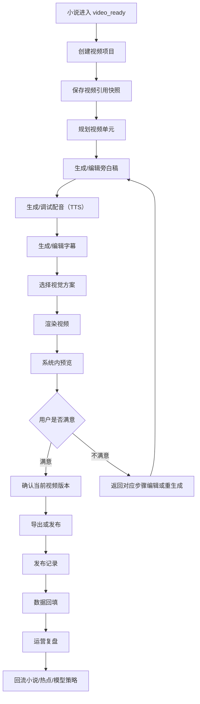

# 视频系统完整需求设计

## 设计定位

视频系统是 AIShortvideo 的核心模块之一。早期研发可以先生成简单视频，但需求设计必须按完整视频生产系统展开。

关键口径：

- “早期内容简单”不等于“系统能力简单”。
- 第一阶段可以只使用循环背景、简单旁白、基础字幕和手动发布，但底层对象、状态、版本、任务、预览、编辑和扩展点必须为后续高级视频能力预留。
- 后续从简单视频升级到短视频单元、多镜头分镜、外部视频工具、AI 画面生成、自动发布和数据回流时，应是扩展生成模式和产物类型，而不是重做视频模块。

## 产品目标

视频系统要解决五个问题：

1. 小说内容如何稳定变成视频项目。
2. 视频生成过程如何可见、可预览、可编辑、可重生成。
3. 用户不满意生成结果时如何回到对应环节修正。
4. 视频发布和数据表现如何被记录并回流小说系统。
5. 未来更复杂的视频能力如何平滑接入。

## 总体流程

## 模块边界

视频系统负责：

- 创建和管理视频项目。
- 保存小说引用快照和引用异常。
- 管理视频单元和短视频集。
- 生成、编辑和确认旁白稿。
- 生成、试听和确认配音（TTS）。
- 生成、编辑和确认字幕。
- 管理视觉方案，例如循环背景、模板素材、分镜、外部视频工具。
- 渲染、预览、确认和导出视频文件。
- 记录发布信息和平台数据。
- 生成运营复盘，并把信号回流到小说、热点和模型配置。

视频系统不负责：

- 直接修改小说正式正文。
- 自动覆盖已发布平台内容。
- 绕过小说的待视频化快照和内容安全门禁。
- 把完整提示词、完整模型响应、API Key 或平台 token 暴露到前端、普通日志或任务摘要。

## 核心对象

### VideoProject

视频项目是视频模块的一级对象。

字段：

- `id`
- `name`
- `type`：首条测试、章节范围、阶段系列、整本短视频集。
- `novelId`
- `referenceId`
- `lifecycleStatus`
- `referenceStatus`
- `productionStatus`
- `generationMode`
- `currentUnitId`
- `currentRenderId`
- `publishStatus`
- `createdBy`
- `createdAt`
- `updatedAt`

规则：

- 视频项目必须来自 `video_ready` 小说或已确认的视频化快照。
- 视频项目创建后不直接生成视频，先保存引用快照。
- 视频项目可以只有一个视频单元，也可以扩展为短视频集。
- `lifecycleStatus` 表达项目是否 active/stopped/archived，`referenceStatus` 表达引用是否 normal/info/warning/blocking/resolved，`productionStatus` 表达生成链路进度，三者不能混成一个字段。

### VideoReference

`VideoReference` 是视频项目引用小说内容的落库实体，它本身就是引用快照。文档里提到的“引用快照”是产品概念，数据库和接口统一使用 `VideoReference`，不要再另建 `VideoReferenceSnapshot` 表。

字段：

- 小说 ID。
- `videoReadinessSnapshotId`。
- 引用章节范围。
- 引用章节快照列表。
- 全书审稿摘要。
- 待视频化检查摘要。
- 首条视频建议。
- 引用创建时间。
- 引用策略版本。

规则：

- 小说后续变化不能自动改写快照。
- 引用快照过期只能产生异常或新快照，不能静默替换。
- 渲染和发布必须能追溯到引用快照。

### VideoReferenceChapterSnapshot

引用章节快照是 `VideoReference` 的子表，用于避免 `chapterIds[]`、`chapterContentVersionIds[]` 等平行数组顺序错乱。

字段：

- `videoReferenceId`
- `chapterId`
- `chapterNo`
- `chapterTitle`
- `contentVersionId`
- `featureCardVersionId`
- `contentHash`
- `summarySnapshot`
- `riskSnapshot`
- `createdAt`

规则：

- 每个被引用章节必须有一条快照记录。
- 引用重检时用该表和当前章节版本/摘要/风险做对比。
- 前端列表只展示摘要和版本号，不展示完整正文。

### VideoUnit

视频单元是单条可生成、可预览、可导出、可发布的视频单位。

字段：

- 所属视频项目。
- 所属短视频集，可为空。
- 单元序号。
- 引用章节范围。
- 单元摘要。
- 前 3 秒钩子。
- 首屏字幕。
- 结尾悬念。
- 预计时长。
- 当前生成步骤。
- 当前推荐动作。

规则：

- 首期可以一个视频项目只有一个默认单元。
- 后续支持一个视频项目拆成多个单元。
- 调整单元引用范围会让旁白、音频、字幕、渲染全部过期。

### VideoArtifact

视频产物是旁白、音频、字幕、字幕样式、视觉方案等可版本化内容的统一概念。渲染后的视频文件使用 `VideoRender`，导出记录使用 `VideoExport`，不要和普通产物混成同一张含义不清的表。

产物类型：

- 旁白稿。
- 配音（TTS）。
- 字幕。
- 字幕样式。
- 背景素材方案。
- 分镜脚本。
- AI 画面片段。
- 封面图。
- 标题/发布文案。

统一字段：

- `artifactType`
- `version`
- `lifecycleStatus`：draft、candidate、confirmed、stale、rejected、archived。
- `isCurrent`：是否为当前被下游使用的版本，或通过 `VideoUnit.current...ArtifactId` 指针表达。
- `sourceTaskId`
- `sourceVersionRefs`
- `strategyVersion`
- `provider`
- `metadata`
- `rejectedReason`
- `confirmedBy`
- `confirmedAt`

规则：

- AI 输出默认先进入候选或新版本。
- 用户确认后 `lifecycleStatus=confirmed`，是否成为当前版本由 `isCurrent` 或 `VideoUnit` 当前指针决定。
- 重新生成不能覆盖旧版本。
- 被导出或发布引用的产物必须冻结。

### VideoRender

渲染结果是可预览和导出的视频文件版本。

字段：

- 视频项目和视频单元。
- 使用的 `VideoReference` 版本。
- 使用的旁白、音频、字幕、视觉方案版本。
- 渲染模式。
- 文件地址或对象存储 key。
- 预览地址。
- 时长、比例、分辨率、码率。
- 状态：rendering、preview_ready、confirmed、rejected、exported、stale、failed。

规则：

- 未确认的视频不能作为当前可导出版本。
- 重新渲染生成新版本。
- 导出记录必须引用具体渲染版本。

### VideoExport

导出记录保存“用户把哪个确认视频文件导出了什么格式”的事实，不等于发布。

字段：

- 视频项目和视频单元。
- `videoRenderId`。
- 导出格式。
- 文件地址或对象存储 key。
- 文件名。
- 分辨率。
- 导出时间。
- 导出人。
- 使用的旁白、音频、字幕、视觉方案和渲染版本摘要。

规则：

- 只有已确认且未过期的 `VideoRender` 可以导出。
- 重新导出创建新 `VideoExport`，不覆盖旧导出记录。
- 导出后不自动创建发布记录，不触发平台发布和数据回填。

### PublishRecord

发布记录保存视频发布到平台后的事实。

字段：

- 视频项目和视频单元。
- 发布平台。
- 平台账号。
- 作品链接或平台作品 ID。
- 发布时间。
- 发布标题。
- 发布文案。
- 使用的视频文件版本。
- 使用的标题、钩子、首屏字幕版本。
- 发布方式：手动、半自动、自动。
- 发布人。

规则：

- 初期只做人工记录。
- 后续可以接自动上传，但自动上传也必须保存同一套发布记录。
- 发布记录不可被重新渲染覆盖。

### VideoPerformanceRecord

表现记录保存发布后的数据。

字段：

- 采集时间。
- 数据窗口：24h、48h、7d、自定义。
- 播放量。
- 完播率。
- 平均观看时长。
- 点赞、评论、收藏、转发、关注。
- 商业转化或付费数据，可为空。
- 数据来源：手动、导入、平台 API。
- 样本判断：有效、样本不足、异常。
- 下一步决策。

规则：

- 样本不足不能直接判定小说失败。
- 数据可以回流到小说审稿、热点策略和 Agent 复盘，但需要标记置信度。

## 页面结构

### 视频列表

视频列表是视频系统主入口，样式和交互应参考小说列表。

页面职责：

- 管理视频项目。
- 展示引用小说、章节范围和引用状态。
- 展示生成、预览、导出、发布和数据回填状态。
- 提供创建视频项目入口。
- 提供行展开摘要。
- 通过详情或抽屉进入具体处理。

列表主按钮：

- 默认是“详情”。
- 不把所有推荐动作直接堆到列表行。
- 任务、引用异常、预览、发布记录进入抽屉或详情页处理。

### 创建视频项目

创建时选择：

- 引用小说。
- 视频类型。
- 引用章节范围。
- 生成模式。
- 默认视频单元策略。
- 项目名称。
- 创建说明。

创建成功后：

- 生成 `VideoReference`。
- 创建默认 VideoUnit。
- 回到视频列表。
- 不自动开始生成。

### 视频详情工作台

视频详情是完整视频生产工作台。

核心区域：

- 顶部状态栏：当前状态、引用状态、推荐动作。
- 左侧：引用快照、视频单元、产物版本。
- 中间：当前步骤工作区。
- 右侧：任务进度、版本依赖、风险和操作记录。

步骤：

1. 引用检查。
2. 视频单元。
3. 旁白稿。
4. 配音。
5. 字幕。
6. 视觉方案。
7. 渲染。
8. 预览确认。
9. 导出/发布。
10. 数据回填。
11. 复盘。

## 生成模式

### 简单循环背景模式

首期推荐模式。

能力：

- 引用小说章节生成旁白稿。
- 使用 TTS 生成配音音频。
- 生成字幕。
- 选择循环背景素材。
- 合成音频、字幕和背景视频。
- 系统内预览、确认和导出。

限制：

- 不生成复杂画面。
- 不做镜头级分镜。
- 不做平台自动发布。

### 模板素材模式

后续模式。

能力：

- 使用固定视频模板。
- 替换标题、字幕、背景、封面、音乐。
- 适合批量生产风格一致的视频。

### 分镜模式

后续模式。

能力：

- 将视频单元拆成多个镜头。
- 每个镜头有画面描述、旁白片段、字幕和素材。
- 支持 AI 图像/视频生成或素材库匹配。

### 外部视频工具模式

后续模式。

能力：

- 调用外部视频生成工具。
- 保存外部任务 ID、输入摘要、输出文件和失败原因。
- 不暴露外部平台 token 或完整原始响应。

## 预览、编辑和不满意闭环

视频生成不能是黑盒。

用户必须能：

- 预览当前渲染视频。
- 试听音频。
- 查看字幕时间轴和首屏字幕。
- 查看当前使用的旁白、音频、字幕、背景素材和渲染版本。
- 确认当前视频。
- 标记不满意并填写原因。
- 返回对应步骤编辑或重新生成。
- 重新渲染受影响产物。
- 导出已确认且未过期的视频版本。

不满意处理矩阵：

| 不满意点 | 回到步骤 | 下游影响 |
| --- | --- | --- |
| 开头不吸引人 | 旁白稿 | 音频、字幕、渲染过期 |
| 旁白太长或节奏差 | 旁白稿 | 音频、字幕、渲染过期 |
| 声音不合适 | 配音 | 字幕、渲染过期 |
| 字幕断句差 | 字幕 | 渲染过期 |
| 字幕样式不清楚 | 字幕样式/渲染 | 渲染过期 |
| 背景素材不合适 | 视觉方案 | 渲染过期 |
| 整体不满意 | 预览确认 | 当前渲染标记 rejected，保留原因 |

## 产物依赖和过期规则

| 上游变化 | 下游影响 |
| --- | --- |
| 引用快照 blocking 异常 | 暂停旁白、音频、字幕和渲染 |
| 视频单元范围变化 | 旁白、音频、字幕、视觉方案、渲染过期 |
| 旁白稿变化 | 音频、字幕、渲染、发布文案过期 |
| 音频变化 | 字幕、渲染过期 |
| 字幕变化 | 渲染过期 |
| 字幕样式变化 | 渲染过期 |
| 背景素材或视觉方案变化 | 渲染过期 |
| 渲染文件变化 | 新导出/发布可选新版本，旧导出/发布不变 |

## 任务和失败处理

异步任务：

- 引用检测。
- 旁白生成。
- 配音（TTS）生成。
- 字幕生成。
- 分镜生成。
- 画面/素材生成。
- 视频渲染。
- 发布上传。
- 数据同步。

每个任务必须有：

- taskId。
- requestId。
- sourceVersionRefs。
- idempotencyToken。
- actionType。
- requestHash。
- 进度事件。
- 失败分类。
- 重试和取消规则。
- 安全脱敏摘要。

失败处理：

- 失败不覆盖旧产物。
- 重试创建新任务或新版本。
- 上游版本变化后旧任务不能写入当前产物。
- 用户能看到失败原因和下一步。

## 引用异常

引用异常详细规则见 `docs/modules/video-reference-exceptions.md`。

本模块补充：

- 引用异常不只影响列表，也会影响生成工作台。
- blocking 引用异常禁止继续渲染。
- warning 级引用异常允许用户填写原因继续，但必须记录。
- 已发布视频引用异常时，只提示和追溯，不自动覆盖平台内容。

## 发布和数据回流

发布可以分三阶段：

1. 手动发布记录。
2. 半自动辅助发布，例如生成标题、文案、封面和发布检查清单。
3. 自动发布和平台 API 同步。

早期至少要支持手动发布记录和 24/48 小时数据回填。

运营复盘输出：

- 这条视频表现如何。
- 是标题问题、开头问题、旁白问题、内容题材问题，还是样本不足。
- 下一步继续、优化、换章节、换题材还是暂停。
- 可回流到小说、热点、模型和 Agent 策略的信号。

## 模型和 Agent 路由

视频系统需要接入配置系统，不应写死模型。

建议 Agent：

- 视频策划 Agent：决定视频单元、钩子、标题和首屏字幕。
- 旁白 Agent：生成短视频旁白。
- 字幕 Agent：切分字幕和优化首屏字幕。
- 视觉 Agent：生成分镜、背景或素材建议。
- 渲染 Agent：组织渲染参数和任务。
- 运营复盘 Agent：分析发布数据和下一步建议。

模型路由规则：

- 按任务类型、Agent、成本等级和质量等级选择模型。
- 每次生成记录模型路由版本和策略版本。
- 用户可在配置系统查看和调整默认路由。

## 分期实现

分期是研发顺序，不是需求上限。

| 阶段 | 研发目标 | 必须保留的完整系统能力 |
| --- | --- | --- |
| P8 | 视频列表、创建项目、引用快照、引用异常 | VideoProject、VideoReference、VideoReferenceChapterSnapshot、VideoUnit 基础结构 |
| P9a | 视频详情工作台地基 | 步骤条、产物版本、任务、预览框架、依赖过期 |
| P9b | 旁白调试 | 旁白候选、编辑、确认、不满意原因 |
| P9c | 配音调试 | 试听、换音色、重生成、版本化 |
| P9d | 字幕调试 | 字幕编辑、首屏字幕、时间轴、样式 |
| P9e | 渲染预览导出 | 播放器预览、确认当前视频、重新渲染、导出 |
| P10 | 发布记录和数据回填 | 发布冻结版本、数据窗口、样本判断 |
| P11 | 短视频单元和系列 | 单元拆分、标题封面钩子、系列结构 |
| P12 | 运营复盘和高级能力 | 数据回流、外部工具、分镜、自动发布 |

## 任务包 8 边界

任务包 8 只做承接地基，但必须按完整系统对象设计。

详细设计见：`docs/modules/video-task-package-8-detailed-design.md`。该文档是任务包 8 的研发和测试入口。

做：

- 视频列表。
- 创建视频项目。
- VideoProject。
- VideoReference。
- VideoReferenceChapterSnapshot。
- 默认 VideoUnit。
- 引用状态和引用异常。
- 从小说详情跳转视频列表创建项目。

不做：

- 旁白、TTS、字幕、渲染。
- 视频预览播放器。
- 发布和数据回填。
- 短视频集和分镜。

注意：

- 不做不代表对象不预留。
- 数据结构不能只适配“一个视频项目一个文件”的临时模型。

## 任务包 9 边界

任务包 9 不应只是“一键生成视频”，而应拆成可验收的生成工作台。

详细设计见：`docs/modules/video-task-package-9-detailed-design.md`。该文档是任务包 9 的研发和测试入口。

最小可接受：

- 用户能看到视频详情工作台。
- 用户能看到生成步骤。
- 用户能生成或编辑旁白。
- 用户能生成配音和字幕，哪怕 provider 是 mock。
- 用户能渲染出可预览的视频版本，哪怕视觉内容是循环背景。
- 用户能不满意并返回编辑。
- 用户确认后才能导出。

## 需求验收标准

- 视频模块完整需求能覆盖：引用、单元、旁白、音频、字幕、视觉、渲染、预览、编辑、导出、发布、数据、复盘。
- 早期简单生成不会把系统架构锁死在单一视频文件模型上。
- 用户不满意生成结果时，有明确的编辑和重生成路径。
- 所有视频产物都有版本和过期规则。
- 已发布或已导出版本不会被后续修改覆盖。
- 视频表现数据能回流，但不会在样本不足时误导小说质量判断。
