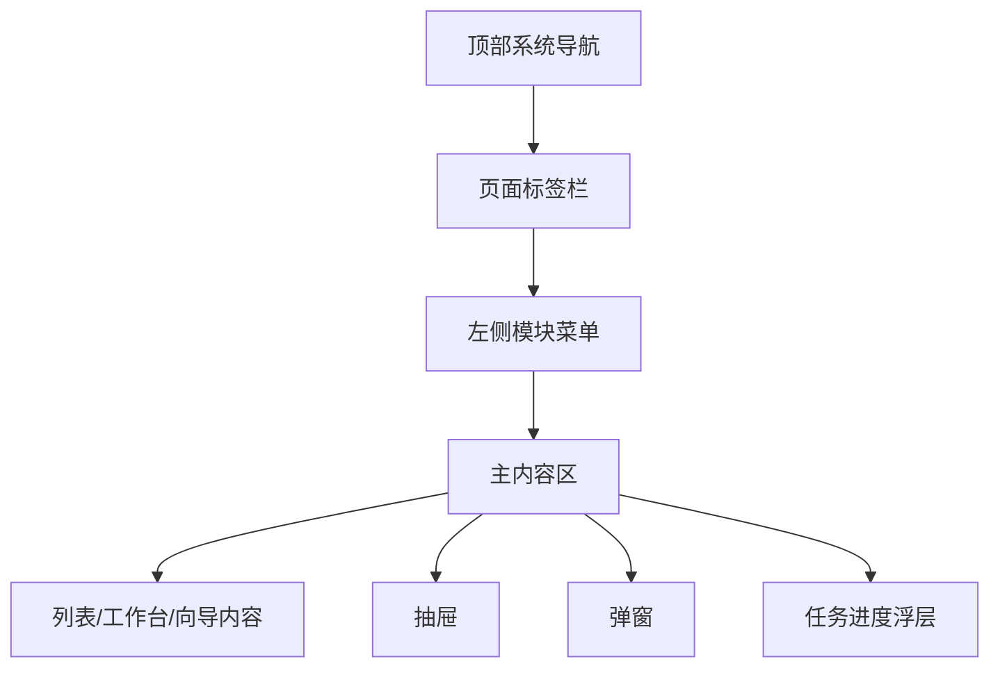

# 后台布局原型

本文档定义 AI 短视频小说系统后台的统一页面外壳，供小说列表、创建小说、小说详情工作台、章节详情工作台、视频列表和任务辅助页面共用。

当前阶段是 Markdown + Mermaid 低保真原型，不生成前端代码。后续实现时使用 Vue 3 + Vite + TypeScript + Element Plus，前端项目必须由 Vite 官方脚手架初始化。

## 设计目标

- 保持传统后台系统的信息密度，贴近用户提供的参考截图。
- 让小白用户默认进入小说列表，立刻看到下一步动作。
- 让复杂能力有位置，但不抢主流程。
- 页面结构稳定，后续新增热点、视频、配置和任务模块时不推翻布局。

## 全局布局

布局分区：

| 区域 | 原型说明 |
| --- | --- |
| 顶部系统导航 | 蓝色主导航，展示产品名、模块入口、全局搜索、用户菜单 |
| 左侧模块菜单 | 当前模块下的页面导航，小说系统默认展开 |
| 页面标签栏 | 显示已打开页面，支持关闭，减少后台用户迷路 |
| 主内容区 | 当前页面主体，承载列表、向导、工作台 |
| 抽屉 | 轻量确认、摘要查看、任务进度、审稿问题 |
| 弹窗 | 高风险确认、原因填写、简单创建和状态确认 |

## 顶部系统导航

顶部导航用于切换系统模块，不承载复杂业务操作。

建议模块：

- 热点分析
- 小说系统
- 视频系统
- 任务中心
- 系统配置

右侧工具：

- 全局搜索：搜索小说、视频、任务。
- 当前账号。
- 消息/任务提醒。
- 关闭当前操作菜单。

规则：

- 默认选中小说系统。
- 当前 P0 原型不做工作台首页。
- 全局搜索只作为入口预留，不进入首期核心。

## 左侧菜单

小说系统菜单：

| 菜单 | 路由 | 说明 |
| --- | --- | --- |
| 小说列表 | `/novels` | 默认首页，主驾驶舱 |
| 创建小说 | `/novels/new` | 从零开始创建小说 |
| 生成任务 | `/tasks` | 查看 AI 长任务和失败任务 |

视频系统菜单：

| 菜单 | 路由 | 说明 |
| --- | --- | --- |
| 视频列表 | `/videos` | 早期承接小说视频化 |

配置菜单后置：

- 模型供应商
- Agent 模型路由
- 任务模型映射
- 策略配置
- 提示词模板

配置入口可以先有菜单位置，但原型重点不展开。

## 页面标签栏

标签示例：

- 首页
- 小说列表
- 创建小说
- 《重生后我靠系统逆袭》详情
- 第 3 章详情
- 视频列表

规则：

- 从小说列表打开详情时新开标签。
- 章节详情可以新开标签，避免用户处理单章后找不到列表。
- 关闭标签不影响任务运行。
- 页面标签只是前端导航体验，不作为业务状态。

## 主内容区通用结构

页面顶部统一包含：

- 页面标题。
- 一句话说明或当前状态。
- 主操作按钮。
- 次要操作区。

列表页通用结构：

| 区域 | 内容 |
| --- | --- |
| 标题栏 | 页面标题、创建按钮、刷新按钮 |
| 筛选区 | 常用筛选、重置、搜索 |
| 批量操作区 | 仅在选择行后出现 |
| 表格区 | 业务列表和行主动作 |
| 分页区 | 页码、每页条数、总数 |

工作台页通用结构：

| 区域 | 内容 |
| --- | --- |
| 顶部概览 | 状态、分数、进度、主动作 |
| 步骤条 | 当前创作流程位置 |
| 主工作区 | 当前阶段内容和问题 |
| 侧边辅助 | 推荐动作解释、任务、风险 |

## 交互承载规则

| 交互 | 承载方式 | 示例 |
| --- | --- | --- |
| 简单确认 | 弹窗 | 确认小说完成、恢复小说 |
| 结果选择 | 抽屉 | 选择方向、确认设定、确认大纲 |
| 长任务进度 | 抽屉或浮层 | 设定生成、正文批量生成 |
| 高风险操作 | 弹窗 + 原因填写 | 清空后续章节、低分强制通过 |
| 深度编辑 | 工作台页面 | 大纲调整、章节正文处理 |
| 单章问题 | 章节详情工作台 | 章节重写、影响评估 |

## 状态与色彩口径

后续用 Element Plus 标签和按钮表达：

| 类型 | 视觉建议 | 示例 |
| --- | --- | --- |
| 正常推进 | Primary | 生成设定、全书审稿 |
| 待确认 | Warning | 确认设定、确认候选 |
| 阻塞问题 | Danger | 章节待处理、内容高风险 |
| 查看类 | Default | 查看详情、查看任务 |
| 已完成 | Success | 已完成、待视频化 |

颜色只用于辅助理解，不能只靠颜色表达状态。

## 小白体验硬规则

- 登录默认进入小说列表。
- 每个页面只突出一个主推荐动作。
- 机器状态不直接裸露给小白。
- 审稿默认只展示总分、一句话结论、Top 3 问题和推荐动作。
- 失败提示必须说明影响范围和下一步。
- 高级入口可以存在，但默认折叠。

## 后续实现注意

- 使用 Element Plus 的 `ElContainer`、`ElMenu`、`ElTabs`、`ElTable`、`ElDrawer`、`ElDialog`、`ElSteps`、`ElTag`、`ElProgress`。
- 列表页可以适度配置化。
- 创建小说、小说详情工作台、章节详情工作台不能被普通 CRUD 模板套死。
- 不引入 Ant Design Vue。
- 不使用营销式首页或大屏驾驶舱作为默认页。
