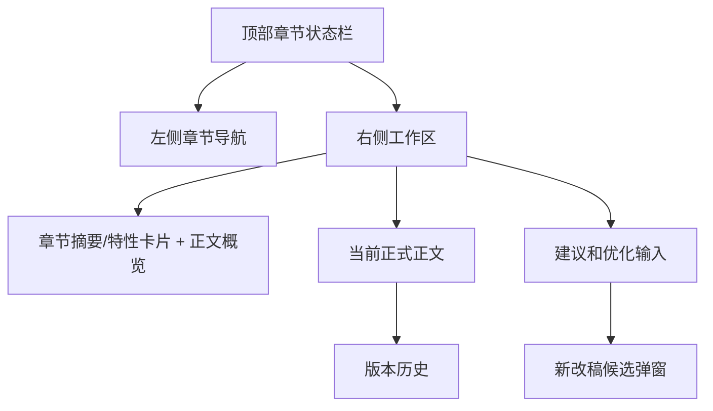

# 章节详情工作台原型

章节详情工作台负责处理单章正文、审稿问题、重写候选、版本对比和后续章节影响。它不是普通写作编辑器，也不是全书结构调整页。

## 页面目标

- 让用户看懂这一章有什么问题。
- 提供一个最推荐的处理动作。
- 支持基于章节摘要/特性卡片重写。
- 候选版本未采用前不影响正式正文。
- 采用后必须评估是否影响后续章节和视频引用。

## 页面入口

| 来源 | 默认聚焦 |
| --- | --- |
| 小说列表“处理待处理章节” | 问题处理区 |
| 小说详情章节表点击章节 | 正文区 |
| 试写问题入口 | 审稿问题区 |
| 任务结果待确认 | 候选版本区 |
| 影响评估入口 | 影响评估区 |
| 视频引用异常 | 视频引用区 |

支持 `focus`：

- `content`
- `review`
- `candidate`
- `impact`
- `videoReference`

## 页面结构

## 顶部章节状态栏

展示：

| 字段 | 说明 |
| --- | --- |
| 小说名 | 可返回小说详情 |
| 章节号和标题 | 当前章 |
| 所属阶段 | 阶段/分卷 |
| 状态 | 正常、待处理、处理中、已处理待确认 |
| 状态备注 | 低分、受影响未调整、候选待确认 |
| 字数 | 当前字数/目标字数 |
| 评分 | 最新章节评分 |
| 视频引用 | 是否被视频引用 |
| 主推荐动作 | 生成正文、AI 审稿、优化、采用候选等 |

规则：

- 顶部始终只有一个主按钮。
- 视频引用只作为顶部状态标签或摘要字段展示，不独立占用一个模块卡片。
- 如果章节阻塞小说完成，文案要说明“这章不处理，全书不能完成”。

## 左侧章节导航

展示：

- 章节号。
- 标题。
- 状态标签。
- 分数。
- 是否有候选。
- 是否影响未处理。
- 是否视频引用。

操作：

- 上一章。
- 下一章。
- 点击切换章节。
- 筛选待处理章节。

规则：

- 左侧只加载章节摘要，不加载所有正文。
- 切换章节前如果当前有未保存候选操作，要提示。

## 右侧工作区

章节导航右侧是主要工作区，不再拆成“中间正文 + 右上角卡片”的割裂布局。

默认顺序：

1. 章节摘要/特性卡片和正文概览。
2. 当前正式正文。
3. 建议和优化输入。
4. 新改稿候选或版本差异入口。

### 章节摘要/特性卡片

章节摘要/特性卡片需要放在右侧工作区顶部，而不是正文下方或右上角孤立卡片。

展示字段：

- 正文概览：如果已有正文，需要先概括当前正式正文版本、段落数量、核心信息和钩子。
- 本章核心任务。
- 主要冲突。
- 爽点。
- 结尾钩子。

规则：

- 这张卡是生成和重写章节的依据。
- 有正文时，必须能看出“当前正文实际写了什么”，而不只是计划摘要。
- 一键重写默认基于卡片补强，不让模型自由发挥。

### 当前正式正文

默认展示正式版本阅读视图。

内容：

- 当前正式正文。
- 正式版本号。
- 字数。
- 生成来源。
- 最近采用时间。
- 上一章结尾摘要。
- 下一章目标摘要。

操作：

- 复制正文。
- 编辑正文。
- 查看正文差异。
- 查看历史版本。

规则：

- 点击“编辑”后切换成编辑状态。
- 保存正文必须生成新的正式版本或候选版本，不能静默覆盖历史版本。
- 版本标签可点击查看历史版本；回退旧版本时需要生成新当前版本，并触发影响评估。
- 长章节支持目录定位和问题定位。

## 建议和优化输入

建议区是章节页面的处理中心。标题使用“建议”，不使用“下一步建议”。

默认展示：

- 推荐原因。
- AI 审稿摘要。
- Top 3 问题。
- 候选版本状态。
- 影响评估状态标签。
- 用户补充要求输入框。

问题卡片字段：

| 字段 | 说明 |
| --- | --- |
| 问题标题 | 通俗描述 |
| 严重程度 | 低、中、高 |
| 影响范围 | 本章、后文、视频 |
| 建议动作 | AI 优化、局部重写、手动确认等 |
| 处理状态 | 未处理、处理中、已处理 |

操作：

- 保存：保存本次人工补充优化要求。
- 生成新改稿：打开新改稿候选弹窗。

规则：

- 推荐提示和问题标签之间需要有清晰间距。
- 操作按钮右侧展示，并与输入框保持上边距。
- “生成新改稿”不直接覆盖正文，只生成候选稿。
- 影响评估提炼成状态标签，例如“影响待评估”“轻微影响”“影响未关闭”，不作为独立模块常驻展示。

## 候选版本区

候选产生来源：

- AI 整章重写。
- 局部优化。
- 手动编辑。
- 问题卡片处理。

候选卡展示：

- 候选版本号。
- 生成原因。
- 改动摘要。
- 评分变化。
- 字数变化。
- 问题数量变化。
- 是否改变关键事实。
- 是否影响后文。

按钮：

- 采用这版。
- 继续优化。
- 放弃这版。
- 查看差异。

规则：

- 点击“生成新改稿”后先弹窗展示候选内容。
- 候选弹窗必须包含可编辑字段：概览、核心任务、主要冲突、爽点、结尾钩子和正文。
- 候选弹窗按钮包括：重新生成、保存候选、取消。
- 保存候选只保存为候选版本，不替换当前正式正文。
- 采用候选才会把候选变为正式正文，并触发影响评估。
- 评分未提升时默认不推荐采用。
- 关键事实变化时采用前必须提示。
- 候选采用后触发影响评估。

## 版本对比

默认展示摘要对比：

| 对比项 | 当前正式版 | 新改稿 |
| --- | --- | --- |
| 字数 | 当前字数 | 新字数 |
| 评分 | 当前分 | 新分 |
| 问题数 | 当前问题 | 新问题 |
| 爽点 | 当前摘要 | 新摘要 |
| 结尾钩子 | 当前摘要 | 新摘要 |
| 关键事实 | 是否变化 | 是否变化 |

完整正文差异默认折叠。

## 影响评估区

触发：

- 采用章节候选。
- 手动编辑正文。
- 恢复历史版本。
- 修改章节摘要中的关键事实。

影响等级：

| 等级 | 页面表现 | 用户动作 |
| --- | --- | --- |
| 无影响 | 绿色提示 | 确认章节正常 |
| 轻微影响 | 备注提示 | 自动同步摘要和记忆 |
| 中等影响 | 黄色警告 | 标记受影响章节，逐章处理 |
| 严重影响 | 红色警告 | 清空后续、逐章处理、返回修改当前候选 |

中等影响：

- 显示受影响章节列表。
- 每章状态备注为“受影响未调整”。
- 小说不能完成，直到影响关闭。

严重影响：

- 展示三个选择：
  - 清空后续章节。
  - 标记后续章节逐章处理。
  - 返回修改当前候选。
- 清空后续必须二次确认并填写原因。

页面承载规则：

- 默认只在建议区或顶部状态中展示影响评估标签。
- 用户点击影响标签或采用候选后，才展开影响评估详情。
- 影响详情用于展示受影响章节、影响等级和处理动作，不常驻挤占右侧工作区。

## 视频引用区

展示：

- 当前章节是否被视频引用。
- 引用视频项目。
- 引用版本。
- 是否已发布。
- 当前修改是否影响引用。

操作：

- 查看引用视频。
- 标记无影响。
- 重新生成视频。
- 创建新视频版本。

规则：

- 已发布视频不自动覆盖。
- 修改被引用章节必须提示影响视频。
- 忽略引用异常必须填写原因。

页面承载规则：

- 视频引用在章节详情中默认是状态，不独立成大模块。
- 当视频引用异常或用户主动点击时，再展开引用明细。

## 任务状态

生成、审稿、影响评估都按任务处理。

任务展示：

- 当前任务名。
- 当前步骤。
- 进度。
- 失败原因。
- 重试。
- 取消。

重复点击主按钮时返回当前任务进度，不创建重复任务。

## 高风险确认

场景：

- 采用低分候选。
- 采用过期候选。
- 清空后续章节。
- 强制确认低分章节无问题。
- 修改已视频引用章节。

弹窗必须展示：

- 影响范围。
- 是否可回退。
- 系统推荐。
- 原因填写。

## 验收标准

- 用户能在首屏看出这一章为什么异常。
- 默认只展示 Top 3 问题。
- 正式正文不会被直接覆盖。
- 候选采用后一定进入影响评估。
- 中等和严重影响有明确后续处理路径。
- 视频引用风险不会被隐藏。
