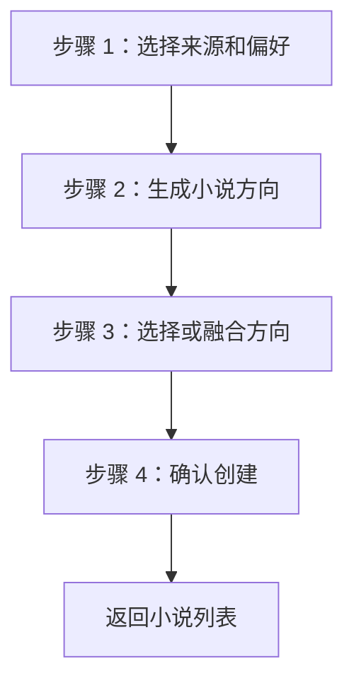

# 创建小说向导原型

创建小说向导负责把完全不懂小说创作的用户，从“想做流量内容”引导到“确认一个可生成的小说方向”。它不是普通新增表单。

## 页面目标

- 用户可以零专业输入创建小说。
- 默认由系统推荐题材、方向、主角开局和核心爽点。
- 方向生成结果必须让用户能判断“哪个更好看”。
- 创建完成后回到小说列表，新小说从“待生成设定”开始，并通过详情页承接下一步。

## 页面入口

| 来源 | 进入方式 |
| --- | --- |
| 小说列表 | 点击“创建小说” |
| 热点报告详情 | 点击“用这个热点创建小说” |
| 视频复盘后 | 点击“基于表现重新创建方向” |

如果来源是热点报告，需要自动带入热点标题、题材、样本摘要和推荐方向。

## 步骤设计

顶部使用 `ElSteps` 展示四步：

1. 来源偏好。
2. 生成方向。
3. 选择方向。
4. 确认创建。

每步都要展示：

- 当前目标。
- 系统推荐。
- 主按钮。
- 失败原因和重试入口。

## 步骤 1：选择来源和偏好

默认布局：

- 左侧：基础选择。
- 右侧：系统推荐说明和高级设置折叠。

基础字段：

| 字段 | 控件 | 默认 |
| --- | --- | --- |
| 创作来源 | 单选 | 系统推荐 |
| 题材方向 | 下拉/推荐标签 | 系统推荐 |
| 目标读者 | 下拉 | 默认网文/短剧受众 |
| 小说长度 | 下拉 | 系统推荐 |
| 视频化倾向 | 下拉 | 适合口播短视频 |

创作来源选项：

- 系统推荐。
- 引用热点报告。
- 手动输入想法。

手动输入只提供一个短文本框：

- “你可以只写一句话，例如：重生后发现老婆才是隐藏大佬。”

高级设置默认折叠：

- 主角性别/身份。
- 开局处境。
- 爽点偏好。
- 反派类型。
- 是否强视频化。
- 每章字数上限：数字输入，只能输入数字，系统上限 20000 字。
- 目标章节数：数字输入，只能输入数字，系统上限 100 章。
- 市场导向程度。

主按钮：

- 生成 3 个小说方向。

## 步骤 2：生成小说方向

生成中状态：

- 展示任务进度。
- 当前步骤：分析题材、设计主角、生成方向、审稿评分。
- 支持取消。

失败状态：

- 显示失败原因。
- 主按钮：重试生成方向。
- 次按钮：调整条件。

成功后进入步骤 3。

## 步骤 3：选择或融合方向

默认生成 3 张方向卡。

方向卡字段：

| 字段 | 说明 |
| --- | --- |
| 方向标题 | 小白可理解的小说卖点 |
| 一句话剧情 | 说明主角、冲突、爽点 |
| 主角开局 | 主角一开始有什么压迫或目标 |
| 核心爽点 | 读者为什么想继续看 |
| 市场理由 | 为什么适合当前短视频/网文市场 |
| 视频化潜力 | 是否适合转口播短视频 |
| 风险提醒 | 同质化、开局弱、长篇支撑不足 |
| AI 推荐标记 | 系统推荐哪个方向 |

方向卡操作：

- 使用这个方向。
- 编辑方向。
- 加入融合。
- 查看详细设定雏形。

页面主动作：

- 使用 AI 推荐方向。

次动作：

- 融合已选方向。
- 重新生成 3 个方向。
- 返回修改偏好。

融合方向：

- 用户最多选择 2 个方向融合。
- 融合结果作为新候选方向。
- 融合完成后同样需要评分和风险提示。

### 编辑方向

每个方向卡都需要支持编辑。编辑不是直接创建小说，而是在确认前让用户调整方向候选。

可编辑字段：

- 方向标题。
- 一句话剧情。
- 主角开局。
- 核心爽点。
- 风险提醒。

规则：

- 编辑后仍保留为当前方向候选。
- 如果编辑了核心爽点、主角开局或剧情方向，系统后续生成设定时要使用编辑后的内容。
- 编辑不会修改其他方向卡。
- 保存编辑后，方向卡需要立即展示最新内容。
- 如果编辑了核心字段，方向卡需要重新计算评分和风险；暂时无法实时评分时，要显示“评分待更新”，确认创建前必须使用最新候选内容。

## 步骤 4：确认创建

确认页展示：

- 小说暂定标题。
- 已选方向。
- 题材。
- 目标章节数：来自数字输入。
- 每章字数上限：来自数字输入。
- 开篇卖点。
- 视频化建议。
- 创建后下一步。

下一步说明：

- “创建后回到小说列表，新小说行会高亮；点击详情后，系统会推荐你生成小说设定。”

按钮：

- 确认创建小说。
- 返回选择方向。
- 保存草稿。

确认后：

- 创建正式小说项目。
- 写入方向当前版本。
- 返回 `/novels`。
- 高亮新小说行。
- 列表主按钮仍显示“详情”；进入小说详情后，默认推荐动作为“生成小说设定”。

## 草稿和离开

用户中途离开：

- 已生成方向保留为草稿。
- 小说列表不默认展示未确认草稿，或者单独展示“创建未完成”提示。
- 再次进入创建页可继续。

离开确认：

- 如果没有生成方向，直接离开。
- 如果已经生成方向但未确认，提示是否保存草稿。

## 高级选项规则

高级选项只影响生成策略，不让小白必须理解。

默认折叠文案：

- “懂一点创作再展开，不填也能生成。”

不展示：

- 完整提示词。
- 模型参数。
- token 和成本明细。

## 异常状态

| 场景 | 页面处理 |
| --- | --- |
| 模型不可用 | 显示“当前生成服务不可用”，提供重试和检查配置 |
| 热点报告过期 | 提示“热点可能已过期”，允许继续或换热点 |
| 方向生成低分 | 展示低分原因，推荐重新生成 |
| 内容安全风险 | 阻止确认，提示调整题材或禁用元素 |
| 重复点击生成 | 返回当前任务进度，不创建重复任务 |

## 小白文案

| 内部概念 | 页面文案 |
| --- | --- |
| direction candidate | 小说方向 |
| market score | 市场潜力 |
| video adaptation | 适合做短视频 |
| originality risk | 同质化风险 |
| policy profile | 生成策略 |

## 验收标准

- 用户不填专业内容也能生成方向。
- 默认只生成 3 个方向。
- 每张方向卡都能让用户判断好不好看。
- 每张方向卡都能在确认前编辑。
- 章节目标和每章上限只能输入数字，不能输入“60-80 章”“20000 字”这类混合文本。
- 创建完成后不进入空详情页，而是回到小说列表继续下一步。
- 创建过程中每个任务都有进度、失败原因和重试入口。
- 高级设置默认折叠。
