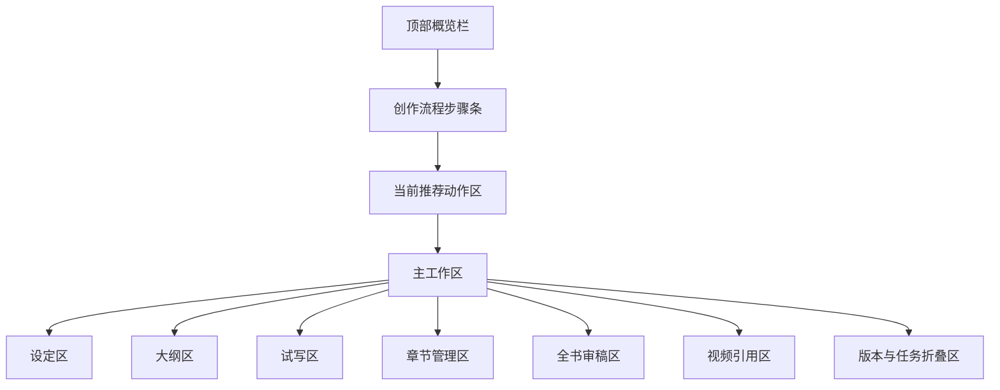

# 小说详情工作台原型

小说详情工作台是单本小说的完整创作现场。它承接整本小说的设定、大纲、章节目录、试写、正文进度、全书审稿、版本、任务和视频引用，但默认首屏仍然服务“小白下一步”。

## 页面目标

- 让用户看清这本小说为什么处于当前状态。
- 支持完整创作资产查看和调试。
- 支持从项目级问题定位到章节详情。
- 复杂内容默认折叠，不抢主流程。
- 与小说列表的主推荐动作保持一致。

## 页面入口

| 来源 | 默认聚焦 |
| --- | --- |
| 小说列表点击小说名 | 概览区 |
| 小说列表点击“详情” | 概览区 |
| 推荐动作需要深度处理 | 对应工作区 |
| 全书审稿问题 | 全书审稿区 |
| 章节问题返回 | 章节管理区 |
| 视频引用异常 | 视频引用区 |

支持 `focus` 参数：

- `overview`
- `setting`
- `outline`
- `trial`
- `chapters`
- `fullReview`
- `video`
- `versions`
- `tasks`

## 页面结构

## 本轮原型校准

根据 2026-06-17 交互闭环评审，小说详情工作台需要优先补齐以下页面承载：

| 区域 | 必须补齐的闭环 | 原型展示要求 |
| --- | --- | --- |
| 设定区 | 设定候选确认后才能进入大纲 | 展示设定状态、正式版本、下一步去大纲 |
| 大纲区 | 全书大纲、阶段大纲、章节目录三层确认 | 用三层状态卡展示是否已确认、待复核或待确认 |
| 试写区 | 试写低分可优化，试写通过可进入批量正文 | 同时展示优化章节、返回目录、生成首条测试卡、确认试写通过 |
| 章节管理区 | 批量正文只在详情页发起，列表不发起 | 展示批量任务摘要、失败/待确认数量和受影响章节摘要 |
| 全书审稿区 | 审稿报告需要能推进到完成确认 | 展示问题卡、重新审稿、接受风险原因和确认完成 |
| 视频引用区 | 小说模块只展示引用状态和快照 | 展示待视频化检查、可引用范围、引用异常和跳转视频列表 |
| 任务抽屉 | 失败不能只展示进度 | 展示当前对象、成功/失败/待确认数量、重试、换模型重试、取消 |

列表页只保留“详情”和轻量“查看任务”入口；创建视频项目属于视频模块，批量正文属于详情页章节管理区。

## 顶部概览栏

内容：

| 字段 | 展示 |
| --- | --- |
| 小说名 | 标题 + 题材标签 |
| 当前阶段 | 例如“正文生成中”“章节待处理” |
| 章节进度 | 已完成/总章节 |
| 质量分 | 最新有效全书或阶段评分 |
| 市场潜力 | 方向或试写评分 |
| 视频引用状态 | 未引用、可被引用、已引用、引用异常 |
| 最近任务 | 任务状态和入口 |
| 主推荐动作 | 与小说列表一致 |

更多操作：

- 返回列表。
- 暂停小说。
- 归档小说。
- 查看操作日志。

顶部主按钮刷新规则：

- 任务状态变化后刷新。
- 候选采用后刷新。
- 审稿完成后刷新。
- 视频引用异常处理后刷新。

## 创作流程步骤条

步骤：

1. 创建项目。
2. 确认方向。
3. 生成设定。
4. 全书大纲。
5. 章节目录。
6. 试写调试。
7. 批量正文。
8. 章节处理。
9. 全书质量检查。
10. 确认完成。
11. 待视频化。

状态文案：

| 机器状态 | 页面文案 |
| --- | --- |
| not_started | 未开始 |
| processing | 处理中 |
| waiting_user | 等你确认 |
| blocked | 需要处理 |
| failed | 失败 |
| completed | 已完成 |

规则：

- 点击已完成步骤查看摘要。
- 点击当前步骤定位到工作区。
- 未完成步骤不能跳过，只展示说明和前置条件。

## 当前推荐动作区

这是工作台首屏最重要区域。

展示：

- 推荐动作标题。
- 推荐原因。
- 阻塞原因。
- 操作后会发生什么。
- 主按钮。
- 次按钮。

示例：

| 当前状态 | 推荐动作区展示 |
| --- | --- |
| 设定已生成待确认 | “系统已生成设定摘要，确认后才能生成大纲。” |
| 试写低分 | “前三章开头吸引力不足，建议先优化第 1 章。” |
| 章节待处理 | “有 3 章影响未处理，小说暂不能完成。” |
| 全书审稿通过 | “可以确认小说完成，确认后会进行视频化检查。” |

## 设定区

默认展示：

- 设定摘要。
- 主角设定。
- 反派/阻力。
- 核心爽点。
- 禁用元素。
- 视频化倾向。
- 当前评分和风险。

操作：

- 生成设定。
- 确认设定。
- 优化设定。
- 查看完整设定。
- 查看版本。

状态承接：

| 设定状态 | 页面展示 | 主动作 | 次动作 |
| --- | --- | --- | --- |
| 待生成设定 | 说明设定会决定主角、冲突、爽点和后续大纲 | 生成设定 | 查看已选方向 |
| 设定生成中 | 任务进度、当前步骤、当前耗时、可取消条件 | 查看生成进度 | 取消任务、查看任务详情 |
| 设定候选待确认 | 设定摘要、评分、审稿结论、主要风险、采用后下一步 | 确认设定，进入大纲 | 优化设定、重新生成、放弃候选 |
| 设定审稿不通过 | Top 3 问题、影响说明、推荐优化方向 | 优化设定 | 重新生成、强制继续 |
| 设定生成失败 | 失败原因、可重试建议、是否需要调整输入 | 重试生成设定 | 返回方向、查看任务详情 |
| 设定已确认 | 当前正式设定摘要、版本号、风险备注 | 生成全书大纲 | 查看完整设定、编辑为新候选 |

规则：

- 设定生成任务不能直接生成正式设定，必须先进入候选待确认。
- 设定候选待确认时，大纲区只展示前置条件说明，不能直接生成全书大纲。
- 用户确认设定后，当前推荐动作刷新为“生成全书大纲”。
- 低分设定强制继续必须填写原因，并写入决策记录。
- 用户编辑已确认设定时，不能直接覆盖正式设定，必须生成新候选版本。

高级折叠：

- 配角关系。
- 世界背景。
- 长篇记忆基础。
- 完整字段 JSON 不展示。

## 大纲区

分为三层：

- 全书大纲。
- 阶段大纲。
- 章节目录。

默认展示：

| 层级 | 展示 |
| --- | --- |
| 全书大纲 | 主线、开局、中期反转、终局高潮、结局方向 |
| 阶段大纲 | 阶段名、章节范围、阶段目标、主要冲突 |
| 章节目录 | 章节号、标题、剧情目标、爽点、结尾钩子 |

操作：

- 生成全书大纲。
- 调整阶段数量。
- 生成章节目录。
- 确认章节目录。
- 局部重写阶段。

规则：

- 阶段数量可以调整，但调整后要重新生成或校验章节范围。
- 大纲变化影响已有正文时，必须提示影响范围。
- 章节目录确认后才能试写。

## 试写区

展示：

- 试写章节列表。
- 每章评分。
- 试写总评。
- Top 3 开篇问题。
- 首条测试卡入口。

操作：

- 试写前 1-3 章。
- 重新试写。
- 优化试写章节。
- 确认试写通过。
- 生成首条测试卡。
- 生成简单测试视频。

首条测试卡展示：

- 推荐标题 2-3 个。
- 前 3 秒旁白 2-3 个。
- 首屏字幕 2-3 个。
- 结尾悬念。
- 测试建议。

规则：

- 首条测试卡是运营验证，不改变正式完成状态。
- 试写低分默认不建议批量生成。

## 章节管理区

展示章节表：

| 列 | 说明 |
| --- | --- |
| 章节号 | 第几章 |
| 标题 | 章节标题 |
| 阶段 | 所属阶段 |
| 状态 | 正常、待处理、处理中、已处理待确认 |
| 分数 | 最新章节评分 |
| 问题数 | 审稿问题数量 |
| 影响备注 | 轻微影响、受影响未调整 |
| 视频引用 | 是否被引用 |
| 操作 | 打开章节、AI 审稿、重写 |

快捷筛选：

- 全部。
- 待处理。
- 低分。
- 有候选。
- 影响未处理。
- 已视频引用。

批量操作：

- 批量生成正文。
- 批量审稿。
- 处理失败章节。

规则：

- 正文批量生成从章节管理区发起，不从小说列表行按钮发起。
- 正文生成进度在最近任务、任务抽屉或生成任务区查看。
- 如果页面提示“正文批量生成正在进行，第 13 章等待生成”，必须同时提供“查看任务进度”和“去章节发起/管理”的入口，不能只有提示文案。
- 章节正文不在详情工作台全文展示。
- 点击章节进入章节详情工作台。
- 中等或严重影响章节必须阻塞完成。

## 全书审稿区

默认展示：

- 总分。
- 评级。
- 一句话结论。
- Top 3 问题。
- 是否允许完成。
- 推荐动作。

完整报告折叠：

- 全部分项评分。
- 章节问题列表。
- AI 味分析。
- 伏笔回收。
- 视频化适配。
- 策略版本。

操作：

- 全书质量检查。
- 重新审稿。
- 按建议优化。
- 确认小说完成。
- 接受风险继续。

接受风险继续：

- 只允许非强阻塞风险。
- 必须填写原因。
- 写入决策记录。

## 视频引用区

展示：

- 视频引用状态。
- 待视频化检查结果。
- 已创建视频项目。
- 引用章节范围。
- 引用异常。

操作：

- 进行视频化检查。
- 确认待视频化。
- 查看引用异常。
- 跳转视频列表。

规则：

- 确认小说完成后才进入视频化检查。
- 视频化检查失败不回滚小说完成状态。
- 已发布视频不被小说修改自动覆盖。
- 创建视频项目属于视频模块能力，小说详情只提供跳转视频列表或查看引用关系。

## 版本与任务折叠区

默认折叠，供高级排查使用。

版本内容：

- 方向版本。
- 设定版本。
- 大纲版本。
- 章节目录版本。
- 全书审稿版本。
- 待视频化快照。

任务内容：

- 最近任务。
- 失败任务。
- 待确认结果。
- 取消记录。

禁止展示：

- 完整提示词。
- 完整模型响应。
- API Key 或 token。

## 高风险弹窗

触发场景：

- 重选方向。
- 修改关键设定。
- 重新生成大纲且已有正文。
- 强制通过低分审稿。
- 清空后续章节。
- 确认完成但仍有轻微风险。

弹窗必须展示：

- 会影响哪些内容。
- 能否回退。
- 系统推荐做法。
- 原因填写框。

## 验收标准

- 进入页面后首屏能看到当前状态和主推荐动作。
- 创作步骤条能解释当前卡在哪一步。
- 复杂版本、任务日志和完整报告默认折叠。
- 章节问题可以一键定位到章节详情。
- 小说列表和详情工作台主推荐动作一致。
- 任一高风险动作都有影响范围、二次确认和原因记录。
