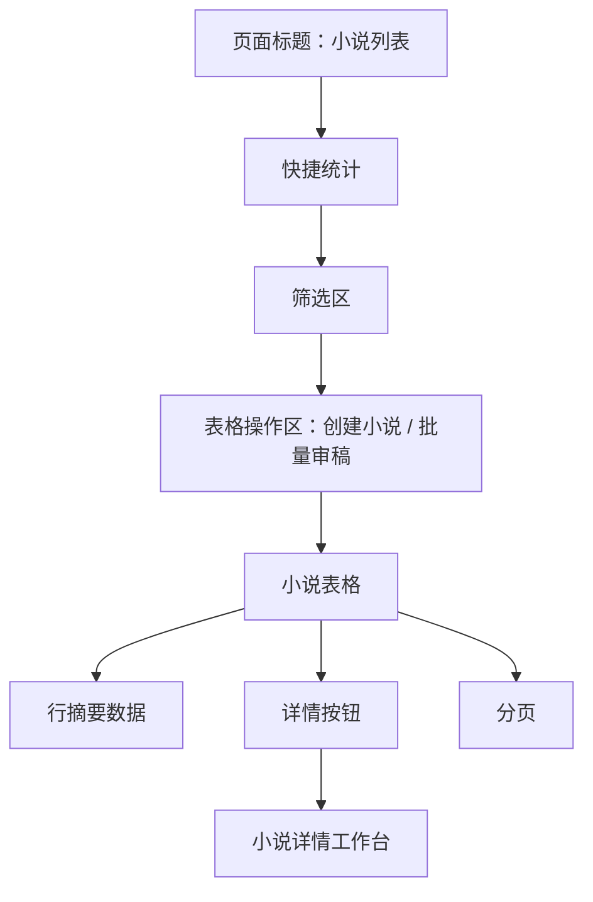

# 小说列表原型

小说列表是小白用户的默认首页，也是小说系统的主驾驶舱。它不是普通 CRUD 列表，而是告诉用户每本小说“现在做到哪一步、有没有问题、下一步点什么”。

## 页面目标

- 默认进入系统后直接看到小说列表。
- 每本小说重点展示小说自己的创作状态、章节进度和视频引用状态。
- 列表默认只承担查看、筛选、批量入口和进入详情，不承载复杂创作决策。
- 单本小说的生成进度、正文批量生成、归档、版本、审稿和影响处理都进入小说详情或章节详情。
- 视频项目创建放到视频模块，小说列表只展示“是否可被视频引用/是否引用异常”。
- 不展示完整正文、完整审稿报告、完整版本树和模型提示词。

## 页面入口

| 来源 | 进入后状态 |
| --- | --- |
| 登录后默认进入 | 展示全部进行中的小说 |
| 创建小说确认完成 | 高亮新小说，小说状态为“待生成设定”，主按钮为“详情” |
| 章节详情返回 | 保留原筛选和分页 |
| 小说详情返回 | 保留原筛选和分页 |
| 视频列表返回 | 可筛选“待视频化”小说 |

## 页面结构

## 顶部标题区

展示：

- 标题：小说列表。
- 标题只是页面标题，不使用白色卡片背景。
- 不展示“系统会根据每本小说状态推荐下一步”这类解释文案，减少首屏噪音。
- 不展示刷新按钮。

小白文案：

- “从这里开始创建小说，也可以继续处理已有小说。”

## 状态筛选

顶部只做轻量筛选，不做复杂统计卡片。数量必须跟随当前筛选条件动态变化。

| 筛选 | 含义 | 点击后筛选 |
| --- | --- | --- |
| 全部 | 当前筛选范围内全部小说 | 不额外加状态 |
| 待处理 | 有待确认、低分、失败或影响问题 | `needsAction=true` |
| 生成中 | 有 AI 任务正在运行 | `hasRunningTask=true` |
| 待视频化 | 小说已完成且通过视频化检查 | `creationStage=video_ready` |

规则：

- 小说自己的状态和视频引用状态必须分开。
- 视频引用状态不再做顶部独立状态条，放到表格列和筛选项中展示。
- 引用异常属于视频引用状态，不等同于小说创作状态。
- 不做复杂大屏统计，避免偏离小说生产主流程。

## 筛选区

常用筛选：

| 字段 | 控件 | 默认 |
| --- | --- | --- |
| 小说名称 | 输入框 | 空 |
| 创作阶段 | 下拉 | 全部 |
| 当前状态 | 下拉 | 全部 |
| 题材 | 下拉 | 全部 |
| 是否待处理 | 下拉 | 全部 |
| 视频引用 | 下拉 | 全部 |
| 更新时间 | 日期范围 | 最近 30 天 |

按钮：

- 搜索。
- 重置。
- 当筛选项超过 6 个时，才显示“查看更多”展开高级筛选；当前常用筛选不超过 6 个时不显示。

布局：

- 筛选项在左侧。
- 搜索、重置和数据条数在右侧。
- 搜索结果数量跟随表格筛选数据动态变化。

高级筛选默认折叠：

- 质量分区间。
- 受欢迎度分区间。
- 审稿风险。
- 归档状态。
- 热点来源。

## 表格字段

| 列 | 内容 | 设计说明 |
| --- | --- | --- |
| 小说名称 | 标题、题材、热点来源 | 点击标题进入详情 |
| 小说状态 | 当前创作阶段 + 阶段状态 | 和视频引用状态分开 |
| 章节进度 | 已完成/总章节、待处理数 | 不展示全部章节 |
| 评分 | 质量分、受欢迎度分 | “受欢迎度”比“市场”更通俗 |
| 视频引用状态 | 未引用、可被引用、已引用、引用异常 | 只表示小说被视频使用的情况 |
| 最近任务 | 生成中/失败/待确认 | 详情页或任务中心查看 |
| 更新时间 | 最近更新时间 | 排序 |
| 操作 | 详情；查看任务等入口放入更多或轻量文本入口 | 详情是唯一主按钮 |

表格默认排序：

1. 待处理小说。
2. 生成失败或待确认。
3. 最近更新。

## 表格操作区

表格和筛选框中间展示表格级操作：

- 创建小说。
- 批量审稿。

规则：

- 创建小说属于表格 action，不放在页面标题右侧。
- 批量动作只对勾选行或当前筛选结果生效，必须二次确认影响范围。
- 列表不提供“创建视频项目”，视频创建必须进入视频模块。
- 正文批量生成必须进入小说详情的章节管理区发起和查看，不放在小说列表表格操作区。

## 行操作

行操作以“详情”为主要按钮。列表不再把所有推荐动作都直接做成行主按钮。

| 场景 | 列表按钮 | 承载方式 |
| --- | --- | --- |
| 普通小说 | 详情 | 进入小说详情工作台 |
| 章节待处理 | 详情 | 进入小说详情后定位到待处理章节 |
| 生成中 | 详情 | 在小说详情查看最近任务和生成进度 |
| 待视频化 | 详情 | 在详情查看视频化快照；创建视频去视频模块 |
| 引用异常 | 详情 | 在详情查看引用异常摘要和处理入口 |

更多操作：

- 查看任务。
- 查看版本记录。
- 暂停小说、归档小说、删除小说不放在列表首屏；进入详情后处理。

高风险操作必须二次确认并填写原因。

## 行展开摘要

行展开用于轻量查看，不代替详情页。

展示分区：

- 创作概况：当前阶段、章节进度、待处理数量。
- 待处理数据：待处理章节数、阻塞原因数量。
- 最近任务：任务名、状态、进度。
- 视频引用：未引用、可被引用、已引用或引用异常。

行展开按钮：

- 详情。
- 查看完整任务。

规则：

- 行展开不展示小说正文细节。
- 行展开不展示完整 Top 3 问题明细，只展示数据摘要和入口。
- 具体审稿问题、正文细节和处理建议进入详情页或章节详情页呈现。

## 抽屉设计

### 任务进度抽屉

展示：

- 任务名称。
- 当前步骤。
- 进度条。
- 当前处理对象，例如第 13 章。
- 成功/失败/待确认数量。
- 失败原因。
- 重试、取消、查看任务详情。

文案示例：

- “正在生成正文，已完成 12/60 章。第 13 章生成失败会影响后续章节，建议先处理失败章节。”

### 结果确认抽屉

用于确认设定、大纲、章节目录、试写总评。

展示：

- 当前版本摘要。
- 新结果摘要。
- 评分变化。
- Top 3 风险。
- 推荐动作。

按钮：

- 使用这版。
- 继续优化。
- 放弃这版。
- 查看详情。

### 审稿问题抽屉

展示：

- 总分。
- 一句话结论。
- Top 3 问题。
- 每个问题的影响范围和推荐动作。

按钮：

- 按建议优化。
- 进入详情处理。
- 接受风险继续。

接受风险继续必须填写原因。

## 完成确认弹窗

触发：全书审稿通过后点击“确认小说完成”。

展示：

- 全书审稿结论。
- 仍存在的轻微风险。
- 确认后将进入视频化检查。
- 视频化检查失败时，小说仍保持已完成，但暂不可视频化。

按钮：

- 确认小说完成。
- 返回优化。

## 空状态

无小说时展示：

- 标题：还没有小说项目。
- 说明：可以让系统先推荐方向，你只需要判断哪个更好看。
- 主按钮：创建第一本小说。

不展示复杂说明、教程或营销内容。

## 加载和失败状态

加载：

- 表格骨架或加载状态。
- 保留筛选区。

失败：

- 显示失败原因。
- 提供重试。
- 如果是接口配置缺失，提示“检查模型或系统配置”。

## 权限和安全

- 小白默认可以创建、生成、确认、优化。
- 管理员能力如模型、提示词、策略不在列表页展示。
- API Key、完整提示词、完整模型响应不出现在页面。

## 验收标准

- 用户进入页面后 5 秒内能知道下一步处理哪本小说。
- 每行只有一个主按钮：详情。
- 任一失败状态都能看到失败原因和下一步。
- 任一高风险操作都有影响范围和原因填写。
- 列表不加载章节正文、完整审稿报告、大 JSON。
- `recommendedAction` 和小说详情工作台保持一致。
