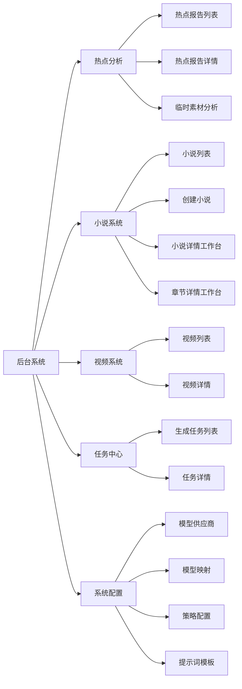
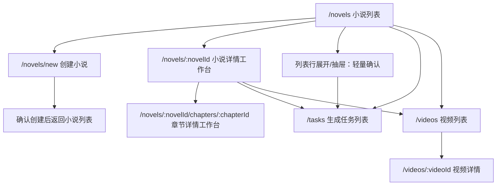
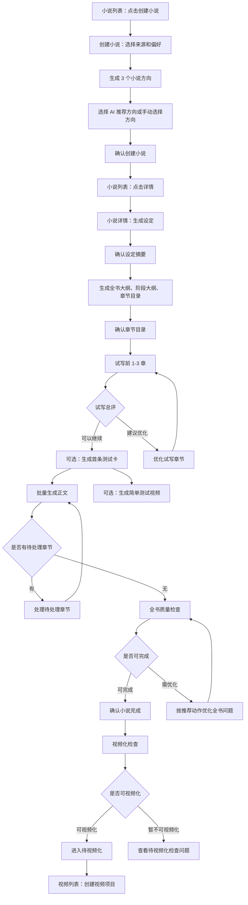
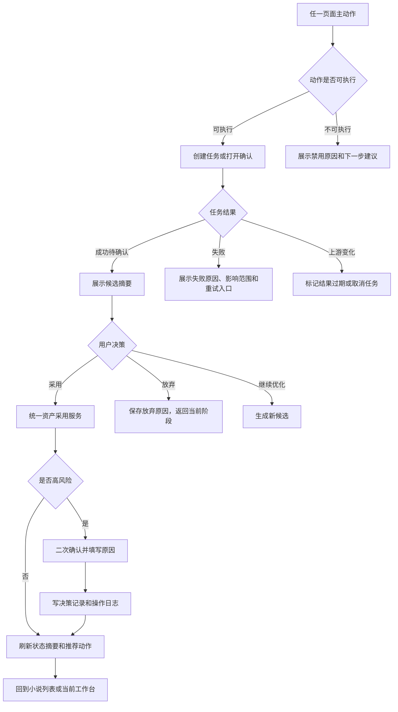

# 小说系统页面流程总图

本文档是小说系统原型设计的第一步，用于确认后台系统页面如何组织、用户从哪里开始、每个页面承载什么，以及异常和高风险动作应该流向哪里。

本文档只做页面流程和低保真原型前置说明，不生成前端代码。

## 原型目标

- 让完全不懂小说创作的小白用户，从小说列表一路走到小说完成和待视频化。
- 保证系统每一步都告诉用户“当前在哪一步”和“下一步点什么”。
- 把复杂能力藏到详情、章节工作台、高级区或异常处理入口，不压垮默认主流程。
- 为后续低保真页面原型提供页面清单、跳转关系和验收口径。

## 后台信息架构

后台系统采用顶部业务系统栏 + 左侧菜单 + 主内容区的管理后台布局，视觉风格参考已有后台系统截图，后续用 Vue 3 + Vite + TypeScript + Element Plus 实现。



默认登录后进入 `/novels` 小说列表。热点、视频、任务、配置都服务于小说创作闭环，不抢默认入口。

## 页面路由关系



页面跳转原则：

- 小说列表优先用于看状态、筛选和进入详情。
- 复杂编辑、版本对比、全书调试进入小说详情工作台。
- 单章正文、单章审稿、章节重写和影响处理进入章节详情工作台。
- 任务失败或长任务排查可以进入任务中心，但小白主流程仍回到小说列表继续。
- 视频系统早期只作为承接层；创建视频项目从视频模块发起，小说模块只展示视频引用状态和跳转入口。

## 小说默认主流程



注意：

- “确认小说完成”和“进入待视频化”是两步，不混在一个按钮里。
- “首条测试卡”和“简单测试视频”是试写后的运营验证分支，不代表小说正式完成。
- 视频化检查失败时，小说可以保持“已确认完成但暂不可视频化”，不回滚小说完成状态。

## 异常和高风险分支



高风险动作包括低分采用、过期候选采用、恢复历史版本、清空后续章节、强制通过审稿、修改已被视频引用章节。

## 核心页面清单

| 页面 | 路由 | 默认用户目标 | 主承载内容 | 不默认展示 |
| --- | --- | --- | --- | --- |
| 小说列表 | `/novels` | 看所有小说状态并进入详情 | 筛选、表格、小说状态、视频引用状态、行摘要、详情入口 | 完整正文、完整审稿、完整版本树、视频创建 |
| 创建小说 | `/novels/new` | 不懂创作也能创建一个方向明确的小说 | 来源偏好、系统推荐、方向生成、方向选择、确认创建 | 复杂提示词、模型参数、完整热点数据 |
| 小说详情工作台 | `/novels/:novelId` | 查看和调试整本小说 | 创作步骤、设定、大纲、章节概览、全书审稿、任务、版本、视频引用 | 原始模型响应、任务事件明细默认折叠 |
| 章节详情工作台 | `/novels/:novelId/chapters/:chapterId` | 处理单章正文和单章问题 | 章节摘要/特性卡、正文概览、正文、建议、新改稿候选、版本和影响标签 | 全书复杂复盘、无关章节详情 |
| 视频列表 | `/videos` | 承接已完成小说做视频 | P8：视频项目、引用小说、章节范围、引用快照、引用异常；P9 起逐步补生成、发布和数据 | AI 分镜、自动发布、平台 API 同步 |
| 任务列表 | `/tasks` | 查看生成、审稿、渲染任务进度 | 任务状态、进度、失败原因、重试入口 | 不作为小白默认主入口 |

## 页面级原型验收

### 小说列表

必须满足：

- 每行同一时间只突出“详情”作为主按钮。
- 主按钮来自统一状态摘要服务，不由前端自己猜。
- 列表能直接看出小说状态、章节进度、评分、待处理问题数和视频引用状态。
- 行展开只展示数据摘要和入口，不塞完整报告或正文细节。
- 任务处理中展示最近任务摘要，具体进度到小说详情或任务中心查看。
- 创建视频项目不在小说列表中出现。

列表主按钮示例：

| 展示状态 | 主按钮 |
| --- | --- |
| 任意小说状态 | 详情 |
| 章节待处理 | 详情，进入后处理章节 |
| 正文生成中 | 详情，进入后查看生成进度 |
| 待视频化 | 详情，视频创建去视频模块 |

### 创建小说

建议步骤：

1. 选择来源和偏好。
2. 生成小说方向。
3. 选择或融合方向。
4. 确认创建。

必须满足：

- 用户可以不填专业内容，直接使用系统推荐。
- 默认只生成 3 个方向。
- 高级自定义折叠，包括题材细分、主角类型、节奏偏好、章节目标、字数目标、市场导向程度。
- 方向卡片只展示标题、题材、主角开局、核心爽点、市场理由和风险提醒。
- 确认创建后返回小说列表并高亮新小说；列表主按钮仍是“详情”，进入小说详情后生成设定。

### 小说详情工作台

建议区域：

- 顶部状态栏：当前阶段、质量分、章节进度、视频引用状态、主推荐动作。
- 创作步骤条：方向、设定、大纲、章节目录、试写、正文、全书审稿、完成、待视频化。
- 当前任务区：任务进度、失败原因、重试入口。
- 内容资产区：方向、设定、大纲、章节目录、全书审稿摘要。
- 章节概览区：章节列表、状态、分数、问题数、入口。
- 版本和操作记录区：默认折叠。

必须满足：

- 进入工作台后仍先看到“当前下一步”，不是直接看到一堆配置。
- 全书问题只展示 Top 3 和推荐动作，完整报告折叠。
- 有视频引用异常时，说明影响什么和怎么处理。

### 章节详情工作台

建议区域：

- 顶部章节状态：章节号、标题、分数、状态、主推荐动作。
- 左侧章节导航：章节列表、分数、状态。
- 右侧顶部：章节摘要/特性卡片和正文概览。
- 正文区：当前正文、字数、版本、编辑按钮。
- 建议区：一句话结论、Top 3 问题、补充要求输入、保存、生成新改稿。
- 新改稿弹窗：概览、核心任务、主要冲突、爽点、结尾钩子和正文都可编辑。
- 影响评估：默认是状态标签，点击后展开影响范围和处理建议。
- 版本对比区：默认折叠。

必须满足：

- 单章页面只处理单章问题，不把全书后台搬进来。
- 保存候选不等于采用，采用候选才替换正式正文并触发影响评估。
- 章节重写后必须展示影响状态。
- 中等或严重影响必须给出后续章节处理入口。
- 采用候选前必须展示风险和原因填写。

### 视频列表

视频列表按 P8-P12 分期承接小说内容。P8 只做视频引用承接层；P9 起再做旁白、TTS、字幕和渲染；P10 起再做人工发布记录和 24/48 小时数据回填。

必须满足：

- 能看到视频项目引用哪本小说、哪些章节和哪些版本。
- 能看到引用快照、引用异常状态和推荐处理动作。
- 能从 `video_ready` 小说创建视频项目。
- 被引用章节变化后能展示异常等级和原因。
- P9 起再展示音频、字幕、渲染状态。
- P10 起再支持人工发布记录和 24/48 小时基础数据回填。
- AI 分镜、自动发布、平台 API 同步、高级运营看板不进入早期默认页面。

## 原型绘制顺序

推荐后续低保真原型按这个顺序画：

1. 小说列表。
2. 创建小说。
3. 小说详情工作台。
4. 章节详情工作台。
5. 视频系统页面流程总图。
6. 视频列表。
7. 视频详情工作台。
8. 任务列表轻量版。

原因：

- 小说列表决定小白默认体验。
- 创建小说决定系统如何帮小白从零开始。
- 小说详情和章节详情决定质量调试闭环。
- 视频系统先做页面流程和列表承接，避免拖大范围。
- 任务列表作为失败排查和长任务辅助，不作为主体验。

## 后续低保真原型交付格式

每个页面单独出一个 Markdown 原型说明，建议格式：

```text
页面目标
入口和返回
页面布局
核心字段
主按钮规则
空状态
加载/任务中状态
失败状态
高风险确认
小白文案
验收标准
```

当前已拆分的完整原型文档：

| 原型文档 | 说明 |
| --- | --- |
| `docs/prototypes/admin-layout-prototype.md` | 后台统一外壳、顶部导航、左侧菜单、标签栏、抽屉和弹窗规则 |
| `docs/prototypes/novel-list-prototype.md` | 小说列表、行主动作、行展开、任务抽屉、轻量确认 |
| `docs/prototypes/novel-create-wizard-prototype.md` | 创建小说 4 步向导、方向生成、方向选择、确认创建 |
| `docs/prototypes/novel-detail-workbench-prototype.md` | 单本小说完整工作台、设定、大纲、试写、章节、全书审稿和视频引用 |
| `docs/prototypes/chapter-detail-workbench-prototype.md` | 单章正文、审稿问题、候选版本、影响评估和视频引用 |
| `docs/prototypes/video-system-page-flow.md` | 视频系统从待视频化到发布回流的页面流程和 P8-P12 分期 |
| `docs/prototypes/video-list-prototype.md` | P8 视频引用承接层、视频项目创建、引用快照和引用异常 |
| `docs/prototypes/video-detail-workbench-prototype.md` | P9-P12 视频详情工作台、旁白、音频、字幕、渲染、发布和数据回填 |
| `docs/prototypes/video-list-task-prototype.md` | 早期草案，仅保留任务辅助和后续交互参考，不作为 P8 范围口径 |

## 关联需求文档

- P0 可见主流程：`docs/modules/novel-p0-visible-main-flow.md`
- 状态、门禁、推荐动作：`docs/modules/novel-state-gate-action-contract.md`
- 任务并发与批量任务：`docs/modules/novel-task-concurrency-contract.md`
- 资产采用与过期：`docs/modules/novel-asset-adoption-staleness-contract.md`
- 章节详情工作台：`docs/modules/novel-chapter-workbench.md`
- 小说详情工作台：`docs/modules/novel-detail-workbench.md`
- 待视频化判定：`docs/modules/novel-video-readiness.md`
- 视频系统：`docs/modules/video-system.md`
- 验收测试矩阵：`docs/modules/novel-acceptance-test-matrix.md`
