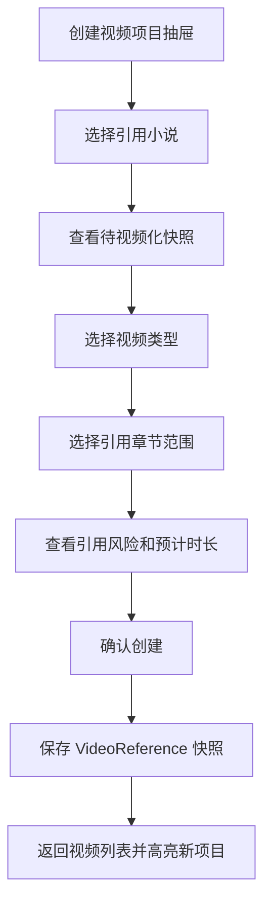

# 创建视频项目原型

本文档细化 P8 的“创建视频项目”抽屉/向导。它承接 `video_ready` 小说，只创建视频项目和引用快照，不生成旁白、配音、字幕、渲染或发布记录。

## 页面目标

- 帮用户从待视频化小说创建一个可追溯的视频项目。
- 让用户明确选择引用范围，同时看到系统推荐的首条视频范围。
- 创建时保存稳定的 `VideoReference` 快照，避免后续小说修改污染视频项目。
- 在 P8 阶段不误导用户以为已经可以生成视频。

## 入口

| 来源 | 行为 |
| --- | --- |
| 视频列表“新建视频项目” | 打开创建抽屉，用户搜索 `video_ready` 小说 |
| 小说详情待视频化区 | 跳转视频列表并自动打开创建抽屉，带入小说和推荐范围 |
| 视频列表空状态 | 引导选择可视频化小说 |

## 抽屉结构

创建抽屉不使用单页长表单，采用 4 步向导：

| 步骤 | 名称 | 用户确认点 | 主按钮 |
| --- | --- | --- | --- |
| 1 | 选择小说 | 这本小说是否已完成且可被视频引用 | 下一步：确认范围 |
| 2 | 确认引用范围 | 选择哪些章节，是否使用系统推荐首条范围 | 下一步：创建前检查 |
| 3 | 创建前检查 | 小说状态、快照版本、章节正文、风险和重复项目是否通过 | 创建视频项目 |
| 4 | 创建完成 | 项目和引用快照已保存，当前不进入生成 | 查看引用快照 |

每一步顶部都要有一句话说明“这一步要确认什么”。如果下一步按钮禁用，按钮旁边必须展示原因。

## 表单字段

| 字段 | 控件 | P8 默认 | 规则 |
| --- | --- | --- | --- |
| 引用小说 | 搜索选择器 | 从入口带入 | 只能选择 `video_ready` 小说 |
| 视频类型 | 单选 | 首条测试 | 首条测试、章节范围、阶段系列、整本短视频集 |
| 引用章节范围 | 章节范围选择 | 系统推荐首条范围 | 必须有正式正文和章节快照 |
| 项目名称 | 输入框 | 小说名 + 章节范围 | 可编辑，不能为空 |
| 创建说明 | 文本框 | 空 | 可记录运营目的 |

P8 不展示旁白音色、字幕样式、背景素材等生成参数；这些参数从 P9 进入生成设置。

## 右侧摘要

右侧固定摘要用于降低误操作：

- 小说标题和当前状态。
- 全书评分和待视频化结论。
- 推荐首条视频范围。
- 引用章节数。
- 预计旁白时长区间。
- 内容安全和平台风险摘要。
- 当前是否存在未处理高风险问题。

## 推荐范围

系统默认优先推荐：

1. 全书待视频化快照中的首条视频建议。
2. 前 1-3 章中冲突最完整、钩子最强的一段。
3. 如果小说有高潮片段建议，展示为次推荐，不默认选中。

推荐卡片展示：

- 推荐名称。
- 章节范围。
- 推荐理由。
- 前 3 秒钩子摘要。
- 首屏字幕摘要。
- 风险标签。
- “使用此范围”按钮。

## 创建前校验

| 校验 | 失败文案 | 推荐动作 |
| --- | --- | --- |
| 小说不是 `video_ready` | 这本小说还不能创建正式视频项目 | 回小说详情处理待视频化问题 |
| 引用章节缺正式正文 | 选中的章节还没有正式正文 | 换章节或回小说处理 |
| 引用范围有 blocking 风险 | 当前范围存在阻塞风险 | 先处理风险 |
| 引用快照生成失败 | 暂时不能保存引用快照 | 重试或稍后再试 |

失败时不能创建视频项目。

## 创建成功

创建成功后：

- 保存 `VideoReference` 快照。
- 视频项目状态为 `draft` 或 `ready_for_generation`，但 P8 页面只显示为“引用正常，待后续生成能力”。
- 回到视频列表。
- 高亮新建项目。
- 主动作是“查看引用快照”，不是“生成视频”。

## 异常状态

| 状态 | 页面表现 | 动作 |
| --- | --- | --- |
| 推荐范围过期 | 推荐卡显示“需重新检查” | 重新读取待视频化快照 |
| 小说状态变化 | 抽屉顶部风险条 | 返回小说详情 |
| 创建重复 | 提示已有相同小说和章节范围项目 | 默认查看已有项目；如仍创建独立项目，必须填写创建原因 |

重复项目规则：

- 默认主动作是“查看已有项目”，防止用户误建多个同范围项目。
- “仍创建新项目”只能作为次操作，必须填写创建原因，例如不同运营测试目的或不同视觉方向。
- 后端需基于 `idempotencyToken + actionType + requestHash` 判断重复提交和真实新建意图。

## 验收口径

- 非 `video_ready` 小说不能创建正式视频项目。
- 创建视频项目时必须保存引用章节版本快照。
- 系统推荐首条范围，但用户可以改章节范围。
- 创建成功后不进入生成视频动作。
- 创建失败时能说明原因和下一步。
- 不暴露完整提示词、完整模型响应、API Key 或平台 token。
