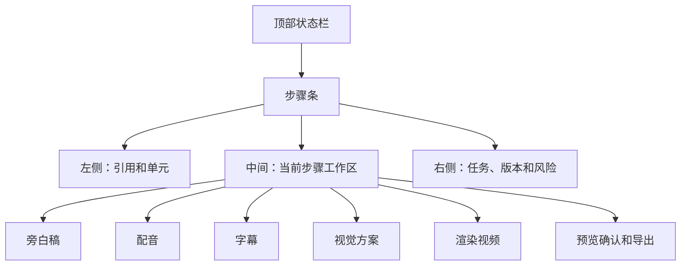

# 视频详情工作台原型

本文档定义 P9-P12 的视频详情工作台低保真原型，用于保留完整视频生产和运营闭环。任务包 8 不实现复杂视频详情页；P8 只需要能从视频列表查看引用快照和引用异常。

P9 详细研发和验收口径见：`docs/modules/video-task-package-9-detailed-design.md`。本文档只作为视频详情工作台低保真原型补充。

## 页面目标

- 让用户围绕一个视频项目处理从引用、旁白、配音、字幕、视觉方案、渲染、预览确认到导出的 P9 生成闭环。
- 把每个产物的版本、过期状态和下一步动作展示清楚。
- 防止上游小说或旁白变化后，下游音频、字幕、渲染和发布记录被静默污染。
- 为后续短视频单元、标题封面钩子和运营复盘预留稳定工作台。

## 页面结构

## 顶部状态栏

| 元素 | 内容 |
| --- | --- |
| 视频项目名称 | 项目名、视频类型、引用小说 |
| 当前状态 | 引用正常、待生成旁白、配音待生成、字幕待确认、视觉待确认、可渲染、待预览、可导出 |
| 引用状态 | normal/info/warning/blocking/resolved |
| 当前推荐动作 | 单个主按钮，例如“确认旁白稿”“生成配音”“查看引用异常” |
| 风险提示 | blocking 异常、产物过期、已发布冻结 |

顶部只保留一个主动作，避免用户同时看到一堆生成按钮。

## 步骤条

每个步骤有四类状态：

- 未开始。
- 进行中。
- 已完成。
- 已过期。

P10+ 灰态延展：

- 发布记录。
- 数据回填。
- 短视频单元和系列。
- 运营复盘。

这些节点可以在页面底部或侧栏以“后续能力”展示，但 P9 不作为可点击主步骤，也不进入当前推荐动作。

## P8 只读模式

P8 阶段如果进入详情，只展示：

- 引用快照。
- 引用异常。
- 当前推荐动作。
- 返回视频列表。

P8 不展示旁白、音频、字幕、渲染、发布和数据回填工作区。

## 左侧：引用和单元

引用卡片：

- 引用小说。
- 引用章节范围。
- 引用章节版本。
- 引用时待视频化检查摘要。
- 当前小说状态。
- 引用异常等级。

短视频单元卡片，P11 起启用：

- 单元序号。
- 引用章节范围。
- 单元摘要。
- 前 3 秒钩子。
- 首屏字幕。
- 结尾悬念。
- 单元状态。

规则：

- 调整单元范围后，旁白、音频、字幕、渲染和发布文案都标记过期。
- 已发布单元不能直接覆盖，只能创建新版本或新视频项目。

## 中间：当前步骤工作区

### 旁白稿

展示：

- 当前旁白稿版本。
- 字数、预计时长。
- 前 3 秒钩子。
- 结尾悬念。
- AI 候选摘要。
- 用户编辑区。

动作：

- 生成旁白稿候选。
- 保存草稿。
- 确认当前旁白稿。
- 查看版本历史。

规则：

- 旁白稿确认后才能生成配音。
- 修改旁白稿后，音频、字幕、渲染和发布文案全部标记过期。

### 配音

展示：

- 使用音色。
- 使用模型或供应商配置摘要。
- 音频版本。
- 时长。
- 试听入口。
- 失败原因。

动作：

- 生成配音。
- 重新生成配音。
- 试听并确认配音。

规则：

- 配音生成必须是异步任务。
- 配音变更后，字幕和渲染标记过期。
- 不展示密钥、完整请求参数或完整模型响应。

### 字幕

展示：

- 字幕版本。
- 字幕预览。
- 时间轴摘要。
- 首屏字幕。
- 错误提示，例如时长不匹配。

动作：

- 生成字幕。
- 编辑字幕。
- 确认字幕。

规则：

- 音频过期时字幕不能确认。
- 字幕变更后，渲染标记过期。

### 视觉方案

展示：

- 生成模式：简单循环背景。
- 背景素材和来源。
- 画面比例。
- 字幕样式。
- 安全区提示。

动作：

- 选择背景素材。
- 调整画面和字幕样式。
- 确认视觉方案。

规则：

- 视觉方案变化后，渲染标记过期。
- P9 只用简单循环背景，但保留素材来源、授权、分镜和外部工具扩展字段。

### 渲染视频

展示：

- 背景素材方案。
- 渲染参数摘要。
- 渲染任务状态。
- 视频文件版本。
- 预览入口。

动作：

- 渲染视频。
- 重新渲染。

规则：

- 渲染前必须重新检查引用状态。
- blocking 引用异常不能渲染。
- 重新渲染不覆盖旧视频文件。

### 预览确认

展示：

- 视频播放器。
- 当前渲染版本。
- 前 3 秒钩子、首屏字幕、时长、分辨率。
- 声音自然度、字幕清晰度、背景适配和导出门禁检查。

动作：

- 确认当前视频。
- 标记不满意并选择原因。
- 返回旁白、配音、字幕、视觉或渲染步骤。

规则：

- 标记不满意不算完成，不能导出。
- 只有确认当前视频后，导出步骤才解锁。

### 导出

展示：

- 已确认视频版本。
- 导出格式、分辨率和文件名。
- 导出记录。

动作：

- 导出文件。
- 下载文件。

规则：

- 导出不等于发布。
- 导出不会创建发布记录或数据回填任务。

### 发布记录

P10 起启用。

字段：

- 发布平台。
- 平台账号。
- 作品链接。
- 发布时间。
- 发布标题。
- 前 3 秒钩子版本。
- 首屏字幕版本。
- 使用视频文件版本。
- 备注。

规则：

- 初期只做人工记录，不做自动上传。
- 发布记录冻结当时使用的旁白、音频、字幕、渲染文件和文案版本。
- 已发布后，上游变化只产生引用异常或产物过期提示，不自动覆盖平台内容。

### 数据回填

P10 起启用。

字段：

- 24 小时播放量、完播率、平均观看时长、点赞、评论、收藏、关注。
- 48 小时播放量、完播率、平均观看时长、点赞、评论、收藏、关注。
- 主观判断：好、一般、差、样本太少。
- 下一步决策：继续同方向、优化标题、优化旁白、换章节、暂停项目、继续观察。

规则：

- 样本不足时不能直接判定小说失败。
- 数据回填结论可以回流小说、热点和模型策略，但需要标记置信度。

## 右侧：任务、版本和风险

任务区：

- 当前任务。
- 任务进度。
- 失败原因。
- 重试入口。
- 取消入口。

版本区：

- 引用快照版本。
- 旁白稿版本。
- 音频版本。
- 字幕版本。
- 渲染文件版本。
- 发布记录使用版本。

风险区：

- 引用异常。
- 产物过期。
- 内容安全风险。
- 平台发布风险。
- 已发布冻结提示。

## 产物依赖门禁

| 上游变化 | 下游影响 | 用户看到的状态 |
| --- | --- | --- |
| 引用快照 blocking 异常 | 旁白、音频、字幕、渲染暂停 | 引用异常，先处理小说 |
| 短视频单元范围变化 | 旁白、音频、字幕、渲染过期 | 单元已变化，需重新确认 |
| 旁白稿变化 | 音频、字幕、渲染、发布文案过期 | 下游产物已过期 |
| 音频变化 | 字幕、渲染过期 | 字幕需重新对齐 |
| 字幕变化 | 渲染过期 | 需要重新渲染 |
| 渲染文件变化 | 新发布记录可选新版本 | 已发布记录不变 |

## 异常和失败状态

| 场景 | 页面表现 | 推荐动作 |
| --- | --- | --- |
| 引用 blocking | 顶部红色风险条，步骤禁用 | 返回小说处理或重新选引用范围 |
| 旁白生成失败 | 旁白区展示失败原因 | 重试或调整要求 |
| 音频生成失败 | 任务区展示失败原因 | 重试音频任务 |
| 字幕时长不匹配 | 字幕区展示对齐风险 | 重新生成字幕 |
| 渲染失败 | 渲染区展示任务失败 | 重试渲染 |
| 已发布后上游变化 | 冻结提示和异常记录 | 创建新版本或新视频项目 |

## 原型验收口径

- 用户能一眼看懂视频项目当前处于哪一步。
- 用户能知道下一步只该做一个主动作。
- 每个产物都有版本和过期状态。
- 上游变化会让下游产物过期或阻塞，而不是静默复用。
- 已发布记录冻结使用版本，后续修改不覆盖旧记录。
- 页面不展示完整提示词、完整模型响应、API Key 或外部平台 token。
