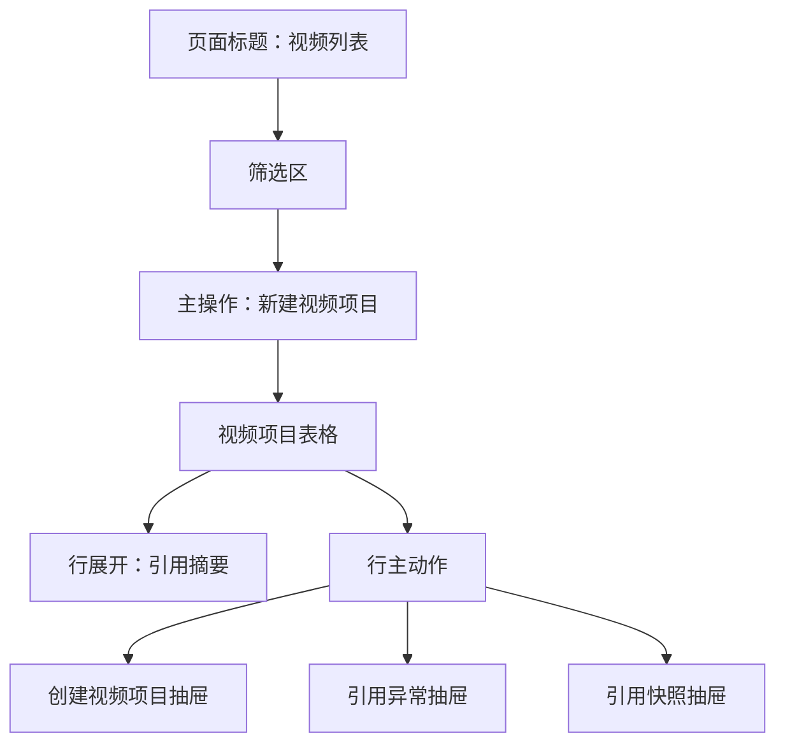

# 视频列表原型

本文档定义任务包 8 的视频列表低保真原型。视频列表是视频模块的固定主入口。P8 先负责“视频引用承接层”：创建视频项目、保存引用快照、展示引用状态和处理引用异常；P9 再在同一个列表上补充简单生成、预览和导出的状态入口。

## 页面目标

- 管理从 `video_ready` 小说创建出来的视频项目。
- 看清每个视频项目引用哪本小说、哪些章节和哪些章节版本。
- 识别小说变化带来的视频引用异常。
- 给用户明确的下一步建议：先处理引用异常，或进入简单生成。
- 让视频生成状态回到列表可见，避免用户只在任务中心里找进度。

## 页面结构

页面第一屏应优先让用户看到“哪些视频可以继续、哪些视频引用异常、下一步点什么”。

## 步骤式承接引导

视频列表参考小说详情的新交互，不把所有视频能力铺成一个长页面。P8 顶部需要有“视频承接步骤条”，让小白用户知道自己处在视频模块的哪一步。

P8 步骤：

| 步骤 | 名称 | 页面表达 |
| --- | --- | --- |
| 1 | 小说已待视频化 | 是否有可引用小说 |
| 2 | 创建视频项目 | 是否已创建项目 |
| 3 | 保存引用快照 | 是否已锁定章节版本 |
| 4 | 引用状态检查 | 当前 normal/info/warning/blocking |
| 5 | 待进入生成 | P8 灰态展示，P9 再开放 |

交互规则：

- 用户从小说详情跳入时，步骤条默认定位到“创建视频项目”。
- 已完成节点可点开摘要，未解锁节点只展示解锁条件。
- blocking 异常高亮“引用状态检查”，并把行主动作改为“处理异常”。
- “待进入生成”在 P8 必须灰态，不能触发旁白、TTS、字幕或渲染。
- P9 启用后，“待进入生成”变为“进入生成工作台”，路由到 `/videos/:videoId?focus=currentRecommendedStep`。

## 顶部区域

| 区域 | 内容 |
| --- | --- |
| 页面标题 | 视频列表 |
| 页面说明 | 管理从小说生成的视频项目，当前阶段先维护引用快照和引用异常 |
| 主按钮 | 新建视频项目 |
| 次按钮 | 刷新引用状态 |
| 风险提示 | 若存在 blocking 异常，顶部显示受影响数量和查看入口 |

P8 的主按钮只允许“新建视频项目”，不提供“生成视频”主入口。

## 筛选区

| 筛选项 | 控件 | 说明 |
| --- | --- | --- |
| 视频项目名称 | 输入框 | 支持模糊搜索 |
| 引用小说 | 远程搜索 | 只搜已进入待视频化或已被引用的小说 |
| 引用状态 | 下拉 | normal、info、warning、blocking、resolved |
| 项目生命周期 | 下拉 | active、stopped、archived |
| 生产状态 | 下拉 | not_started、ready_for_generation、generation_locked、generating、generated、exported |
| 更新时间 | 日期范围 | 按视频项目更新时间筛选 |

快捷筛选：

- 全部。
- 引用正常。
- 有轻微变化。
- 需要关注。
- 阻塞异常。
- 可生成。
- 生成中。
- 已导出。
- 已处理异常。

## 表格字段

| 列 | 展示 | 说明 |
| --- | --- | --- |
| 视频项目 | 名称、视频类型 | 例如首条测试、章节范围、阶段系列 |
| 引用小说 | 小说名、当前小说状态 | 点击可回小说详情 |
| 引用章节 | 章节范围、章节数量 | 例如第 1-3 章 |
| 引用快照 | 快照时间、章节版本摘要 | 展示版本号或版本摘要 |
| 引用状态 | normal/info/warning/blocking/resolved | 用统一标签展示 |
| 视频生产状态 | 未开始、生成中、已生成、已导出 | P8 固定为未开始；P9 起启用 |
| 当前任务 | 任务状态和失败原因摘要 | P9 起展示生成进度 |
| 最近变化 | 小说或引用最近更新时间 | 帮用户判断是否刚刚变更 |
| 当前推荐动作 | 单个主按钮 | 查看快照、查看异常、重新检测、进入小说处理 |

## 行主动作

| 条件 | 主动作 | 说明 |
| --- | --- | --- |
| 引用正常 | 查看引用快照 | 默认只看引用信息 |
| `info` | 查看差异 | 轻微变化，不强阻塞 |
| `warning` | 查看异常 | 建议确认继续或返回小说处理 |
| `blocking` | 处理异常 | 暂停后续生成能力 |
| 引用正常且 P9 可用 | 进入生成工作台 | 打开 `/videos/:videoId?focus=currentRecommendedStep`，由详情页处理旁白、配音、字幕、视觉、渲染、预览和导出 |
| 生成中 | 查看任务 | 查看生成进度、失败和重试 |
| 已生成 | 预览/导出 | 查看视频文件并导出 |
| 已处理 | 查看处理记录 | 展示原因和处理人 |

P8 不提供“生成旁白”“生成配音”“生成字幕”“渲染视频”“标记发布”作为行主动作。
P9 起列表也不直接确认旁白、配音、字幕、视觉方案或导出，只负责进入详情工作台的当前推荐步骤。

## 行展开摘要

展示：

- 引用小说摘要。
- 引用章节范围。
- 引用时章节版本。
- 引用时待视频化检查摘要。
- 当前小说状态。
- 当前引用异常原因。
- 推荐处理动作。

不展示：

- 完整小说正文。
- 完整模型提示词。
- 完整模型响应。
- 平台账号、token 或外部密钥。

## 创建视频项目抽屉

触发入口：

- 视频列表点击“新建视频项目”。
- 小说详情待视频化区域点击“创建视频项目”，跳转后自动打开抽屉并带入小说。

表单字段：

| 字段 | 控件 | 默认 |
| --- | --- | --- |
| 引用小说 | 搜索选择器 | 从入口带入；只能选择 `video_ready` 小说 |
| 视频类型 | 单选 | 首条测试 |
| 引用章节范围 | 章节范围选择 | 使用待视频化快照推荐范围 |
| 项目名称 | 输入框 | 小说名 + 章节范围自动生成 |
| 创建说明 | 文本框 | 可选，用于记录为什么创建 |

侧边摘要：

- 小说当前状态。
- 待视频化检查结论。
- 系统推荐首条视频范围。
- 引用章节数和预计旁白长度。
- 当前是否存在未处理高风险问题。

按钮：

- 创建视频项目。
- 取消。

规则：

- 非 `video_ready` 小说不可创建正式视频项目。
- 创建成功后必须生成不可变的 VideoReference 快照。
- 创建成功后回到视频列表并高亮新项目。
- 如果章节范围包含风险章节，必须阻止创建或要求先返回小说处理。

## 引用快照抽屉

展示：

- 引用小说 ID 和小说名。
- 引用章节范围。
- 每章正式正文版本。
- 引用时全书审稿摘要。
- 引用时待视频化检查摘要。
- 创建时间、创建人。

用户动作：

- 返回小说详情。
- 重新检测引用状态。
- 查看引用异常历史。

## 引用异常抽屉

展示结构：

| 区域 | 内容 |
| --- | --- |
| 异常结论 | 一句话说明，例如“第 2 章正式正文已变化，建议重新生成后续视频产物” |
| 异常等级 | info、warning、blocking |
| 影响范围 | 受影响章节、受影响视频项目、是否已有生成产物或发布记录 |
| 变化摘要 | 引用时版本和当前版本差异摘要 |
| 推荐动作 | 返回小说处理、重新检测、确认忽略、停止项目 |
| 处理记录 | 处理人、处理时间、原因 |

动作规则：

| 视频状态 | 异常等级 | 可用动作 |
| --- | --- | --- |
| 未生成产物 | info | 查看差异、确认忽略 |
| 未生成产物 | warning | 返回小说处理、确认继续、重新检测 |
| 未生成产物 | blocking | 返回小说处理、重新选择引用范围、停止项目 |
| 已生成未发布 | warning | P9 起重新生成受影响产物；P8 只记录风险 |
| 已发布 | info/warning/blocking | 保留发布记录，建议创建新视频版本或新视频项目 |

确认忽略必须填写原因。blocking 异常未处理前，后续生成入口必须禁用。

## 空状态

无视频项目时：

- 文案：当前还没有视频项目。
- 推荐动作：从已待视频化的小说创建第一个视频项目。
- 辅助入口：查看待视频化小说。

无可引用小说时：

- 文案：暂无可创建视频的视频化小说。
- 推荐动作：回小说系统完成全书审稿和待视频化确认。

## P8 验收口径

- 视频列表能展示视频项目、引用小说、章节范围和引用快照。
- 创建视频项目只能选择 `video_ready` 小说。
- 创建后保存章节版本快照。
- 被引用章节变化后，视频项目能展示异常等级和原因。
- 引用异常能查看、重新检测、确认忽略或返回小说处理。
- 忽略异常必须记录原因。
- 页面不把配音、字幕、渲染、发布和数据回填作为 P8 可用能力。

## P9 列表扩展

P9 启用简单生成后，视频列表增加生成相关状态，但仍然保持“一行一个主动作”：

| 视频状态 | 列表显示 | 主动作 |
| --- | --- | --- |
| 未开始 | 引用正常，待生成 | 进入生成 |
| 旁白待确认 | 旁白稿已生成 | 确认旁白 |
| 音频生成中 | 任务进度 | 查看任务 |
| 字幕待确认 | 字幕已生成 | 确认字幕 |
| 渲染中 | 渲染进度 | 查看任务 |
| 已生成 | 视频文件版本 | 预览/导出 |
| 生成失败 | 失败原因摘要 | 查看失败 |

P9 列表仍不出现“标记发布”“回填数据”“系列拆条”作为主动作。
