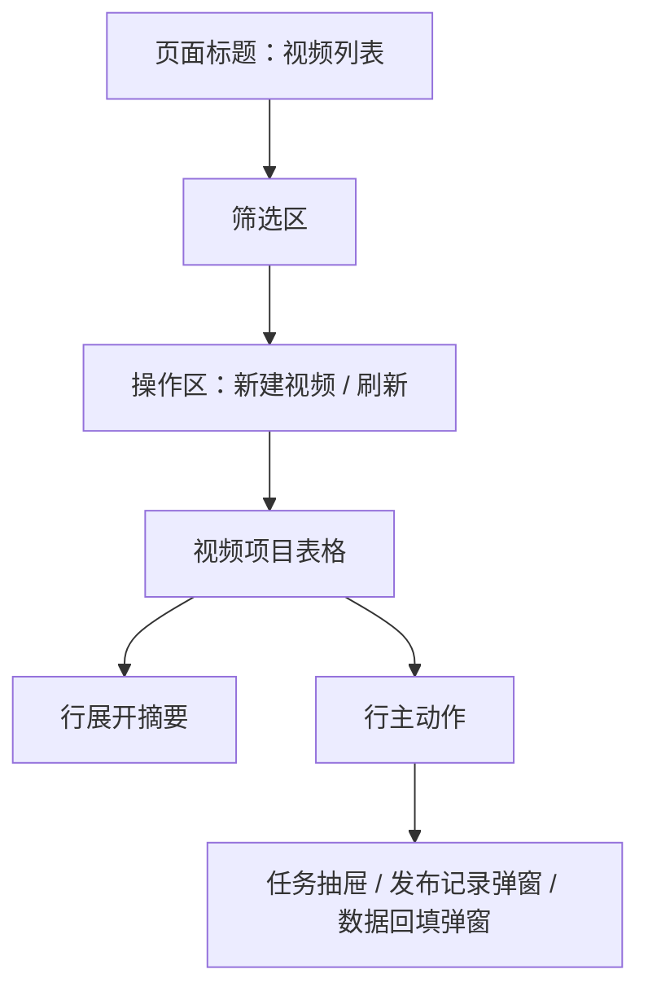

# 视频列表与任务辅助原型

本文档是早期视频列表和任务辅助交互草案。当前视频模块已经拆分为 P8-P12：P8 只做视频引用承接层，P9 做简单视频生成，P10 做人工发布和数据回填，P11 做视频详情和短视频单元，P12 做运营复盘和高级能力。

任务包 8 的正式原型以 `docs/prototypes/video-system-page-flow.md`、`docs/prototypes/video-list-prototype.md` 为准。视频详情工作台以 `docs/prototypes/video-detail-workbench-prototype.md` 为准。本文保留任务抽屉、任务辅助和早期交互参考，不再作为 P8 范围口径。

## 草案中的视频列表页面目标

本节是 P9/P10 以后的视频生产、发布和数据回填参考，不作为任务包 8 验收口径。

- 管理从小说创建出来的视频项目。
- 看清每个视频引用哪本小说、哪些章节和哪些版本。
- 看清音频、字幕、渲染、发布和引用异常状态。
- 支持人工发布记录和基础数据回填。
- 对失败任务提供重试入口。

## 视频列表入口

| 来源 | 默认行为 |
| --- | --- |
| 顶部视频系统 | 打开视频列表 |
| 小说详情待视频化区 | 跳转视频列表，并带入小说和章节范围 |
| 视频列表“新建视频” | 打开创建视频弹窗 |
| 任务失败提醒 | 筛选生成失败视频 |

## 视频列表结构

## 视频列表筛选区

字段：

| 字段 | 控件 |
| --- | --- |
| 视频名称 | 输入框 |
| 引用小说 | 远程搜索 |
| 视频状态 | 下拉 |
| 发布状态 | 下拉 |
| 引用异常 | 下拉 |
| 更新时间 | 日期范围 |

快捷筛选：

- 全部。
- 待生成。
- 生成中。
- 生成失败。
- 可发布。
- 已发布。
- 数据待回填。
- 引用异常。

## 视频表格字段

| 列 | 展示 | 说明 |
| --- | --- | --- |
| 视频项目 | 名称、视频类型 | 单条测试、章节范围、阶段系列 |
| 引用小说 | 小说名、章节范围 | 点击可回小说详情 |
| 引用快照 | 章节版本、快照时间 | 防止小说修改后不可追溯 |
| 生成状态 | 视频主状态 | 草稿、待生成、生成中、失败、可发布 |
| 产物状态 | 音频、字幕、渲染 | 用小标签展示 |
| 发布状态 | 未发布、已发布、发布异常 | 已发布可查看链接 |
| 数据状态 | 未回填、24h 已填、48h 已填 | 早期人工回填 |
| 引用异常 | 正常、轻微、强异常 | 小说修改后提示 |
| 当前推荐动作 | 单个主按钮 | 生成、查看进度、下载、标记发布 |

## 视频行主动作

| 视频状态 | 主动作 | 承载 |
| --- | --- | --- |
| 草稿 | 完善引用范围 | 弹窗 |
| 待生成 | 生成视频 | 创建任务并打开任务抽屉 |
| 生成中 | 查看进度 | 任务抽屉 |
| 生成失败 | 重试失败步骤 | 失败抽屉 |
| 可发布 | 下载视频 | 下载或产物抽屉 |
| 已下载未发布 | 标记发布 | 发布记录弹窗 |
| 已发布 24h 未回填 | 回填 24h 数据 | 数据回填弹窗 |
| 已发布 48h 未回填 | 回填 48h 数据 | 数据回填弹窗 |
| 引用异常 | 查看引用异常 | 引用异常抽屉 |

## 行展开摘要

展示：

- 引用小说摘要。
- 引用章节范围。
- 旁白稿摘要。
- 前 3 秒钩子。
- 首屏字幕。
- 最近任务状态。
- 发布记录摘要。
- 24/48 小时数据摘要。
- 下一步运营建议。

不展示：

- 完整小说正文。
- 完整音频文件。
- 完整字幕文件。
- 平台账号 token。

## 创建视频弹窗

触发：

- 视频列表点击新建视频。
- 从小说详情待视频化区跳转并带入小说。

字段：

| 字段 | 控件 | 默认 |
| --- | --- | --- |
| 引用小说 | 选择器 | 从入口带入 |
| 引用章节范围 | 章节范围选择 | 系统推荐首条 |
| 视频类型 | 单选 | 首条测试 |
| 生成模式 | 单选 | 解压背景循环 |
| 旁白音色 | 下拉 | 默认音色 |
| 字幕样式 | 下拉 | 默认字幕 |
| 背景素材 | 下拉 | 默认解压视频 |

按钮：

- 创建视频项目。
- 取消。

规则：

- 引用小说必须已完成或通过待视频化检查。
- 试写后的简单测试视频可以引用试写章节，但标记为运营测试，不代表正式视频化。
- 创建时保存章节版本快照。

## 发布记录弹窗

字段：

- 发布平台。
- 平台账号。
- 作品链接。
- 发布时间。
- 发布标题。
- 标题钩子版本。
- 前 3 秒旁白版本。
- 首屏字幕版本。
- 备注。

按钮：

- 保存发布记录。
- 稍后填写。

规则：

- 初期只做人工记录。
- 不接平台自动上传。
- 不保存平台 token。

## 数据回填弹窗

字段：

| 字段 | 24h | 48h |
| --- | --- | --- |
| 播放量 | 是 | 是 |
| 完播率 | 是 | 是 |
| 平均观看时长 | 是 | 是 |
| 点赞数 | 是 | 是 |
| 评论数 | 是 | 是 |
| 收藏数 | 是 | 是 |
| 新增关注 | 是 | 是 |
| 主观判断 | 是 | 是 |
| 下一步决策 | 是 | 是 |

下一步决策：

- 继续同方向。
- 优化开篇。
- 换标题钩子。
- 换题材。
- 暂停该小说。
- 重新生成试写。
- 样本不足，继续观察。

规则：

- 样本不足时不能直接判定小说失败。
- 回填数据可进入小说复盘和自我成长数据口子。

## 引用异常抽屉

展示：

- 哪些章节被引用。
- 引用时版本。
- 当前小说版本。
- 差异摘要。
- 是否已发布。
- 影响等级。

动作：

- 确认无影响。
- 重新生成视频。
- 创建新视频版本。
- 查看小说章节。

高风险：

- 忽略强异常必须填写原因。
- 已发布视频不自动覆盖。

## 任务辅助原型

任务辅助包括任务抽屉和任务列表。

### 任务抽屉

触发：

- 小说详情查看生成进度。
- 创建小说方向生成中。
- 小说详情任务进行中。
- 章节详情重写中。
- 视频列表生成中。

展示字段：

| 字段 | 说明 |
| --- | --- |
| 任务名称 | 例如“批量生成正文” |
| 绑定对象 | 小说、章节、视频项目 |
| 当前状态 | 排队中、处理中、待确认、失败、已取消、已完成 |
| 当前步骤 | 正在处理什么 |
| 进度 | 百分比或已处理数量 |
| 当前对象 | 例如第 13 章 |
| 成功数 | 批量任务已成功 |
| 失败数 | 批量任务失败 |
| 待确认数 | 等用户确认 |
| 失败原因 | 可读原因 |
| 下一步建议 | 重试、调整、取消、查看详情 |

按钮：

- 重试失败步骤。
- 取消未开始任务。
- 查看任务详情。
- 返回当前页面。

规则：

- 任务抽屉不展示完整提示词和完整模型响应。
- 任务失败必须说明是否阻塞主流程。
- 上游版本变化时提示“前置内容已变化，需要重新生成”。

### 任务列表

任务列表不是小白默认入口，只用于排查和集中处理。

筛选：

- 任务类型。
- 状态。
- 绑定小说。
- 创建时间。
- 是否阻塞主流程。

表格字段：

- 任务名称。
- 绑定对象。
- 状态。
- 进度。
- 当前步骤。
- 触发来源。
- 失败原因。
- 创建时间。
- 操作。

行操作：

- 查看详情。
- 重试。
- 取消。
- 回到业务页面。

## 任务详情

展示：

- 任务基本信息。
- 输入版本摘要。
- 进度事件。
- 子任务列表。
- 失败原因。
- 结果摘要。
- 关联版本或候选。

隐藏：

- 原始完整提示词。
- 原始完整模型响应。
- API Key、token。

## 草案验收参考

本节只作为 P9/P10 和任务辅助参考。任务包 8 的正式验收口径以 `docs/prototypes/video-list-prototype.md` 为准。

- P8 只要求视频列表能管理引用小说、引用快照和引用异常。
- P9/P10 之后，视频列表可以逐步管理生成、发布和数据回填。
- 早期不出现 AI 分镜和自动发布主流程。
- 发布记录能保存标题、钩子和首屏字幕版本。
- 24/48 小时数据能回填并形成下一步决策。
- 所有 AI 长任务都有进度、失败原因和重试入口。
- 任务失败不会让用户困在 loading 状态。
