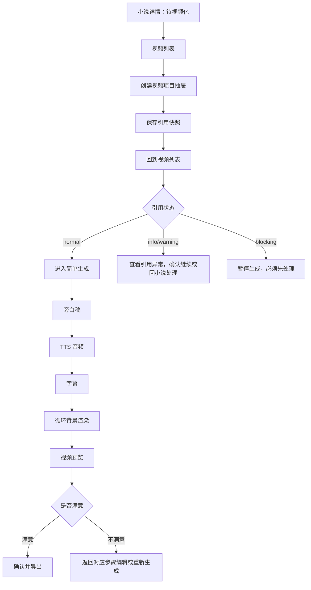

# 视频模块核心原型

本文档用于收拢当前阶段的视频模块原型。当前先把“视频列表 + 创建视频项目 + 引用状态 + 简单生成/导出”讲清楚；发布与数据回填、短视频单元与系列先保留为后续规划，不进入当前确认主线。

可视化原型见：`docs/prototypes/video-module-core-clickable-prototype.html`。

## 当前设计结论

视频模块必须有一个独立的视频列表。视频列表是视频系统主入口，也是用户管理视频项目、查看引用异常、进入生成链路的统一中枢。

当前视频模块按两步确认：

| 阶段 | 核心能力 | 用户能完成什么 | 不做什么 |
| --- | --- | --- | --- |
| P8 | 视频列表、创建视频项目、引用快照、引用异常 | 从待视频化小说创建视频项目，看清引用章节和异常 | 不生成视频、不发布、不回填数据 |
| P9 | 简单视频生成、预览、调试和导出 | 基于引用正常的视频项目生成旁白、音频、字幕、循环背景视频；预览后可编辑或重新生成，满意后导出 | 不做自动发布、不做运营数据、不做系列拆条 |

P10 之后再考虑发布记录与数据回填。P11 之后再考虑短视频单元与系列。

P8 的交互必须是步骤式承接，而不是普通列表 CRUD：

- 视频列表顶部展示“小说已待视频化 -> 创建视频项目 -> 保存引用快照 -> 引用状态检查 -> 待进入生成”的承接步骤条。
- 创建视频项目使用 4 步抽屉：选择小说、确认引用范围、创建前检查、创建完成。
- 引用快照抽屉使用子步骤阅读：引用来源、章节版本、视频建议、引用状态。
- 引用异常抽屉使用 4 步处理：查看异常、判断影响、选择处理、处理结果。
- “待进入生成”在 P8 只灰态提示，不开放生成主动作。

## 页面主结构

## 视频列表职责

视频列表不是普通文件列表，它要回答用户三个问题：

1. 现在有哪些视频项目。
2. 每个视频项目引用了哪本小说、哪些章节、哪些版本。
3. 当前下一步应该处理引用异常，还是进入生成。

列表第一屏结构：

| 区域 | 内容 | 目的 |
| --- | --- | --- |
| 顶部状态汇总 | 全部项目、引用异常、可生成、生成中、已导出 | 让用户快速知道整体进度 |
| 筛选区 | 小说、引用状态、视频生产状态、更新时间 | 快速找项目 |
| 视频项目表格 | 项目、引用小说、章节范围、引用状态、生产状态、当前任务、推荐动作 | 完成日常管理 |
| 行展开 | 引用快照摘要、风险摘要、最近变化 | 不进详情也能判断风险 |

## 视频项目状态

| 状态 | 含义 | 列表主动作 |
| --- | --- | --- |
| draft | 已创建项目，还未进入生成 | 查看引用快照 |
| reference_normal | 引用正常，可以进入生成 | 进入生成 |
| reference_info | 有轻微变化，不强阻塞 | 查看差异 |
| reference_warning | 有风险，建议确认后继续 | 查看异常 |
| reference_blocking | 阻塞，不能继续生成 | 处理异常 |
| generating | 正在生成旁白、音频、字幕或渲染 | 查看任务 |
| generated | 已生成视频文件 | 预览/导出 |
| exported | 已导出文件 | 查看导出记录 |
| stopped | 项目已停止 | 查看记录 |

P8 只需要支持到 `draft`、`reference_normal`、`reference_info`、`reference_warning`、`reference_blocking`、`stopped`。P9 再启用 `generating`、`generated`、`exported`。

## 创建视频项目

创建视频项目从视频列表发起，也可以由小说详情跳转到视频列表后自动打开抽屉。

创建时必须选择：

- 引用小说。
- 视频类型，默认“首条测试”。
- 引用章节范围，默认系统推荐首条范围。
- 项目名称。
- 创建说明。

创建成功后必须保存不可变的 `VideoReference` 快照。创建成功后回到视频列表，不直接跳到生成动作，避免用户误以为生成链路已经自动开始。

## 简单生成入口

P9 之后，只有引用状态满足条件时，列表才出现“进入生成”：

| 引用状态 | 是否可进入生成 | 规则 |
| --- | --- | --- |
| normal | 可以 | 进入生成前仍需重新检测引用 |
| info | 可以 | 页面提示轻微变化，允许继续 |
| warning | 受控允许 | 必须确认继续并记录原因 |
| blocking | 不可以 | 必须先回小说或重新选引用范围 |

简单生成页只做：

- 旁白稿。
- TTS 音频。
- 字幕。
- 循环背景渲染。
- 视频预览。
- 不满意时返回编辑或重新生成。
- 确认后导出。

导出不等于发布。发布记录、数据回填和平台账号都不出现在当前主线里。

## 预览和调试能力

视频模块即使早期只做简单视频，也必须让用户能判断生成效果并修正：

- 预览当前渲染视频。
- 试听音频。
- 查看字幕和首屏字幕。
- 编辑旁白稿。
- 调整音色或语速。
- 编辑字幕和字幕样式。
- 更换循环背景素材。
- 重新渲染。
- 标记某个视频版本“不采用”，并记录原因。

每次修改只让受影响的下游产物过期，不要求用户重建整个视频项目。

## 当前不做

| 能力 | 放到后续原因 |
| --- | --- |
| 自动发布平台 | 需要平台账号、权限、风控和失败补偿，当前过早 |
| 发布记录与数据回填 | 需要先有稳定导出视频，P10 再做 |
| 短视频单元与系列 | 会引入拆条、排期、标题封面和运营策略，P11 再做 |
| AI 分镜和多镜头渲染 | 当前先用循环背景视频跑通最低可用生产链 |
| 平台数据自动抓取 | 涉及平台 API 和账号安全，后续独立设计 |

## 原型验收口径

- 用户能从小说待视频化状态进入视频列表。
- 用户能在视频列表创建视频项目。
- 用户能看清每个视频项目引用的小说、章节范围和版本快照。
- 用户能看懂引用异常等级和下一步处理建议。
- P8 不出现可用的生成、发布和数据回填主动作。
- P9 才出现简单生成入口，并且生成前会重新检查引用状态。
- P9 生成结果必须可预览；用户不满意时能返回对应步骤编辑或重新生成。
- 当前可导出视频必须是用户确认过且未过期的视频文件版本。
- 发布与数据回填、短视频单元与系列不干扰当前视频模块主线。
