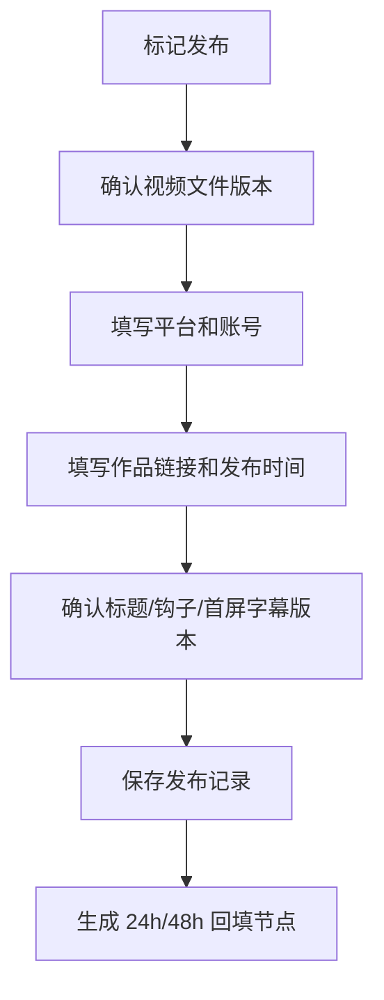

# 发布记录与数据回填原型

本文档是后续规划草案，细化 P10 的人工发布和 24/48 小时数据回填。当前视频模块先确认视频列表、创建视频项目、引用异常和简单生成；本文档暂不进入当前视频模块主线验收。

P10 不做自动上传、不接平台 API，只让用户把已导出的视频发布到平台后，回到系统记录发布信息和基础表现。

## 页面目标

- 记录视频实际发布到哪个平台、哪个账号和哪个链接。
- 冻结发布时使用的视频文件、旁白、音频、字幕、标题和钩子版本。
- 让 24/48 小时数据回填形成最小运营闭环。
- 让用户做出下一步决策，而不是只存一组播放数。

## 页面入口

| 来源 | 行为 |
| --- | --- |
| 视频详情“标记发布” | 打开发布记录弹窗 |
| 视频列表“可发布”行 | 打开发布记录弹窗 |
| 发布后数据待回填提醒 | 打开数据回填弹窗 |
| 视频详情数据区 | 查看发布记录和回填状态 |

## 发布记录弹窗

字段：

| 字段 | 控件 | 必填 |
| --- | --- | --- |
| 发布平台 | 下拉 | 是 |
| 平台账号 | 输入/选择 | 是 |
| 作品链接 | 输入框 | 是 |
| 发布时间 | 日期时间 | 是 |
| 发布标题 | 输入框 | 是 |
| 发布文案 | 文本框 | 否 |
| 使用视频文件版本 | 只读选择 | 是 |
| 标题钩子版本 | 只读/选择 | 是 |
| 前 3 秒钩子版本 | 只读/选择 | 是 |
| 首屏字幕版本 | 只读/选择 | 是 |
| 备注 | 文本框 | 否 |

规则：

- 保存后发布记录冻结当时使用的产物版本。
- 后续重新渲染不会覆盖旧发布记录。
- 不保存平台 token，不做自动上传。

## 数据回填区

发布记录保存后，系统生成两个回填节点：

- 24 小时数据。
- 48 小时数据。

状态：

| 状态 | 含义 | 主动作 |
| --- | --- | --- |
| 待回填 | 到点前或到点后未填 | 回填数据 |
| 已回填 | 用户已填写 | 查看/编辑 |
| 逾期 | 超过建议时间仍未填 | 立即回填 |
| 样本不足 | 数据量太小 | 标记样本不足 |
| 已复盘 | 已形成下一步决策 | 查看复盘 |

## 数据字段

| 字段 | 24h | 48h |
| --- | --- | --- |
| 播放量 | 是 | 是 |
| 完播率 | 是 | 是 |
| 平均观看时长 | 是 | 是 |
| 点赞数 | 是 | 是 |
| 评论数 | 是 | 是 |
| 收藏数 | 是 | 是 |
| 转发数 | 可选 | 可选 |
| 新增关注 | 是 | 是 |
| 主观判断 | 是 | 是 |
| 样本是否足够 | 是 | 是 |
| 下一步决策 | 是 | 是 |

下一步决策固定选项：

- 继续投放。
- 优化标题。
- 优化前三秒钩子。
- 优化旁白。
- 换章节。
- 重做视频。
- 暂停项目。
- 样本不足，继续观察。

## 复盘摘要

数据回填后，页面展示：

- 表现结论：好、一般、差、样本不足。
- 标题/钩子是否有效。
- 内容留存是否有效。
- 是否值得继续投入这本小说。
- 推荐下一步动作。

样本不足时：

- 不能判定小说失败。
- 不能自动调低小说质量判断。
- 只记录为低置信度信号。

## 风险和保护

- 已发布视频引用异常时，不自动修改平台内容。
- 删除发布记录需要二次确认。
- 平台账号和发布链接按租户隔离。
- 页面不展示平台 token。
- 数据可能由人工填写，复盘结论必须标记数据来源。

## 验收口径

- 发布记录能冻结当时使用的全部产物版本。
- 保存发布记录后生成 24/48 小时待回填节点。
- 24/48 小时数据能形成下一步决策。
- 样本不足不会被当作小说失败。
- 已发布视频不会被重新渲染或小说修改自动覆盖。
- P10 仍不做自动上传和平台 API 同步。
