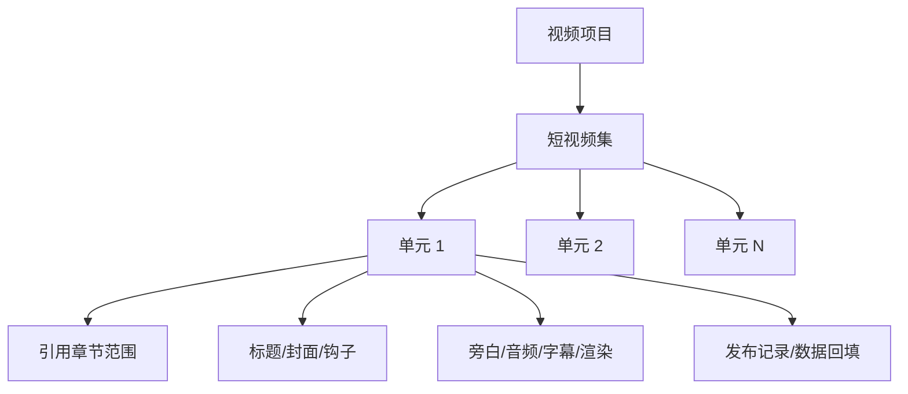

# 短视频单元与系列原型

本文档是后续规划草案，细化 P11 的短视频单元和短视频集原型。当前视频模块先确认视频列表、创建视频项目、引用异常和简单生成；短视频单元与系列暂不进入当前视频模块主线验收。

P11 用于把一个视频项目从“单条简单视频”扩展为可以按章节、剧情冲突或情绪峰值管理的一组短视频。

## 页面目标

- 把小说章节范围拆成适合短视频发布的单元。
- 让每个单元都有引用范围、钩子、标题、封面文案和产物状态。
- 用户可以调整单元范围，但下游产物必须过期或重新生成。
- 支持短视频集的基础排期和连续发布管理。

## 信息结构

## 短视频集区

展示：

- 短视频集名称。
- 引用小说。
- 引用阶段或章节范围。
- 计划集数。
- 已生成集数。
- 已发布集数。
- 系列标题规则。
- 统一封面模板。
- 统一旁白音色。
- 当前进度。

动作：

- 生成单元拆分。
- 调整系列设置。
- 查看发布进度。

## 单元列表

| 列 | 展示 |
| --- | --- |
| 集数 | 第 1 条、第 2 条 |
| 引用范围 | 章节或片段范围 |
| 单元摘要 | 一句话剧情冲突 |
| 前 3 秒钩子 | 短文本 |
| 首屏字幕 | 短文本 |
| 结尾悬念 | 短文本 |
| 标题/封面状态 | 未生成、候选、已确认 |
| 产物状态 | 旁白、音频、字幕、渲染 |
| 发布状态 | 未发布、已发布、待回填 |
| 推荐动作 | 生成标题、确认单元、生成视频、查看数据 |

## 单元详情抽屉

展示：

- 引用章节范围。
- 引用版本快照。
- 单元摘要。
- 主要冲突。
- 情绪峰值。
- 前 3 秒钩子候选。
- 首屏字幕候选。
- 标题候选。
- 封面文案候选。
- 结尾悬念。
- 留存风险。

动作：

- 采用标题/钩子候选。
- 调整引用范围。
- 重新生成单元候选。
- 确认单元。
- 进入生成步骤。

## 单元拆分规则

拆分可以按：

- 章节。
- 剧情冲突。
- 情绪峰值。
- 旁白时长。
- 结尾悬念。

默认策略：

- 首条优先开篇冲突和主角困境。
- 后续单元优先一条视频解决一个冲突。
- 每条保留明确结尾钩子。
- 预计时长过长时建议拆分。

## 调整范围后的影响

| 调整 | 下游影响 |
| --- | --- |
| 单元引用范围变化 | 旁白、音频、字幕、渲染、标题封面全部过期 |
| 标题候选变化 | 发布文案过期 |
| 首屏字幕变化 | 渲染文件过期 |
| 结尾钩子变化 | 旁白和字幕需重新确认 |
| 已发布单元范围变化 | 不覆盖旧发布，建议复制新单元 |

调整范围前必须二次确认影响范围。

## 系列发布视图

展示：

- 集数时间线。
- 每条生成状态。
- 每条发布状态。
- 24/48 小时数据状态。
- 表现标签：好、一般、差、样本不足。
- 下一步推荐：继续系列、优化钩子、暂停系列。

## 验收口径

- 单元拆分结果保存为视频结构资产版本。
- 用户调整单元范围后，下游产物全部标记过期。
- 标题、封面、钩子候选不自动成为发布版本。
- 已发布单元不能被范围调整静默覆盖。
- 短视频集能展示集数进度、生成进度、发布进度和数据回填状态。
