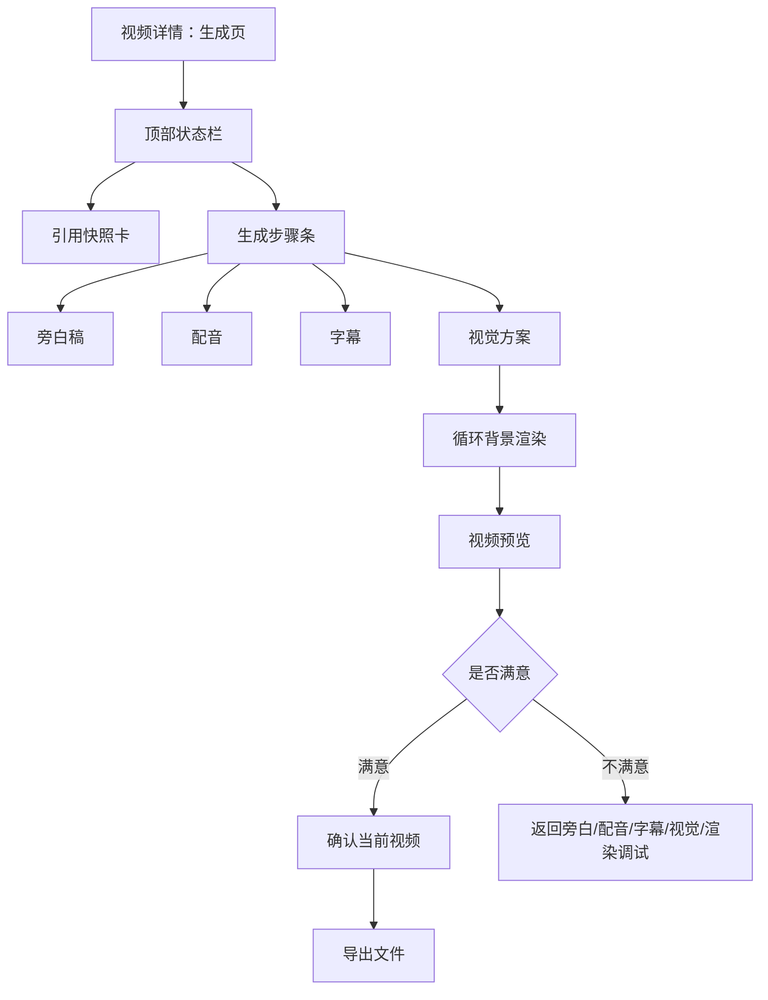

# 简单视频生成原型

本文档细化 P9 的简单视频生成闭环。P9 的目标不是复杂分镜，而是跑通“旁白稿 -> 配音 -> 字幕 -> 视觉方案 -> 循环背景渲染 -> 预览确认 -> 导出”的可控链路。

P9 详细研发和验收口径见：`docs/modules/video-task-package-9-detailed-design.md`。本文档只作为低保真交互原型补充。

## 页面目标

- 让用户从一个引用正常的视频项目生成可导出的简单视频。
- 每一步都展示产物版本、过期状态、失败原因和下一步动作。
- 保证旁白、配音、字幕、视觉方案、渲染之间的依赖清楚，不静默复用过期产物。
- 让用户能在系统内预览生成结果；不满意时可以回到对应步骤编辑或重新生成。
- 不做自动发布和平台数据回填。

## 页面结构

## 调试闭环

P9 的核心不是“一键生成文件”，而是让用户能看见结果，并在不满意时知道改哪里。

| 用户不满意点 | 入口 | 动作 | 结果 |
| --- | --- | --- | --- |
| 开头不够抓人 | 旁白稿区 | 编辑或重新生成前 3 秒钩子 | 配音、字幕、渲染过期 |
| 旁白啰嗦或节奏慢 | 旁白稿区 | 精简旁白、调整口语化程度 | 配音、字幕、渲染过期 |
| 声音不合适 | 配音区 | 换音色、调语速、重新生成配音 | 字幕、渲染过期 |
| 字幕看不清或断句差 | 字幕区 | 编辑字幕、调整首屏字幕、重新切句 | 渲染过期 |
| 背景素材不合适 | 视觉方案区 | 更换循环背景或画面比例 | 渲染过期 |
| 最终视频不满意 | 预览区 | 标记不采用并返回对应步骤 | 保留旧版本和不采用原因 |

用户每次修改都必须产生新版本或草稿版本，不能直接覆盖已确认版本。

## 步骤条

| 步骤 | 状态 | 主动作 |
| --- | --- | --- |
| 引用检查 | normal/warning/blocking | 查看引用快照 / 处理异常 |
| 旁白稿 | 未生成、生成中、待确认、已确认、失败、已过期 | 生成旁白稿 / 确认旁白稿 |
| 配音 | 未生成、生成中、已生成、失败、已过期 | 生成配音 / 试听确认 |
| 字幕 | 未生成、生成中、待确认、已确认、失败、已过期 | 生成字幕 / 预览确认 |
| 视觉方案 | 未设置、待确认、已确认、已过期 | 选择素材和样式 / 确认视觉方案 |
| 渲染 | 未渲染、渲染中、已渲染、失败、已过期 | 渲染视频 / 进入预览 |
| 预览确认 | 待预览、已确认可导出、已拒绝待回退 | 确认当前视频 / 标记不满意 |
| 导出 | 未导出、导出中、已导出、失败 | 导出文件 / 下载文件 |

顶部同一时间只给一个主动作。

## 旁白稿区

展示：

- 当前旁白稿版本。
- 预计时长。
- 前 3 秒钩子。
- 结尾悬念。
- 口语化程度。
- 候选摘要和完整稿抽屉。

动作：

- 生成旁白候选。
- 重新生成。
- 手动编辑。
- 确认旁白稿。

规则：

- 旁白稿确认后才能生成配音。
- 修改旁白稿后，配音、字幕、渲染和发布文案全部标记过期。
- 候选不自动成为当前旁白稿。

## 配音区

展示：

- 音色名称。
- 配音 provider 摘要。
- 配音时长。
- 试听播放器。
- 失败原因。
- 成本/耗时轻量提示。

动作：

- 生成配音。
- 重新生成配音。
- 确认配音。

规则：

- 配音生成是异步任务。
- 配音变更后字幕和渲染过期。
- 页面不展示密钥、完整请求或供应商原始响应。

## 字幕区

展示：

- 字幕版本。
- 首屏字幕。
- 字幕分句预览。
- 时间轴摘要。
- 音频匹配状态。

动作：

- 生成字幕。
- 编辑字幕。
- 确认字幕。

规则：

- 配音未生成或已过期时不能确认字幕。
- 字幕变化后渲染过期。
- 字幕过长、首屏太弱、时间轴不匹配时展示风险。

## 视觉方案区

P9 默认只支持“循环背景视频 + 字幕样式 + 画面比例”，但需要保留素材来源、授权和后续分镜扩展字段。

展示：

- 背景素材方案。
- 素材来源和授权摘要。
- 画面比例。
- 字幕样式和安全区提示。

动作：

- 选择背景素材。
- 调整画面比例。
- 调整字幕样式。
- 确认视觉方案。

规则：

- 视觉方案变化后渲染过期。
- 未确认视觉方案不能渲染。

## 渲染区

P9 默认只支持“循环背景视频 + 旁白配音 + 字幕”。

展示：

- 背景素材方案。
- 字幕样式。
- 画面比例。
- 渲染任务状态。
- 渲染文件版本。
- 预览入口。

动作：

- 渲染视频。
- 重新渲染。
- 进入预览。

规则：

- 渲染前必须重新检查引用异常。
- 引用 blocking 时不能渲染。
- 重新渲染保存新视频文件版本，不覆盖旧文件。

## 预览区

展示：

- 视频播放器。
- 当前视频文件版本。
- 使用的旁白稿版本、配音版本、字幕版本和视觉方案。
- 首屏字幕、前 3 秒钩子、预计完播风险。
- 渲染参数摘要，例如画面比例、分辨率、字幕样式。
- 不满意原因输入，用户选择“不采用/返回编辑”时出现。

动作：

- 确认当前视频。
- 标记不满意。
- 返回编辑旁白。
- 返回编辑配音。
- 返回编辑字幕。
- 返回调整视觉方案。
- 重新渲染。

规则：

- 未确认的视频不能作为当前可导出版本。
- 标记不满意不算预览完成，不能导出。
- 不满意原因需要记录到视频产物版本或操作日志中，并给出推荐返回步骤。
- 导出只允许选择已确认、未过期且通过质量门禁的视频文件版本。
- 重新渲染生成新视频文件版本，不覆盖旧文件。

## 导出区

展示：

- 已确认视频版本。
- 导出格式、分辨率和文件名。
- 导出前检查清单。
- 导出记录。

动作：

- 导出文件。
- 下载文件。
- 回视频列表。

规则：

- 导出不等于发布。
- 导出不会创建发布记录，也不会出现数据回填主动作。

## 失败处理

| 失败点 | 页面提示 | 用户动作 |
| --- | --- | --- |
| 旁白生成失败 | 旁白生成失败，建议调整要求或重试 | 重试 / 编辑要求 |
| 配音失败 | 配音生成失败，可能是供应商或文本过长 | 重试 / 换音色 |
| 字幕失败 | 字幕生成失败或配音无法对齐 | 重试 / 手动编辑 |
| 渲染失败 | 渲染失败，旧产物不受影响 | 重试渲染 |

失败任务必须进入任务中心，可查看事件、失败原因、重试和取消。

## 验收口径

- 引用 blocking 时不能进入生成。
- 旁白稿未确认不能生成配音。
- 配音变化会让字幕和渲染过期。
- 字幕变化会让渲染过期。
- 视觉方案变化会让渲染过期。
- 渲染文件版本化，不覆盖旧文件。
- 系统内能预览视频，且能看到当前使用的旁白、配音、字幕、视觉方案和渲染版本。
- 用户不满意时能返回对应步骤编辑或重新生成。
- 不满意原因和不采用版本可追溯。
- 标记不满意不能导出；确认当前视频后才能导出。
- 导出后不自动发布。
- 页面不出现平台发布、24/48 小时数据回填主动作。
