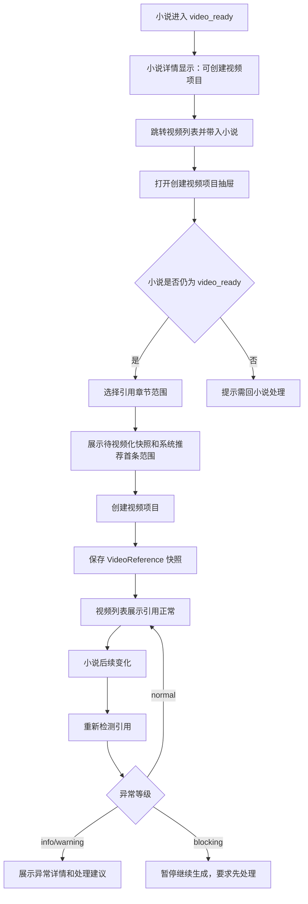
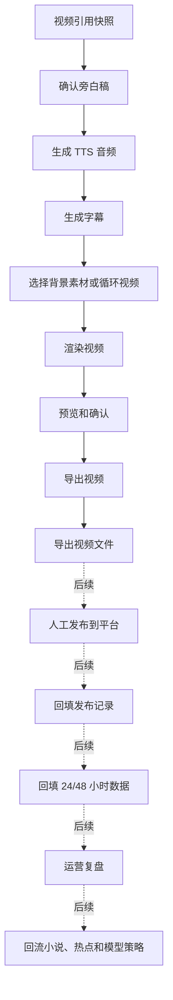
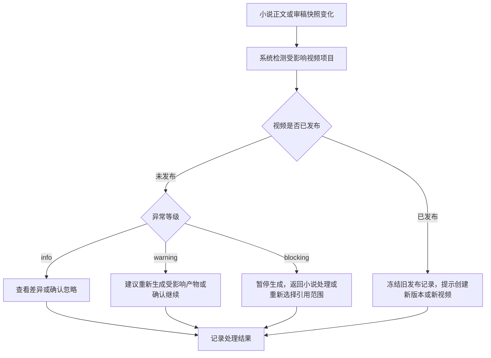

# 视频系统页面流程总图

本文档定义视频系统从小说待视频化到视频生产的低保真页面流程。它不是前端实现稿，也不生成可运行页面；当前目标是先确认视频模块的产品结构、页面职责、状态流转和研发分期边界。

当前原型暂存为低保真草案。视频模块需求设计按完整视频生产系统展开，原型后续需要依据 `docs/modules/video-system.md` 重新校准；研发分期只决定先后，不降低完整产品能力边界。

## 原型目标

- 让视频模块稳定承接 `video_ready` 小说，不破坏小说创作链路。
- 让用户清楚知道视频项目引用了哪本小说、哪些章节和哪些版本。
- 先把 P8 的视频引用快照和引用异常做扎实，再逐步进入旁白、音频、字幕、渲染、发布和数据回流。
- 保证已发布视频不会被小说修改或重新生成动作静默覆盖。

## 页面范围

P8 只实现到“视频列表、视频引用快照和引用异常”。P9 起进入旁白、TTS、字幕、渲染、预览和导出。P10 起再考虑人工发布和数据回填；P11 起再考虑短视频单元、标题封面和钩子候选；P12 起做运营复盘和高级能力。

## 信息架构

| 页面 | 路由 | 阶段 | 用户目标 | 主要内容 |
| --- | --- | --- | --- | --- |
| 视频列表 | `/videos` | P8 起 | 管理视频项目和引用异常 | 视频项目、引用小说、章节范围、引用快照、引用状态、推荐动作 |
| 创建视频项目 | `/videos` 内抽屉 | P8 起 | 从待视频化小说创建视频引用 | 选择小说、章节范围、视频类型、保存引用快照 |
| 视频引用详情 | `/videos/:videoId/reference` 或抽屉 | P8 起 | 看清引用版本和异常原因 | 引用快照、当前小说版本、异常等级、处理建议 |
| 视频详情工作台 | `/videos/:videoId` | P9 起 | 处理单条视频生产链路 | 引用、旁白、音频、字幕、渲染、预览、导出 |
| 简单视频生成 | `/videos/:videoId/generation` 或详情分区 | P9 起 | 生成可导出的简单视频 | 旁白稿、TTS、字幕、循环背景渲染、预览导出 |
| 发布记录 | `/videos/:videoId/publish-records` 或详情分区 | P10 后续 | 记录人工发布结果 | 平台、账号、链接、标题、使用产物版本 |
| 数据回填 | `/videos/:videoId/performance` 或详情分区 | P10 后续 | 回填 24/48 小时基础数据 | 播放、完播、互动、样本判断、下一步决策 |
| 短视频单元 | `/videos/:videoId/units` 或详情分区 | P11 后续 | 管理系列拆条和标题钩子 | 单元范围、标题封面、钩子、生成/发布进度 |

## P8 页面流

P8 不展示“生成视频”“生成音频”“生成字幕”“渲染”“发布”“数据回填”作为主动作，只可以在页面中以灰态或后续能力提示出现。

## 完整视频链路

完整链路在产品原型中保留，但当前视频模块先确认到“预览和导出”。发布、数据、系列拆条作为后续规划，避免干扰当前视频列表和生成主链路。

## 引用异常流

已发布视频的原则是追溯和提示，不自动修改平台内容，不覆盖旧产物版本。

## 用户默认路径

1. 用户在小说详情看到小说已进入待视频化。
2. 用户点击“去视频系统创建视频项目”。
3. 系统打开视频列表并带入该小说。
4. 用户创建视频项目，系统推荐首条章节范围。
5. 系统保存引用快照，视频列表显示引用正常。
6. 如果小说后续变化，视频列表显示引用异常和下一步建议。
7. P9 之后，用户再进入视频详情工作台生成旁白、音频、字幕和视频文件。

## 交互规则

- 每个页面都要展示当前状态和下一步建议。
- 创建视频项目必须基于 `video_ready` 小说。
- 视频项目创建时必须保存章节范围和章节版本快照。
- 小说修改不能自动修改视频项目。
- 引用异常需要有等级、原因、影响范围和推荐动作。
- 忽略 warning 或 blocking 异常必须填写原因。
- 已发布视频使用的引用、旁白、音频、字幕、渲染文件和发布文案版本必须冻结。
- P8 只做承接层，不做 TTS、字幕、渲染、发布和数据回填。

## 原型验收口径

- 用户能从小说待视频化状态进入视频列表创建视频项目。
- 用户能在视频列表看懂每个视频项目引用了什么小说内容。
- 用户能看到引用快照是否正常。
- 被引用章节变化后，用户能看到异常等级和处理建议。
- 已发布视频不会被小说变化自动覆盖。
- P8 页面没有把后续视频生成链路误导成已可用主功能。

## 关联原型文档

| 原型文档 | 阶段 | 说明 |
| --- | --- | --- |
| `docs/prototypes/video-module-core-prototype.md` | P8-P9 | 当前视频模块核心原型和边界 |
| `docs/prototypes/video-list-prototype.md` | P8 | 视频列表、引用快照、引用异常 |
| `docs/prototypes/video-create-project-prototype.md` | P8 | 创建视频项目抽屉和引用范围选择 |
| `docs/prototypes/video-detail-workbench-prototype.md` | P9-P12 | 视频详情工作台总骨架 |
| `docs/prototypes/video-simple-generation-prototype.md` | P9 | 旁白、TTS、字幕、循环背景渲染 |
| `docs/prototypes/video-publish-data-prototype.md` | P10 后续 | 人工发布记录和 24/48 小时数据回填 |
| `docs/prototypes/video-short-unit-series-prototype.md` | P11 后续 | 短视频单元、标题封面钩子和系列管理 |
