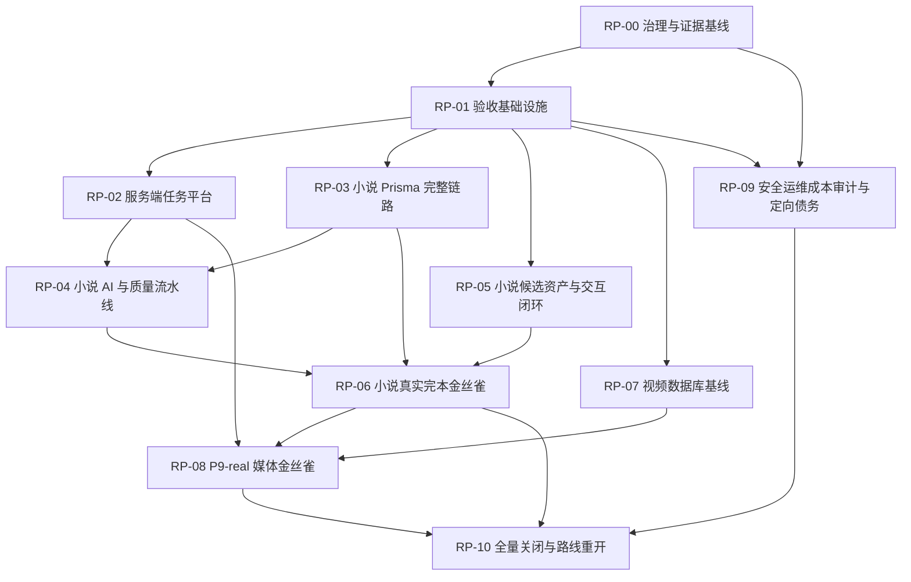

# AIShortvideo 整改执行方案

状态：ready_for_review

问题源：`docs/remediation/issue-ledger.md`

验收源：`docs/remediation/acceptance-matrix.md`

## 1. 总目标

在开展任何下一阶段需求设计或业务研发前，关闭唯一问题总账中的全部 42 项问题与验证缺口，并建立可以防止同类问题复发的工程、测试和主控门禁。

整改不是一次“大修提交”。每个整改包必须独立完成需求确认、实现、自测、独立验收、关闭证据、commit 和 push。

## 2. 执行原则

1. PB 优先恢复用户核心目标，RB 恢复真实环境和发布可信度。
2. QG 在对应 PB/RB 前或同包完成，不能留到最后补测试。
3. DEBT 只做与风险直接相关的定向拆分，不做无目标重构。
4. 每包默认不超过 20 个文件或 2,000 净新增行；超限必须拆包或由 MC 写 ADR。
5. DEV 自测不能关闭问题；TEST 独立验收后，由 MC 更新唯一总账。
6. 涉及真实 DB/provider/media 的包必须单独取得用户授权，并写成本、安全和回滚边界。
7. 任一包出现 P0/P1 回归，停止后续包并返回当前包修复。

## 3. 依赖图

## 4. 执行波次

| 波次 | 整改包 | 目标 | 新需求门禁 |
| --- | --- | --- | --- |
| W0 | RP-00A → RP-00B | 状态、Git、证据模板、SLA 与临时文件归因 | 冻结 |
| W1 | RP-01A/RP-01B/RP-01D，RP-01A → RP-01C；RP-09A 至 RP-09G 按依赖启动审计 | 可重复浏览器 E2E、fixture、真实测试库入口和遗漏领域审计 | 冻结 |
| W2 | RP-02A → RP-02B1 → RP-02B2 → RP-02B3 → RP-02C；RP-03A → RP-03B → RP-03C → RP-03D | 持久任务平台与小说真实数据库链 | 冻结 |
| W3 | RP-04A → RP-04B → RP-04C → RP-04D；RP-05A → RP-05B/RP-05C → RP-05D；完成后 RP-09H1 | 小说内容质量、用户交互闭环和小说/任务热点文件拆分 | 冻结 |
| W4 | RP-06A → RP-06B → RP-06C | 真实 DeepSeek + MySQL 小规模完本 | 冻结 |
| W5 | RP-07A → RP-07B → RP-07C → RP-07D；RP-08A → RP-08B → RP-08C → RP-08D → RP-08E → RP-08F；完成后 RP-09H2 | 视频数据库与真实音频/字幕/MP4 金丝雀 | 冻结 |
| W6 | 审计发现的独立整改子包；RP-10A → RP-10B | 定向问题清理、全量关闭和路线决策 | 全部关闭后重开 |

同一波次允许并行的前提是写集不重叠、依赖已满足且测试席位可及时验收。

## 5. 整改包

`RP-00` 至 `RP-10` 是管理分组，不可直接整体派发。实际研发和验收只能使用下面的可派发子包 ID；每个子包继续受 20 文件/2,000 行门禁约束。

### 5.1 可派发子包

| 子包 | 范围 | 依赖 | 主要问题 |
| --- | --- | --- | --- |
| RP-00A | 状态单源、证据等级、关闭模板、协作阶段 | 无 | RMD-TEST-EVIDENCE-001、RMD-GOV-STATUS-001、RMD-GOV-STAGE-001 |
| RP-00B | Git 规模门禁、派发 SLA、临时文件归因 | RP-00A | RMD-GOV-GIT-001、RMD-GOV-SLA-001、RMD-GOV-TEMP-001 |
| RP-01A | Playwright、服务启动、health、seed/reset | RP-00B | RMD-TEST-E2E-001 |
| RP-01B | Vue DOM/event 测试 | RP-00B | RMD-TEST-DOM-001 |
| RP-01C | 失败状态 fixture factory | RP-01A | RMD-TEST-FIXTURE-001 |
| RP-01D | 受控 MySQL 测试入口 | RP-00B | RMD-TEST-DB-001 基础设施 |
| RP-02A | 小说 AI Task SSOT、provider 前原子 preclaim、幂等与冲突的 E3 阶段；首请求快速返回/worker 与真实 DB 并发不在本包关闭 | RP-01C | RMD-TASK-001（保持 partial/implemented_pending_verification，等待 RP-02B1-B3 与 E6） |
| RP-02B1 | ExecutionEnvelope、lease/fencing 合同与仓储原语 | RP-02A | RMD-TASK-002、RMD-TASK-003（保持 open/partial） |
| RP-02B2 | worker dispatcher、HTTP 快速返回、heartbeat、幂等 finalize、最小前端 transport 适配 | RP-02B1 | RMD-TASK-002 保持 partial；RMD-TASK-003 保持 open/partial；不得提前进入 implemented_pending_verification |
| RP-02B3 | restart recovery、真实 retry、poison/unknown outcome 与 deterministic 故障注入 | RP-02B2 | RMD-TASK-002、RMD-TASK-003（E3 后仍等待 RP-01D E6） |
| RP-02C | cancel 语义、迟到结果和前端统一投影 | RP-02B3 | RMD-TASK-004、RMD-TASK-005 |
| RP-03A | 小说 migration、tenant、version/current 基础 | RP-01D | RMD-NOV-VERSION-001 |
| RP-03B | 正文批量、重写、采用和影响案例 Prisma | RP-03A、RP-02B3 | RMD-NOV-DB-001 前半 |
| RP-03C | 全书审稿、完结确认 Prisma | RP-03B | RMD-NOV-DB-001 后半 |
| RP-03D | 并发、来源审计、回滚与重启 E2E | RP-03C | RMD-NOV-VERSION-001、RMD-TEST-DB-001 小说部分 |
| RP-04A | JSON/schema repair、章节目录分段恢复 | RP-02B3、RP-03B | RMD-NOV-AI-001 |
| RP-04B | 正文 checkpoint、长期记忆和字数门禁 | RP-04A、RP-03B | RMD-NOV-BATCH-001、RMD-NOV-QUALITY-001 |
| RP-04C | 全书审稿正文输入和质量判定 | RP-04B、RP-03C | RMD-NOV-REVIEW-001 |
| RP-04D | 内容基准集、错误分类和安全诊断 | RP-04C | RMD-NOV-ERROR-001、RMD-TEST-CONTENT-001 |
| RP-05A | CandidateAsset 后端状态机和 API 合同 | RP-03A | RMD-NOV-UX-001 |
| RP-05B | 候选组件、resultId 定位、编辑/优化/融合/采用 | RP-05A | RMD-NOV-UX-001 |
| RP-05C | 题材/爽点权威配置与历史兼容 | RP-05A | RMD-NOV-PREF-001 |
| RP-05D | 原始用户事故浏览器回归 | RP-05B、RP-05C、RP-01A | RMD-NOV-UX-001、RMD-NOV-PREF-001 |
| RP-06A | 真实 DeepSeek/MySQL preflight、安全与预算 | RP-04D、RP-03D | RMD-NOV-PROVIDER-001 |
| RP-06B | 固定小说样本真实完本 | RP-06A、RP-05D | RMD-NOV-PROVIDER-001 |
| RP-06C | 故障、刷新、多标签、重启和重放验收 | RP-06B | 小说 PB/RB 最终 E7 |
| RP-07A | 视频空库 baseline migration | RP-01D | RMD-VID-DB-001 |
| RP-07B | relations、tenant、current/version 并发约束 | RP-07A | RMD-VID-DB-001 |
| RP-07C | P8-P9 artifact 真实持久化 | RP-07B | RMD-VID-DB-001 |
| RP-07D | 回滚、并发、重启 E2E | RP-07C | RMD-TEST-DB-001 视频部分 |
| RP-08A | narration provider 和版本来源 | RP-02B3、RP-07C | RMD-VID-NARRATION-001 |
| RP-08B | TTS provider、音频存储和播放 | RP-08A | RMD-VID-AUDIO-001 |
| RP-08C | 时间戳字幕与 SRT/VTT | RP-08B | RMD-VID-SUB-001 |
| RP-08D | render、media storage、MP4、文件服务和下载 | RP-08C | RMD-VID-MEDIA-001 |
| RP-08E | VideoTask worker、取消、重试和重启 | RP-02B3、RP-08D | RMD-VID-TASK-001 |
| RP-08F | 从小说引用到 MP4 的浏览器媒体 E2E 与能力标签 | RP-08E、RP-01A | RMD-VID-CAPABILITY-001、RMD-VID-MEDIA-001、视频 PB 最终 E7 |
| RP-09A | 权限与租户只读审计 | RP-00A | RMD-AUD-SEC-001 |
| RP-09B | 部署与回滚只读审计 | RP-01A | RMD-AUD-OPS-001 |
| RP-09C | 观测与 SLO 只读审计 | RP-02A | RMD-AUD-OBS-001 |
| RP-09D | 成本与容量只读审计 | RP-00A | RMD-AUD-COST-001 |
| RP-09E | 备份恢复只读审计 | RP-03A、RP-07A | RMD-AUD-DR-001 |
| RP-09F | 可访问性与响应式只读审计 | RP-01A | RMD-AUD-A11Y-001 |
| RP-09G | 依赖与供应链只读审计 | RP-00A | RMD-AUD-SUPPLY-001 |
| RP-09H1 | 小说与任务巨型文件定向拆分 | RP-02C、RP-04D | RMD-ARCH-SIZE-001 小说/任务部分 |
| RP-09H2 | 视频巨型文件定向拆分 | RP-08F | RMD-ARCH-SIZE-001 视频部分 |
| RP-10A | 总账、关闭证据、Git 与远程全量审计 | 所有子包 | 全部问题 |
| RP-10B | 小说/视频演示与 P10 路线决策 | RP-10A | RMD-P10-001 |

RP-09A 至 RP-09G 只允许输出审计证据，不允许夹带实现。审计发现确认缺陷后必须在唯一总账创建新 ID，并由 MC 放入最早可执行的独立子包；不得把七类审计合并成一个实现提交。

### RP-00 管理分组：治理与证据基线（不可派发）

目标：建立后续所有整改包共同使用的控制面。

范围：

- 更新协作阶段为“整改冻结期”。
- 固化唯一总账、证据等级、关闭模板和验收结论格式。
- 建立研发交付 15 分钟内派测试、测试结论 30 分钟内收口/返工的 SLA。
- 建立 20 文件/2,000 行规模门禁与超限 ADR；ADR 必须位于 `docs/adr/*.md`、属于本次 diff，并写明 package、超限类型、实际规模、拆包原因、owner 和有效期/适用 commit。
- 处理 `apps/api/tsconfig.testrun.json`：归因、正式纳管、改为生成产物后清理或删除，四选一并留证。
- 规模门禁命令：`npm run governance:git-budget -- --staged`、`--worktree` 或 `--base <ref> --head <ref>`。
- SLA 收据命令：`npm run governance:sla -- <receipt-file>`；超时只能标记 `waived` 或 `accepted_with_reason`，不能用 `passed` 掩盖。
- 清理当前状态文档与历史事件文档的冲突表述。

不做：业务代码、真实环境调用、巨型文件拆分。

Owner：MC；DEV/TEST/QUALITY 复核。

子包关闭覆盖：RMD-TEST-EVIDENCE-001、RMD-GOV-GIT-001、RMD-GOV-STATUS-001、RMD-GOV-SLA-001、RMD-GOV-TEMP-001、RMD-GOV-STAGE-001；以 RP-00A、RP-00B 和 ledger 映射为准。

### RP-01 管理分组：验收基础设施（不可派发）

目标：让用户发现过的问题能够自动、稳定地复现和回归。

范围：

- 纳管 Playwright 配置、固定浏览器版本和本地启动脚本。
- 建立服务 health、seed、reset、fixture factory 和测试数据隔离。
- 建立真实 Vue DOM/event 测试能力。
- 建立 processing、timeout、malformed JSON、迟到结果、重复 current、分块失败、保存失败、重启恢复 fixture。
- 建立受控 MySQL 测试环境入口；默认安全拒绝，显式授权后执行。

不做：修复具体业务问题、读取真实密钥。

Owner：TEST 主责，DEV 配合，QUALITY 审核环境安全。

子包关闭覆盖：RMD-TEST-E2E-001、RMD-TEST-DOM-001、RMD-TEST-FIXTURE-001、RMD-TEST-DB-001 的基础设施部分；以 RP-01A 至 RP-01D 和 ledger 映射为准。

### RP-02 管理分组：服务端任务平台（不可派发）

目标：所有长任务拥有同一服务端事实源和真实执行生命周期。

范围：

- 原子 preclaim、幂等指纹、冲突阻断。
- 持久任务、worker、heartbeat、checkpoint、取消和真实 retry。
- HTTP 快速返回 taskId，worker 异步调用 provider。
- 迟到结果、旧版本回写、进程重启和失败恢复。
- 主卡片、最近任务、任务抽屉统一投影。
- 统一“停止本页等待”“取消任务”“重新生成”的产品语义。

不做：具体模型 prompt 和媒体 provider。

Owner：DEV；TEST 独立并发/重启验收；PRODUCT 验证动作语义。

子包关闭覆盖：RMD-TASK-001 至 RMD-TASK-005；以 RP-02A、RP-02B1-B3、RP-02C 和 ledger 映射为准。

### RP-03 管理分组：小说 Prisma 完整链路（不可派发）

目标：在真实 MySQL/Prisma 下完成小说从创建到完结的所有写路径。

范围：

- 补齐正文批量、重写、正文采用、影响案例、全书审稿、完结确认 repository。
- 补 migration、事务、tenant filter、version check、current 唯一性和 provenance。
- 验证并发采用、幂等、回滚、重启恢复。
- 未完成路径不得自动回退 in-memory 或先调用 provider。

不做：修改模型质量算法、视频数据库。

Owner：DEV；TEST 执行 MySQL E2E；QUALITY 审核 SQL、租户和安全摘要。

子包关闭覆盖：RMD-NOV-DB-001、RMD-NOV-VERSION-001、RMD-TEST-DB-001 小说部分；以 RP-03A 至 RP-03D 和 ledger 映射为准。

### RP-04 管理分组：小说 AI 与质量流水线（不可派发）

目标：让真实模型生成可恢复、可校验且内容可用的小说资产。

范围：

- JSON schema、定向 repair、安全诊断摘要。
- 章节目录分段持久化、失败段续跑和范围完整性校验。
- 正文逐章 checkpoint、长期记忆进入下一章 payload。
- 目标字符数容差、自动续写/失败策略。
- 全书审稿使用正文分层摘要、角色记忆和章节审稿结果。
- 建立内容质量基准集和可重复评估。

不做：真实视频生产。

Owner：DEV；PRODUCT 定义内容质量；TEST 构建基准和失败回归。

子包关闭覆盖：RMD-NOV-REVIEW-001、RMD-NOV-AI-001、RMD-NOV-BATCH-001、RMD-NOV-QUALITY-001、RMD-NOV-ERROR-001、RMD-TEST-CONTENT-001；以 RP-04A 至 RP-04D 和 ledger 映射为准。

### RP-05 管理分组：小说候选资产与交互闭环（不可派发）

目标：统一方向、设定、大纲、章节目录和试写候选的可观察行为。

范围：

- 统一 CandidateAsset 合同和组件。
- 详情、编辑新版本、优化指令、融合来源、差异、采用、放弃和历史。
- 使用 resultId 自动定位、高亮和刷新恢复。
- 采用后唯一 current、旧版历史化和明确下一步。
- 题材/爽点配置或可搜索自定义标签。
- 长任务动作层级和风险文案。

不做：修改真实模型 provider。

Owner：PRODUCT + DEV；TEST 浏览器原问题回归。

子包关闭覆盖：RMD-NOV-UX-001、RMD-NOV-PREF-001；以 RP-05A 至 RP-05D 和 ledger 映射为准。

### RP-06 管理分组：小说真实完本金丝雀（不可派发）

目标：证明真实 DeepSeek + MySQL + 浏览器能稳定完成一本受控规模小说。

范围：

- 固定题材和质量样本，完成创建、方向、设定、大纲、章节目录、试写、批量正文、全书审稿、完结和待视频化。
- 保存耗时、inputTokens/outputTokens 用量、重试、失败、版本、字数和质量证据。
- 至少覆盖刷新、多标签页、服务重启和一次故障恢复。
- 形成可重放的脱敏验收报告。

不做：扩大到生产规模、开放所有用户、进入 P10。

Owner：TEST 主验，DEV 修复，PRODUCT 内容验收，QUALITY 审核真实环境。

子包关闭覆盖：RMD-NOV-PROVIDER-001，以及 RP-02 至 RP-05 的最终 E5/E6/E7 证据；以 RP-06A 至 RP-06C 和 ledger 映射为准。

### RP-07 管理分组：视频数据库基线（不可派发）

目标：从空库建立 P8-P9 的完整视频持久化链。

范围：

- baseline migration、Prisma relations/外键策略、tenant filter。
- version、current、幂等和并发约束。
- 视频项目、引用、单元、旁白、音频、字幕、渲染、导出元数据的真实读写。
- migrate、seed、并发、回滚和重启恢复。

不做：真实媒体生成、P10。

Owner：DEV；TEST/QUALITY 独立数据库验收。

子包关闭覆盖：RMD-VID-DB-001、RMD-TEST-DB-001 视频部分；以 RP-07A 至 RP-07D 和 ledger 映射为准。

### RP-08 管理分组：P9-real 媒体金丝雀（不可派发）

目标：从一个小说章节生成一个真实、可播放、可下载的视频文件。

范围：

- narration provider、真实可播放音频。
- 基于真实音频的时间戳字幕和 SRT/VTT。
- render provider、media storage、文件服务和真实 MP4。
- 浏览器 audio/video 播放器、下载与版本引用。
- 视频持久任务、取消、重试、重启恢复和旧版本阻断。
- 页面明确真实、mock、占位能力标签。

不做：平台上传、自动发布、P10-R1、批量生产。

Owner：DEV；TEST 真实媒体验收；PRODUCT 体验验收；QUALITY 审核成本与密钥。

子包关闭覆盖：RMD-VID-NARRATION-001、RMD-VID-AUDIO-001、RMD-VID-SUB-001、RMD-VID-MEDIA-001、RMD-VID-TASK-001、RMD-VID-CAPABILITY-001；以 RP-08A 至 RP-08F 和 ledger 映射为准。

### RP-09 管理分组：安全运维成本审计与定向债务（不可派发）

目标：完成第一次复盘遗漏领域的专项审计，并关闭确认问题。

范围：

- 权限/租户、安全日志。
- 部署、health、migration 顺序、回滚。
- 任务 SLO、监控和告警。
- 模型/媒体成本、容量和限流。
- 备份恢复。
- 可访问性和响应式。
- 依赖漏洞、许可证和构建复现。
- 对超大文件做定向拆分，优先拆新增任务、AI、媒体和 publishing 子域。

Owner：QUALITY 统筹；DEV/TEST/PRODUCT 按领域配合。

子包关闭覆盖：RP-09A 至 RP-09G 只读审计、RP-09H1 小说/任务拆分、RP-09H2 视频拆分，以及审计后新增的独立整改子包。

### RP-10 管理分组：全量关闭与路线重开（不可派发）

目标：确认整改完成，并决定是否重新启动下一阶段需求设计。

范围：

- 总账全量状态审计。
- 所有关闭证据与 commit/push 对账。
- 小说真实完本与视频真实媒体演示。
- P10-R1 价值、成本和依赖重新评审。
- 更新主控状态和产品路线。

不做：直接实现 P10-R1。

Owner：MC；PRODUCT/DEV/TEST/QUALITY 全部签字。

子包关闭覆盖：RMD-P10-001 和所有残余状态；以 RP-10A、RP-10B 和 ledger 映射为准。

## 6. 每包交付协议

研发交付必须包含：

- package_id 和 issue_ids。
- 变更文件与新增/删除行数。
- 数据迁移与回滚说明。
- 自测命令和原始结果摘要。
- 未证明能力。
- commit hash 和远程分支。

测试结论必须包含：

- acceptance_ids。
- environment 和 evidence level。
- 正常、失败、刷新、并发和回归结果。
- blocked/needs_revision/approved。
- 关闭证据文件。

主控收口必须包含：

- 总账状态更新。
- 是否存在降级或未证明项。
- 下一包依赖是否满足。
- 是否继续保持新需求冻结。

## 7. 最终重开门禁

安全记录规则：`tokenUsage`、`inputTokens`、`outputTokens` 只表示模型用量；不得在整改资产、任务、日志或验收证据中记录 API key、provider token、DATABASE_URL、Cookie 或 credential。

只有以下条件全部满足，才允许准备下一阶段需求：

1. 总账 42 项全部 `closed`。
2. 小说真实完本金丝雀达到 E7。
3. 视频真实媒体金丝雀达到 media E5 与 browser E7。
4. 真实 MySQL 小说和视频路径达到 E6。
5. 浏览器 E2E、失败 fixture、Git 规模门禁和派发 SLA 可重复执行。
6. 专项验证缺口全部形成关闭结论。
7. 本地与远程同步，无未归因工作树文件。
