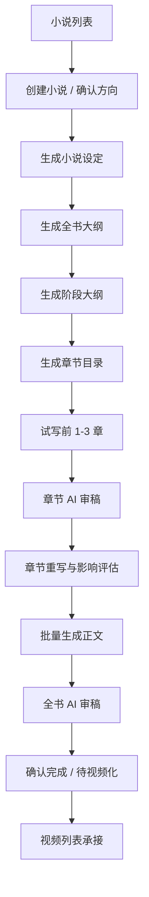

# 需求缺口台账

本文档用于管理需求设计和原型设计过程中暴露出来的缺口。

当前项目按“完整产品形态先设计，研发实现再分期”的方式推进。因此，出现缺口是正常现象。台账的目标不是压缩需求，而是让每个缺口都能被看见、被排序、被补齐或明确后排期。

## 使用原则

- 先补主链路，再补周边能力。
- 先补会影响原型和状态流转的缺口，再补配置、权限、数据复盘等增强能力。
- 缺口不等于 bug，也不等于必须马上研发；它表示需求还需要继续设计。
- 每次讨论完一个模块，都要回到台账更新状态。
- 如果一个缺口已经在具体需求文档中明确，需要在本台账标记为“已落文档”。

## 状态说明

- 待补齐：已经发现问题，但还没有展开设计。
- 设计中：正在讨论或已经有方向，但还没形成稳定结论。
- 已明确：已经形成结论，但还没完全落到模块文档。
- 已落文档：已经写入对应需求或架构文档。
- 实施后排期：完整产品需要，但研发首期可以不做。

## 优先级说明

- P0：不补会影响小说主链路、原型流程或关键状态判断。
- P1：不补会影响使用体验、异常处理或后续研发准确性。
- P2：完整产品需要，但可以等主链路稳定后再细化。

## 当前主链路

## P0 缺口

| 编号 | 缺口 | 当前问题 | 建议补齐内容 | 状态 |
| --- | --- | --- | --- | --- |
| GAP-P0-001 | 小说完整状态机 | 已有状态名称，但状态与 step、推荐动作、阻塞规则还没有完整映射 | 已补多维状态机，见 `docs/modules/novel-state-machine.md` | 已落文档 |
| GAP-P0-002 | 列表推荐动作规则 | 列表是主入口，但 `recommendedAction` 的生成规则还需要明确 | 已补推荐动作推导规则，见 `docs/modules/novel-recommended-actions.md` | 已落文档 |
| GAP-P0-003 | 小说详情工作台信息架构 | 已确认完整原型需要小说详情，但页面结构和主操作还需细化 | 已补工作台信息架构，见 `docs/modules/novel-detail-workbench.md` | 已落文档 |
| GAP-P0-004 | 章节详情工作台完整形态 | 已有轻量能力描述，但完整工作台还需明确 | 已补单章正文、摘要卡、审稿问题、候选版本、版本对比、影响评估和后续章节处理，见 `docs/modules/novel-chapter-workbench.md` | 已落文档 |
| GAP-P0-005 | AI 任务生命周期 | 已有任务概念，但任务从创建到完成、失败、取消、待确认的交互还需统一 | 已补任务状态机、进度展示、失败分类、重试、取消、互斥和依赖规则，见 `docs/modules/generation-task-lifecycle.md` | 已落文档 |
| GAP-P0-006 | AI 产物确认规则 | 多处 AI 生成结果需要确认，但哪些直接生效、哪些进入候选版本还需明确 | 已补自动记录、自动成为当前版本、候选待确认和高风险确认规则，见 `docs/modules/ai-artifact-confirmation.md` | 已落文档 |
| GAP-P0-007 | 设定档案生成与确认 | 设定档案是后续大纲和正文基础，但字段、编辑和确认流程还未完整设计 | 已补设定字段、摘要视图、高级编辑、审稿、确认后锁定和修改影响规则，见 `docs/modules/novel-setting-profile.md` | 已落文档 |
| GAP-P0-008 | 大纲三层结构交互 | 全书大纲、阶段大纲、章节目录已有概念，但页面交互和重生成规则未补齐 | 已补全书大纲、阶段大纲、章节目录的生成、确认、局部重写、阶段数量调整和影响规则，见 `docs/modules/novel-outline-structure.md` | 已落文档 |
| GAP-P0-009 | 试写前三章调试闭环 | 已确定先试写，但试写评分、是否通过、如何优化还需明确 | 已补试写任务、章节审稿、试写总评、低分处理、确认进入批量生成门槛，见 `docs/modules/novel-trial-writing-loop.md` | 已落文档 |
| GAP-P0-010 | 章节重写影响处理 | 已讨论轻微/中等/严重影响，但操作流程还需完整化 | 已补影响评估、轻微同步、中等标记、严重三选一、受影响章节处理和清空后续规则，见 `docs/modules/chapter-rewrite-impact-handling.md` | 已落文档 |
| GAP-P0-011 | 全书 AI 审稿完成门禁 | 已明确完成前要全书审稿，但通过规则和低分处理还需补齐 | 已补全书审稿输入、评分维度、完成门禁、低分强制继续、审稿过期和完成确认规则，见 `docs/modules/novel-full-review-gate.md` | 已落文档 |
| GAP-P0-012 | 待视频化判定 | 小说何时可进入视频列表承接还需要明确 | 已补待视频化检查清单、确认进入视频化、视频引用范围、内容快照和引用异常规则，见 `docs/modules/novel-video-readiness.md` | 已落文档 |

## P1 缺口

| 编号 | 缺口 | 当前问题 | 建议补齐内容 | 状态 |
| --- | --- | --- | --- | --- |
| GAP-P1-001 | 列表、抽屉、详情边界 | 目前知道可以用展开行、抽屉、详情，但边界未明确 | 已补列表、行展开、抽屉、弹窗、小说详情、章节详情的承载边界，见 `docs/modules/novel-surface-boundaries.md` | 已落文档 |
| GAP-P1-002 | 版本管理规则 | 已有版本概念，但版本类型、恢复、对比和当前版本规则需细化 | 已补关键资产版本化、候选采用/放弃、过期、对比和恢复规则，见 `docs/modules/novel-version-management.md` | 已落文档 |
| GAP-P1-003 | 审稿严格程度与策略 | 已确认可配置，但默认策略、阈值和阻塞规则需明确 | 已补统一默认分数档位、严格程度、阻塞规则和审稿展示规则，见 `docs/modules/review-strictness-policy.md` | 已落文档 |
| GAP-P1-004 | 失败和异常处理 | 生成失败、解析失败、模型超时、输出不合格都需统一 | 已补失败分类、用户提示、推荐动作、重试、取消、候选过期和空状态规则，见 `docs/modules/failure-exception-handling.md` | 已落文档 |
| GAP-P1-005 | 归档、暂停、恢复 | 已有概念，但和状态机、推荐动作、原因记录需要打通 | 已补暂停、归档、恢复、复制、删除保护和视频引用保护规则，见 `docs/modules/archive-pause-restore.md` | 已落文档 |
| GAP-P1-006 | 视频引用异常 | 小说被视频引用后修改，会影响下游，但联动规则还需细化 | 已补引用对象、异常状态、触发场景、等级、处理动作和页面承载，见 `docs/modules/video-reference-exceptions.md` | 已落文档 |
| GAP-P1-007 | 成本与资源提醒 | 长篇生成会消耗模型 token、时间和本地资源，但提醒策略未定 | 已补耗时、资源、批量任务、超长章节、重试成本和排队提醒，见 `docs/modules/cost-resource-reminders.md` | 已落文档 |
| GAP-P1-008 | 内容安全与平台风险 | 小说和视频发布可能涉及平台风险，但规则未细化 | 已补内容安全、平台、原创化、版权、风险等级、检查时机和阻塞规则，见 `docs/modules/content-safety-platform-risk.md` | 已落文档 |
| GAP-P1-009 | 状态、门禁、推荐动作总矩阵 | 后端复盘发现状态来源分散在任务、版本、审稿、章节、影响案例和视频引用中，存在状态和按钮漂移风险 | 已补核心状态、展示状态、门禁矩阵、推荐动作优先级、禁用原因和重算事件，见 `docs/modules/novel-state-gate-action-contract.md` | 已落文档 |
| GAP-P1-010 | 资产采用与过期副作用矩阵 | 候选版本采用后会影响当前版本、审稿报告、长篇记忆、影响评估、全书门禁和视频引用，副作用容易漏 | 已补关键资产采用前置条件、采用后副作用、下游过期规则、高风险确认和决策记录契约，见 `docs/modules/novel-asset-adoption-staleness-contract.md` | 已落文档 |
| GAP-P1-011 | 任务并发与批量任务契约 | 批量正文、章节重写、全书审稿和视频化检查存在重复点击、任务重试、部分成功和上游版本变化风险 | 已补任务绑定、幂等、互斥矩阵、父子任务、部分成功语义、上游版本变化处理和失败阻塞规则，见 `docs/modules/novel-task-concurrency-contract.md` | 已落文档 |

## P2 缺口

| 编号 | 缺口 | 当前问题 | 建议补齐内容 | 状态 |
| --- | --- | --- | --- | --- |
| GAP-P2-001 | 热点系统服务化 | 已确认热点分析可独立成系统，但服务接口和报告结构未完整设计 | 已补报告结构、机会点结构、定期报告、手动触发、对外服务、小说创建引用、效果回流和实施分期，见 `docs/modules/hotspot-service-system.md` | 已落文档 |
| GAP-P2-002 | 系统自我成长 | 已确认要留口子，但指标、学习信号和复盘页面未细化 | 已补学习信号、质量指标、成功/失败案例、优化建议、模型/提示词效果复盘和数据规则，见 `docs/modules/system-self-growth.md` | 已落文档 |
| GAP-P2-003 | AI 配置管理后台 | 已确认可配置，但完整管理交互可以后续细化 | 已补模型供应商、模型配置、任务模型映射、提示词模板、策略方案、程度项、输出结构校验、测试发布和回滚，见 `docs/modules/ai-config-management.md` | 已落文档 |
| GAP-P2-004 | 权限与租户 | 当前可先单用户，但产品化售卖需要完整权限 | 已补单用户、团队、售卖和 SaaS 形态下的用户、角色、租户、授权、权限点、数据归属和高风险操作，见 `docs/modules/auth-tenant-system.md` | 已落文档 |
| GAP-P2-005 | 视频详情与发布运营 | 视频不是当前核心，但完整产品需要 | 已补视频详情、短视频集、视频产物、生成流程、发布记录、平台数据回流、运营复盘和实施分期，见 `docs/modules/video-detail-publishing-operations.md` | 已落文档 |
| GAP-P2-006 | 爆款内容策划体系 | 多 Agent 复盘发现当前更像生产控制系统，缺少题材模板、开篇黄金段、爽点节奏和爆款拆解等内容方法论 | 已补题材模板库、爆款对标拆解、开篇黄金段、爽点/痛点节奏、人设关系、伏笔台账、故事圣经和短视频旁白单元，并补齐方向、设定、大纲、章节、试写、全书审稿、待视频化和归档复盘落点矩阵，见 `docs/modules/novel-hit-content-planning.md`、`docs/modules/novel-hit-content-integration-matrix.md` | 已落文档 |

## 下一步补齐顺序建议

P0、P1 主链路、异常边界、后端契约和 P2 完整产品能力均已落文档。P0/P1 后续研发和测试优先级收口见 `docs/modules/novel-p0-p1-detailed-design.md`。下一步建议从“补需求缺口”切换到“原型确认和研发前准备”：

1. 做 P0-P2 需求一致性总复盘，检查是否有互相冲突、过度设计或遗漏。
2. 进入原型设计，优先画小说列表、创建小说、小说详情工作台、章节详情工作台、视频列表。
3. 研发前再拆 MVP、第一期和后续排期，不在需求文档里提前砍掉完整形态。

## 复盘修正记录

2026-06-15 多 Agent 复盘报告见 `docs/reviews/p0-p2-requirements-agent-review-2026-06-15.md`。以下事项不是新增大模块，而是进入原型和研发前需要收口的需求修正。

| 编号 | 类型 | 修正项 | 建议处理 | 状态 |
| --- | --- | --- | --- | --- |
| REVIEW-P0-001 | 小白体验 | 小白默认路径仍可能被完整后台复杂度压垮 | 已补原型验收硬规则：默认进 `/novels`、列表每行一个主动作、审稿只展示 Top 3 问题、内部状态不外露，见 `docs/modules/novel-p0-visible-main-flow.md` | 已修正 |
| REVIEW-P0-002 | 状态口径 | 完成确认与待视频化检查顺序存在口径不一致 | 已统一为“确认小说完成”先写完成决策，视频化检查通过后再确认 `video_ready`，见 `docs/modules/novel-state-machine.md`、`docs/modules/novel-video-readiness.md` | 已修正 |
| REVIEW-P0-003 | 运营验证 | 首条视频验证偏晚，当前更偏全书完成后再视频化 | 已在试写后增加“首条测试卡”和简单视频试投入口，不改变正式待视频化状态，见 `docs/modules/novel-trial-writing-loop.md`、`docs/modules/novel-video-readiness.md` | 已修正 |
| REVIEW-P0-004 | 内容质量 | AI 审稿容易把结构完整误判为好看 | 已纳入样例校准、多开篇候选、主角代入感、AI 腔识别、局部编辑动作和中段抽检，见 `docs/modules/novel-hit-content-planning.md`、`docs/modules/novel-hit-content-integration-matrix.md`、`docs/modules/novel-full-review-gate.md` | 已修正 |
| REVIEW-P1-001 | 后端契约 | `GenerationTask` 缺少任务创建时的关键版本引用契约 | 已补 `sourceVersionRefs`、`conflictScope`、`conflictKey`、`idempotencyToken`、`requestHash` 和 worker 写入前重校验规则，见 `docs/architecture.md`、`docs/modules/novel-task-concurrency-contract.md` | 已修正 |
| REVIEW-P1-002 | 版本契约 | 通用版本表口径不足以表达候选、当前、历史、过期和风险过期 | 已统一版本状态为 `status + staleLevel + decisionRecordId`，见 `docs/architecture.md`、`docs/modules/novel-version-management.md` | 已修正 |
| REVIEW-P1-003 | 资产采用 | 候选采用副作用链较长，容易各模块自行处理导致漏副作用 | 已补统一资产采用服务，负责版本切换、下游过期、任务触发、日志和推荐动作重算，见 `docs/modules/novel-asset-adoption-staleness-contract.md` | 已修正 |
| REVIEW-P1-004 | 状态摘要 | 推荐动作和展示状态如果只靠约定会漂移 | 已补统一状态摘要服务 `calculateNovelStatusSummary` 或等价方法，供列表、详情、章节和任务入口共用，见 `docs/modules/novel-state-gate-action-contract.md` | 已修正 |
| REVIEW-P1-005 | 审稿策略 | 试写/全书审稿中的 85/75/65 与默认 80/70/60 口径容易混淆 | 已统一默认标准策略为 80/70/60，85/75/65 仅保留为严格策略示例，见 `docs/modules/review-strictness-policy.md`、`docs/modules/novel-trial-writing-loop.md`、`docs/modules/novel-full-review-gate.md` | 已修正 |
| REVIEW-P1-006 | 测试验收 | 当前缺跨模块组合测试矩阵 | 已补状态-门禁-推荐动作、任务生命周期、资产采用副作用、高风险操作、视频引用异常和 P2 指标矩阵，见 `docs/modules/novel-acceptance-test-matrix.md` | 已修正 |
| REVIEW-P1-007 | 运营数据 | 发布数据回流字段有，但最小实验记录和下一步决策不足 | 已补手动发布记录、24/48 小时数据回填、标题/钩子/字幕版本和下一步决策，见 `docs/modules/video-detail-publishing-operations.md`、`docs/modules/video-system.md` | 已修正 |
| REVIEW-P2-001 | 分期收敛 | P2 完整能力容易被误带入首期 | 已明确 AI 分镜、自动发布、平台 API 同步、完整 AI 配置后台、完整权限租户、自我成长大屏和热点服务化继续后置，见 `docs/architecture.md`、`docs/modules/video-system.md` | 已修正 |
